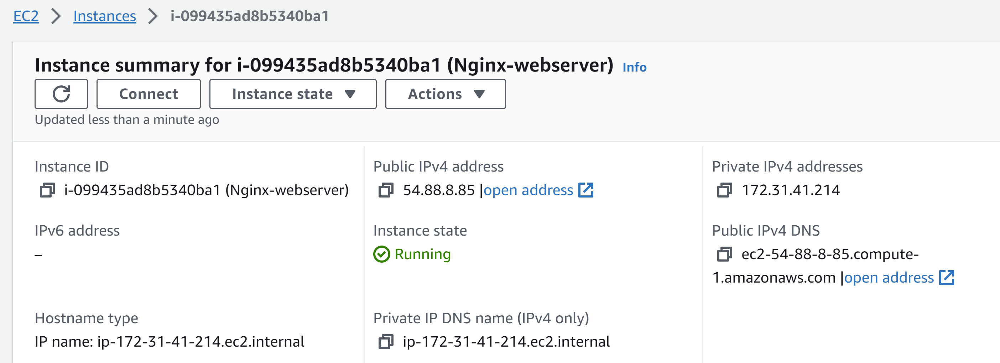
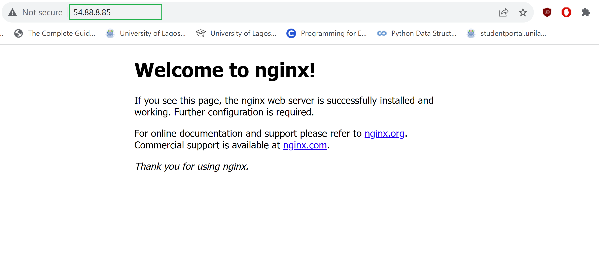
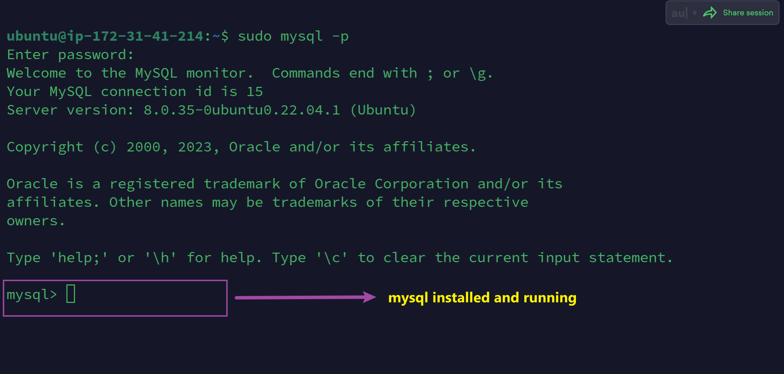
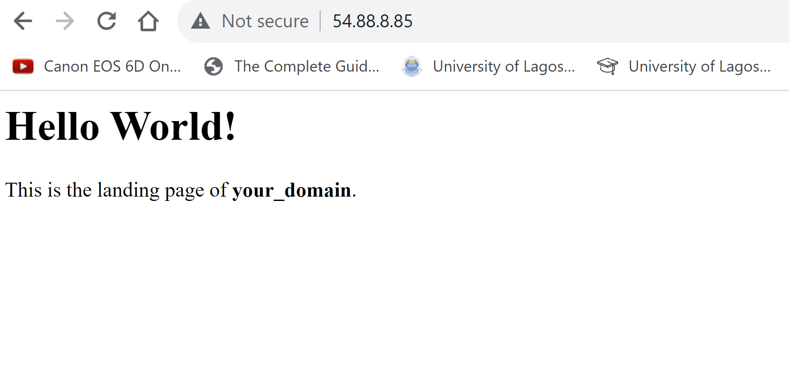
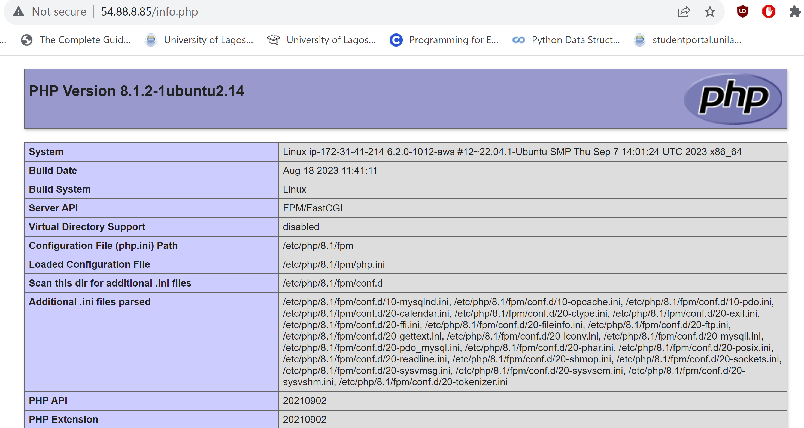
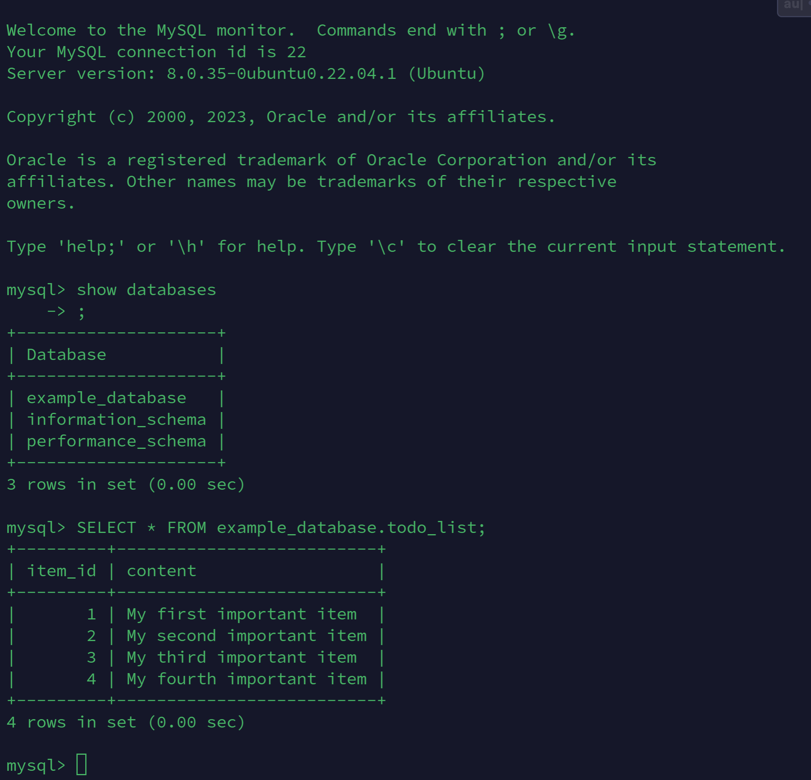
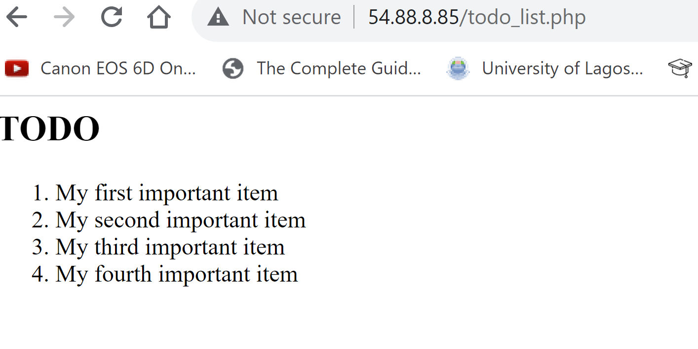

# LEMP-Stack Implementation Assignment by Itoro Ekpo

> A short documentation of the assignment given to implement the LEMP-Stack deploying Nginx, MySQL and PHP on Ubuntu Linux OS EC2 instance on AWS.

1. ## Step 1: Create EC2 instance on AWS running Linux.

    

2. ## Step 2: Install Nginx webserver

    

3. ## Step 3: Install Mysql server

    

4. # Step 4: Install PHP and Configure Nginx to use PHP processor

    

5. # Step 5: Testing PHP with Nginx

    

6. # Step 6: Testing database connection from PHP

    _Below is a sample database and sample table created to test DB connection_

    

    _Below shows Nginx processing PHP page that acesses data from MySQL database._

    

    

