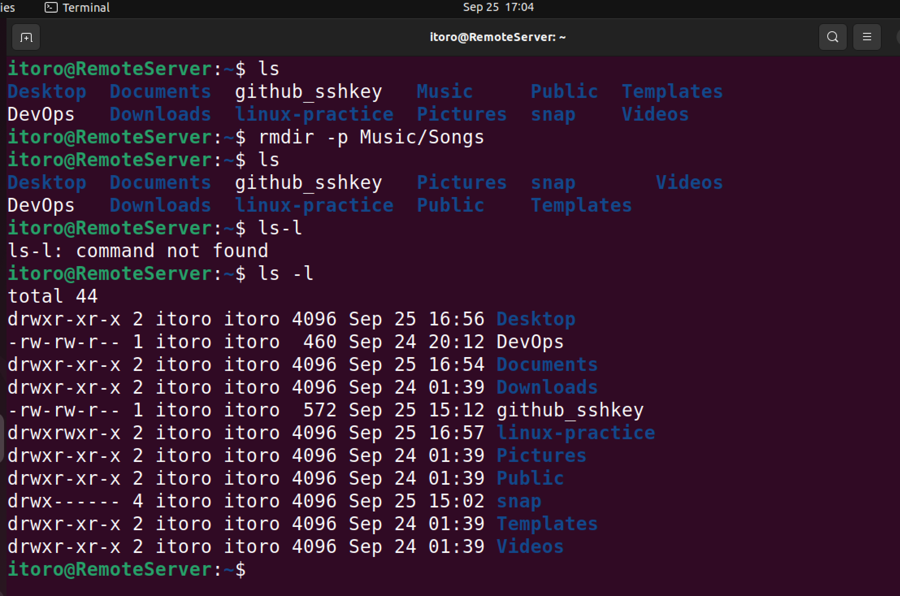
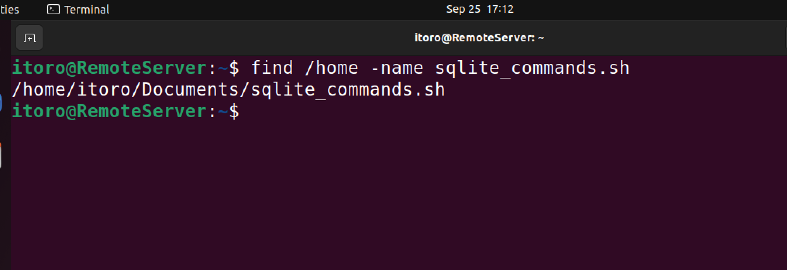
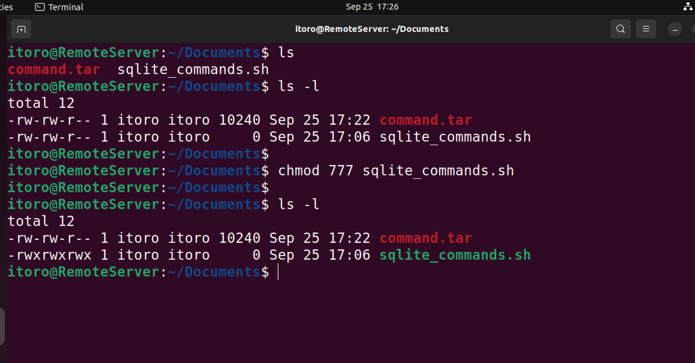
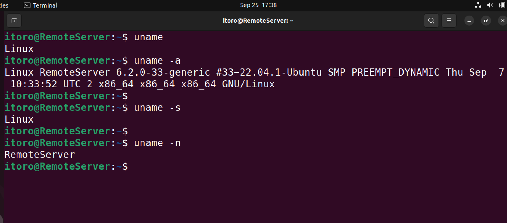

# Linux Practice Project - Itoro Ekpo
> A repository of screenshots of _**linux**_ commands studied on this project assignment\
> The below commands have been practiced and displayed below.

1. sudo command `sudo apt upgrade`   
2. pwd command `pwd` 
3. cd command `cd Desktop/` 
4. ls command `ls` 
5. cat command `cat Learning_Linux` 
6. cp command `cp Learning_Linux /home/itoro/Documents/` 
7. mv command `mv mv_test ~/Desktop/` 
8. mkdir command `mkdir linux-practice` 
9. rmdir command `rmdir -p Music/Songs` 
10. rm command `rm mv_test` 
11. touch command `touch sqlites.sh` 
12. locate command `locate -i sqlites.sh` 
13. find command `find /home -name sqlites.sh` 
14. grep command `grep command DevOps` 
15. df command `df` 
16. du command `du DevOps` 
17. head command `head DevOps` 
18. tail command `tail DevOps` 
19. diff command `diff DevOps github_sshkey` 
20. tar command `tar -cvf command.tar sqlites.sh` 
21. chmod command `chmod 777 sqlites.sh` 
22. chown command `chown [option] owner[:group] file(s)`
23. jobs command `jobs [options] jobID`
24. kill command `ps ux` `kill [signal_option] pid`
25. ping command `ping google.com` 
26. wget command `wget https://wordpress.org/latest.zip` 
27. uname command `uname` `uname -a` `uname -s` `uname -n` 
28. top command `top` 
29. history command `history` 
30. man command `man ls` 
31. echo command `echo Good Morning` 
32. zip and unzip commands `zip zip_test.zip zip_test` `unzip zip_test.zip` 
33. hostname command `hostname -i` 
34. useradd and userdel commands `useradd [option] username`
35. apt get command `apt-get` 
36. nano command `nano DevOps` 
37. alias and unalias command `alias e='echo'` 
38. su command `su root` 
39. htop command `htop` 
40. ps command `ps` 
