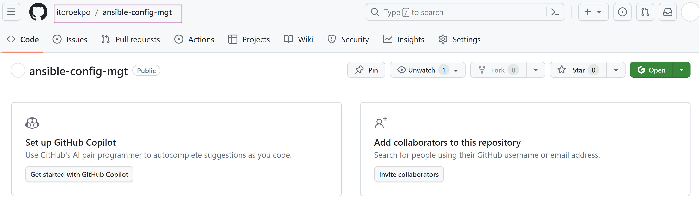
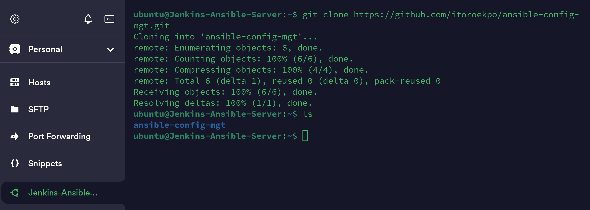
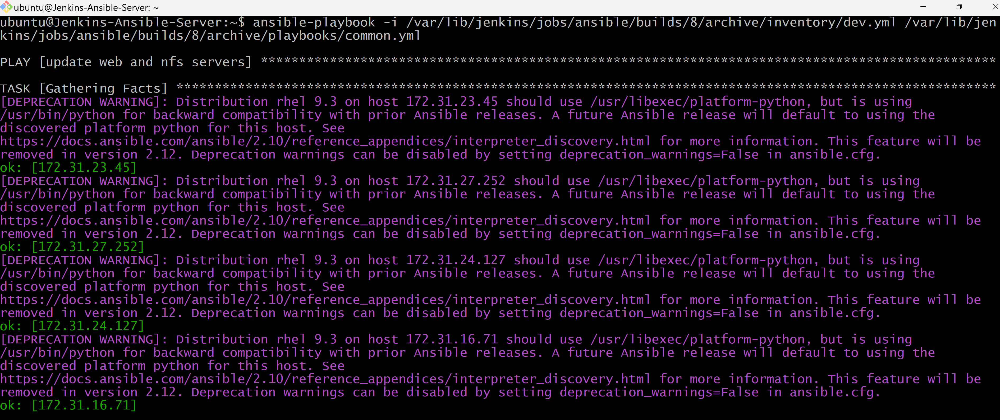

# Ansible - Automate Project By Itoro Ekpo


[ANSIBLE](https://www.ansible.com/) is a software tool that provides simple but powerful automation for cross-platform computer support.

It is primarily intended for IT professionals, who use it for application deployment, updates on workstations and servers, cloud provisioning, configuration management, intra-service orchestration, and nearly anything a
systems administrator does on a weekly or daily basis. Ansible doesn't depend on agent software and has no
additional security infrastructure, so it's easy to deploy.

While Ansible may be at the forefront of automation, systems administration, and DevOps, it's also useful to
everyday users. Ansible allows you to configure not just one computer, but potentially a whole network of
computers at once, and using it requires no programming skills. Instructions written for Ansible are human-
readable. Whether you're entirely new to computers or an expert, Ansible files are easy to understand.

## Ansible Client as a Jump Server (Bastion Host)
A Jump Server (sometimes also referred as [Bastion Host](https://en.wikipedia.org/wiki/Bastion_host)) is an intermediary server through which access to internal network can be provided. If you think about the current architecture you are working on, ideally, the webservers would be inside a secured network which cannot be reached directly from the Internet. That means, even DevOps engineers cannot `SSH` into the Web servers directly and can only access it through a Jump Server - it provides better security and reduces attack surface.

On the diagram below the Virtual Private Network (VPC) is divided into two subnets - Public subnet has public IP addresses and Private subnet is only reachable by private IP addresses.


In previous projects we had to perform lots of manual operations to set up virtual servers, install and configure required software and deploy our web applications especially on projects 7 through 10. This project however, will make us appreciate DevOps tools more by making the most of the routine tasks automated with [Ansible Configuration Management](https://www.digitalocean.com/community/conceptual-articles/an-introduction-to-configuration-management-with-ansible), at the same time building confidence in writing code using declarative languages such as [YAML](https://en.wikipedia.org/wiki/YAML).

In this project, I will install and configure Ansible client as a Jump Server/Bastion Host and create a simple Ansible [Playbook](https://docs.ansible.com/ansible/latest/playbook_guide/playbooks_intro.html) to automate servers configuration.

## Install and Configure Ansible on EC2 Instance

**Step 1**: Install and Configure Jenkins and Ansible on EC2
---
1. Create an AWS EC2 Server Instance running Ubuntu OS {Jenkins-Ansible}

    

    

2. Install JDK (Since Jenkins is a Java-based application)

    ```
    sudo apt update  
    sudo apt install openjdk-11-jre

    #Confirm Java installation  
    java -version
    ```
    

3. Install Jenkins. You can refer to the official [Jenkins Documentation](https://www.jenkins.io/doc/book/installing/linux/#debianubuntu)

    ```
    curl -fsSL https://pkg.jenkins.io/debian/jenkins.io-2023.key | sudo tee \
    /usr/share/keyrings/jenkins-keyring.asc > /dev/null

    echo deb [signed-by=/usr/share/keyrings/jenkins-keyring.asc] \
    https://pkg.jenkins.io/debian binary/ | sudo tee \
    /etc/apt/sources.list.d/jenkins.list > /dev/null

    sudo apt-get update

    sudo apt-get install -y jenkins

    #Confirm Jenkins is up and running

    sudo systemctl status jenkins
    ```
    

4. By default Jenkins server uses TCP port 8080. Open this port by creating a new Inbound Rule in your EC2 Security Group.

    

5. Perform initial Jenkins setup.
    * From your browser access `http://<Jenkins-Server-Public-IP-Address-or-Public-DNS-Name>:8080`. You will be prompted for a default admin password.

        

    * The default password can be retrieved with the command `sudo cat /var/lib/jenkins/secrets/initialAdminPassword`

        

    * Install suggested plugins and that completes the installation of Jenkins.

        

        

        

6. In your [GitHub](https://github.com/) account, create a new repository and name it `ansible-config-mgt`

    

7. Install **Ansible**
    ```
    sudo apt update
    sudo apt install ansible

    # Check your ansible version
    ansible --version
    ```
    
    

8. Configure Jenkins build job to archive your repository content every time you make a change to it.

    * Create a new Freestyle project `ansible` in Jenkins and point it to your `ansible-config-mgt` repository.

        

    * Configure a webhook in GitHub and set the webhook to trigger `ansible` build.

        

    * Configure a post-build job to save all (`**`) files.

        

9. Test your setup by making some change in README.md file in `master` branch and make sure that builds starts automatically and Jenkins saves the files (build artifacts) in the folder `ls /var/lib/jenkins/jobs/ansible/builds/<build_number>/archive/`

    

    

    

_Note: Trigger Jenkins project execution for main (or master) branch_

**Tip:** Every time you stop/start your `Jenkins-Ansible` server, you have to reconfigure GitHub webhook to a new IP address. In order to avoid it, it makes sense to allocate an Elastic IP to your `Jenkins-Ansible` server. Note that Elastic IP is free only when it is being allocated to an EC2  instance so do not forget to release Elastic IP once you terminate your EC2 instance.


**Step 2**: Prepare the development environment using Visual Studio Code
---
1. The `Dev` in `DevOps`means you will be required to write some codes and should have proper tools to make your coding and debugging comfortable. You need an [Integrated Development Environment (IDE)](https://en.wikipedia.org/wiki/Integrated_development_environment). I will be using **Visual Studio Code (VSC)**. It is free and versatile and will fully satisfy your development needs. You can download this amazing and powerful development tool by clicking right [_**here**_](https://code.visualstudio.com/Download).

2. After installing visual studio code, configure it to connect to your newly created GitHub repository.

    

3. Clone down your `ansible-config-mgt` repo to your Jenkins-Ansible instance  
    `git clone <ansible-config-mgt repo link>`

    


**Step 3**: Begin Ansible Development
---
1. In the `ansible-config-mgt` GitHub repository, create a new branch that will be used for development of a new feature.

    `git checkout -b new_feature`

    

2. Checkout the newly created feature branch to your local machine and start building your code and directory structure.

    `git checkout -b new_feature`

3. Create a directory named `playbooks`. It will be used to store all your playbook files. `mkdir plabooks`

4. Create a directory named `inventory`. It will be used to keep your hosts organised. `mkdir inventory`

5. Within the `playbooks` folder, create your first _playbook_ and name it `common.yml`

    `cd playbooks`  
    `code common.yml`

6. Within the inventory folder, create an inventory file for each environment (Development, Staging, Testing and Production) named `dev`, `staging`, `uat` and `prod` respectively. These files use `.ini` languages style to configure Ansible hosts.

    


**Step 4**: Set up an Ansible Inventory
---
An Ansible inventory file defines the hosts and groups of hosts upon which commands, modules, and tasks in a playbook operate. Since our intention is to execute Linux commands on remote hosts, and ensure that it is the intended configuration on a particular server that occurs. It is important to have a way to organize our hosts in such an Inventory.

1. Save the below inventory structure in the `inventory/dev` file to start configuring your development servers. Ensure to replace the IP addresses according to your own setup.

    **Note:** Ansible uses TCP port 22 by default, which means it needs to `ssh` into target servers from `Jenkins-Ansible` host. For this we can implement the concept of `ssh-agent`. Now you need to import key into `ssh-agent`:

    ```
    eval `ssh-agent -s`
    ssh-add -k <path-to-private-key>
    ```

2. Confirm the key has been added with the command `ssh-add -l `

    

3. _SSH_ into the `Jenkins-Ansible` server using ssh-agent `ssh -A ubuntu@public-ip`

    

4. Update the `inventory/dev.yml` file with the below code snippet.
    ```
    [nfs]
    <NFS-Server-Private-IP-Address> ansible_ssh_user=ec2-user

    [webservers]
    <Web-Server1-Private-IP-Address> ansible_ssh_user=ec2-user
    <Web-Server2-Private-IP-Address> ansible_ssh_user=ec2-user

    [db]
    <Database-Private-IP-Address> ansible_ssh_user=ec2-user 

    #[lb]
    #<Load-Balancer-Private-IP-Address> ansible_ssh_user=ubuntu
    ```

    _update the code with the IP addresses and usernames of the respective servers to be managed_

    


**Step 5**: Create a common playbook
---
It is time to begin giving Ansible the instructions on what you need to be performed on all servers listed in `inventory/dev`.

1. In `common.yml` playbook you will write configuration for repeatable, re-usable and multi-machine tasks that is common to systems within the infrastructure.

2. Update the `playbooks/common.yml` file with the below code:
    ```
    ---
    - name: update web, nfs and db servers
      hosts: webservers, nfs, db
      become: yes
      tasks:
        - name: ensure wireshark is at the latest version
          yum:
            name: wireshark
            state: latest
    

    - name: update LB server
      hosts: lb
      become: yes
      tasks:
        - name: Update apt repo
          apt: 
            update_cache: yes

        - name: ensure wireshark is at the latest version
          apt:
            name: wireshark
            state: latest
    ```
    _The above `playbook` is divided into two parts, each of them is intended to perform the same task: install `wireshark` utility (or make sure it is updated to the latest version) on your RHEL 8 and Ubuntu servers. It uses `root` user to perform this task and respective package manager: `yum` for RHEL 8 and `apt` for Ubuntu._

3. Feel free to update this playbook with the following tasks:
    * Create a directory and a file inside it
    * Change timezone on all servers
    * Run some shell script


**Step 6**: Update _Git_ with the latest code
---
Now all of the directories and files live on your local machine and you need to push changes made locally to GitHub. In the real world, you will be working within a team of other DevOps engineers and developers. It is important to learn how to collaborate with the help of `Git`. 

In many organizations, there is a development rule that does not allow the deployment of any code until it has been reviewed by an extra pair of eyes - It is called the **_Four-Eyes Principle_**.

Now you have a separate branch, you will need to know how to raise a Pull Request (PR), get your branch peer reviewed and merged to the master branch.

1. Commit your code into GitHub: Use git commands to add, commit and push your branch to GitHub.
    ```
    git status

    git add <selected files>

    git commit -m "commit message"

    git push --set-upstream origin new_feature
    ```

    

    

    

2. Create a Pull Request (PR)

    

    

3. Wear the hat of another developer for a second, and act as a reviewer.

    

4. If the reviewer is happy with your new feature development, merge the code to the `master` branch.

    

5. Head back to your terminal, checkout from the feature branch into the master, and pull down the latest changes.

    `git checkout main`

    

    Once your code changes in `master` branch, Jenkins will do its job and save all the files (build artifacts) to `/var/lib/jenkins/jobs/ansible/builds/<build_number>/archive/` directory on `Jenkins-Ansible` server.

    

    


**Step 7**: Run first Ansible test
---
Now it is time to execute `ansible-playbook` command and verify the playbook actually works.

1. Setup VSCode to connect to your instance.

    

2. Run the playbook using the command 
    ```
    # change to your ansible directory
    cd ansible-config-mgt

    # run the playbook
    ansible-playbook -i inventory/dev.yml playbooks/common.yml

    # actual command
    ansible-playbook -i /var/lib/jenkins/jobs/ansible/builds/8/archive/inventory/dev.yml /var/lib/jenkins/jobs/ansible/builds/8/archive/playbooks/common.yml
    ```

    

    We can see from the screenshots above and below that the playbook ran successfully. Successful connections were made to all servers and changes (installing wireshark) were made. We can login and confirm this from each server.

    

3. Check each of the servers and confirm [wireshark](https://www.varonis.com/blog/how-to-use-wireshark#:~:text=Wireshark%20is%20a%20packet%20sniffer,that%20data%20for%20offline%20analysis.) has been installed using the command 

    `which wireshark` or   
    `wireshark --version`

    NFS Server Instance
    

    MySQL Server Instance
    

    Webserver1 Instance
    

    Webserver2 Instance
    

    Webserver3 Instance
    

    > _It is seen from the above screenshots that ansible is able to connect to the remote servers and execute the playbook successfully_


4. The updated Ansible Architecture now looks like the below:

    


Project Complete
---
I have automated my routine tasks by implementing my first Ansible project and creating an ansible playbook to deploy wireshark on 5 servers at the same time.
 

