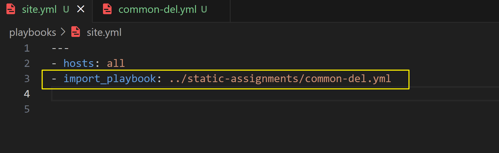
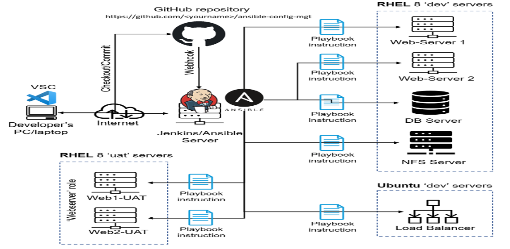

# Ansible Refactoring, Assignments & Imports - Project By Itoro Ekpo


In this project, I will continue working with `ansible-config-mgt` repository and make some improvements to my code. We will learn to refactor our Ansible code, create assignments and learn how to use imports functionality. Imports allow to effectively re-use previously created playbooks in a new playbook, allowing for reuse when needed.

## Code Refactoring

**Refactoring** is a general term in computer programming. It means making changes to the source code without changing expected behaviour of the software. The main idea of refactoring is to enhance code readability, increase maintainability and extensibility, reduce complexity, add proper commenting without affecting the logic. For this project we will move things around a little in our ansible code from the last project but the overall state of the infrastructure will remain the same.

Let us review and improve on our Ansible code!

**Step 1: Jenkins job ehnacement**
---

We will first make some changes to our Jenkins job. From our [Ansible-Automate-Project](https://github.com/itoroekpo/DevOps-projects/blob/e050463ba7a4291de6ca70f4141ead7c40add404/project11-ansible-automate/project11.md), every new change in the codes created a separate directory which is not very convenient when we want to run some commands from one place.

Also, it consumes space on the Jenkins server with each subsequent change. Let us enhance it by introducing a new Jenkins project/job. To do this we will require a `copy Artifact` plugin.

1. Login to `Jenkins-Ansible` server and create a new directory called `ansible-config-artifact`. We will store there all artifacts after each build.

    `sudo mkdir /home/ubuntu/ansible-config-artifact`

2. Change permissions to this directory so Jenkins could save files there.

    `chmod -R 0777 /home/ubuntu/ansible-config-artifact`

    

3. Go to Jenkins web console `->` Manage Jenkins `->` Manage Plugins. On the `Available` tab, search for `copy Artifact` and install this plugin without restarting Jenkins.

    

4. Create a new Freestyle project and name it `save_artifacts`.

5. This project will be triggered by completion of your existing `ansible` project. Configure it accordingly.

    _Note: You can configure number of builds to keep in order to save space on the server, for example, you might want to keep only last 2 or 5 build results. You can also make this change to your `ansible` job._

    

6. The main idea of `save_artifacts` project is to save artifacts into `/home/ubuntu/ansible-config-artifact` directory. To achieve this, create a `build` step and choose `copy artifacts from other project`, specify `ansible` as source project and `/home/ubuntu/ansible-config-artifact` as target directory.

    

    > _In the implementation of this project I was unable to execute this step. Jenkins was not able to access the folder created in my home dirtectory. Even after consulting support there was no solution but to use the default directory for the job in `/var/lib/jenkins/workspace/save_artifacts/` by leaving the field for target directory blank._

7. Test your setup by making some change in README.md file inside your `ansible-config-mgt` repository (right inside `main` branch).

    

    If both Jenkins jobs have completed one after another, we shall see our files inside `/home/ubuntu/ansible-config-artifact` directory and it will be updated with every commit to your `main` branch.

    

    Now our Jenkins pipeline is neater and cleaner.

**Step 2: Refactor Ansible code by importing other playbooks into the `site.yml` file**
---
Before starting to refactor the codes, ensure that you have pulled down the latest code from `main` branch, and create a new branch, name it `refactor`.

> git checkout -b refactor

DevOps philosophy implies constant iterative improvement for better efficiency - refactoring is one of the techniques that can be used, but you always have an answer to question "why?". 

> Why do we need to change something if it works well? good question yea? 

In [Project 11](https://github.com/itoroekpo/DevOps-projects/blob/e050463ba7a4291de6ca70f4141ead7c40add404/project11-ansible-automate/project11.md) we wrote all tasks in a single playbook `common. yml`, now it is a pretty simple set of instructions for only 2 types of OS but imagine you have many more tasks and you need to apply this playbook to other servers with different requirements. 

In this case, you will have to read through the whole playbook to check if all tasks written there are applicable and is there anything that you need to add for certain server/OS families. 

Very fast it will become a tedious exercise and your playbook will become messy with many commented parts. Your DevOps colleagues will not appreciate such organization of your codes and it will be difficult for them to use your playbook.

Most Ansible users learn the one-file approach first. However, breaking tasks up into different files is an excellent way to organize complex sets of tasks and reuse them.

We will now see re-use in action by importing other playbooks.

1. Within `playbooks` folder, create a new file and name it `site.yml` - _This file will now be considered as an entry point into the entire infrastructure configuration._ Other playbooks will be included here as a reference. In otherwords, `site.yml` will become a parent to all other playbooks that will be developed. Including `common.yml` that we created previously.

    

2. Create a new folder  in root of the repository and name it `static-assignments`. The **stati-assignments** folder is where all other children playbooks will be stored. This is merely for easy organization of our work. It is not an Ansible specific concept, therefore you can choose how you want to organize your work. We will see why the folder name has a prefix of **static** pretty soon.

    

3. Move `common.yml` file into the newly created `static-assignments` folder.

    

4. Inside `site.yml` file, import `common.yml` playbook using the below commands.

    ```
    ---
    - hosts: all
    - import_playbook: ../static-assignments/common.yml
    ```

    The above code uses a built-in `import_playbook` Ansible module.

    Your folder structure should mimic the below:

    ```
    ├── static-assignments
    │   └── common.yml
    ├── inventory
        └── dev
        └── stage
        └── uat
        └── prod
    └── playbooks
        └── site.yml
    ```

    

5. Run `ansible-playbook` command against the `dev` environment. Since we need to apply some tasks to our `dev` servers and `wireshark` is already installed, we can go ahead and create another playbook under `static-assignments` and name it `common-del.yml`. In this playbook, configure deletion of `wireshark` utility.

    ```
    ---
    - name: update web, nfs and db servers
    hosts: webservers, nfs, db
    remote_user: ec2-user
    become: yes
    become_user: root
    tasks:
    - name: delete wireshark
        yum:
        name: wireshark
        state: removed

    - name: update LB server
    hosts: lb
    remote_user: ubuntu
    become: yes
    become_user: root
    tasks:
    - name: delete wireshark
        apt:
        name: wireshark-qt
        state: absent
        autoremove: yes
        purge: yes
        autoclean: yes
    ```

    

    update `site.yml` with `- import_playbook: ../static-assignments/common-del.yml` instead of `common.yml` and run it against the `dev` servers.

    

    

    Before we run we have to configure the ssh-agent as shown in the below screenshot

    > eval `ssh-agent -s`

    > ssh-add itoro-web-server.pem

    > ssh -A user@<Server_Public_IP_Address>

    > ssh-add -l

    

    

    ```
    cd /var/lib/jenkins/workspace/save_artifacts/

    ansible-playbook -i inventory/dev.yml playbooks/site.yml
    ```

    

    _1 error appears in screenshot which I realized the problem and will correct now by editing the playbook. My db server is an ubuntu server. I just need to edit that in the playbook and run again. So I expect no change in the ones that were previously successful and 1 change in the one that previously failed._

    So I run again ...

    

    As predicted we can see from the screenshot above, after correcting the playbook. The point of failure is resolved.

    Confirm that `wireshark` is deleted on all the servers by runing `wireshark --version`. Below is screenshot of confirmation from NFS Server running RHEL and MySQL server running Ubuntu. Both have wireshark uninstalled by the ansible playbook.

    

    

    Now we have learned how to use the `import_playbook` module and we have a ready solution to install/delete packages on multiple servers with just one command.


**Step 3: Configure UAT Webservers with a role `Webserver`**
---
We are going to put aside our nice and clean `dev` environment and configure two new webservers as `uat`. We could write tasks to configure webservers in the same playbook, but it would be too messy so instead, we will use a dedicated [role](https://docs.ansible.com/ansible/latest/playbook_guide/playbooks_reuse_roles.html) to make our configuration reusable.

1. Launch two new EC2 instances using RHEL 8 image. We will use them as our `uat` servers so name them accordingly - `Web1-UAT` and `Web2-UAT`.

    

2. To create a role, you must create a directory called `roles/`, relative to the playbook file or in the `/etc/ansible` directory.

    There are two ways we can create this folder structure:

    * Use an Ansible utility called `ansible-galaxy` inside `ansible-config-mgt/roles` directory (you need to create `roles` directory upfront).

        ```
        mkdir roles
        cd roles
        ansible-galaxy init webserver
        ```
    * Create the directory/files structure manually. 
    
        Note: You can choose either way, but since you store all your codes in GitHub, it is recommended to create folders and files there rather than locally on `Jenkins-Ansible` server.

        The entire folder structure should look like below, but if you create it manually- you can skip creating `tests`, `files` `vars` or remove them if you used `ansible-galaxy`.

        ```
        └── webserver
            ├── README.md
            ├── defaults
            │   └── main.yml
            ├── files
            ├── handlers
            │   └── main.yml
            ├── meta
            │   └── main.yml
            ├── tasks
            │   └── main.yml
            ├── templates
            ├── tests
            │   ├── inventory
            │   └── test.yml
            └── vars
                └── main.yml
        ```

        After removing unnecessary directories and files, the `roles` structure should look like below:

        ```
        └── webserver
            ├── README.md
            ├── defaults
            │   └── main.yml
            ├── handlers
            │   └── main.yml
            ├── meta
            │   └── main.yml
            ├── tasks
            │   └── main.yml
            └── templates
        ```

        

    **Note:** Because I am using a windows system, I was unable to run ansible-galaxy and thus I had to follow the below steps to achieve this.
    
    I had to install WSL for windows to enable me install Ubuntu on my windows machine.

    

    After installation, You will need to restart your computer. After installation, I opened a command prompt and ran the command `wsl --update` to update the kernel. Having WSL installed now enables me to install linux on my windows machine.

    Next step was I opened the Microsoft store and installed Ubuntu OS

    

    Upon completion I clicked on **Open** and this will launch a terminal installing ubuntu. It will ask you for a username for your home directory and complete the installation of Ubuntu OS on your windows machine.

    Now that Ubuntu OS was installed on my machine, I was able to open a Linux terminal in `vscode` as shown below.

    

    Next step is to install **ansible**

    ```
    sudo apt update
    sudo apt install ansible
    ```

    

    

    And finally I was able to run `ansible-galaxy init webserver` successfully

    

    You can see the below resulting directory structure

    

3. Update the inventory `ansible-config-mgt/inventory/uat.yml` file with IP addresses of our two new UAT webservers. Ensure you are using ssh-agent to ssh into the Jenkins-Ansible instance just as we did in the previous project.

    ```
    [uat-webservers]
    <Web1-UAT-Server-Private-IP-Address> ansible_ssh_user='ec2-user'
    <Web2-UAT-Server-Private-IP-Address> ansible_ssh_user='ec2-user'
    ```

    

4. In `/etc/ansible/ansible.cfg` file, uncomment `roles_path` string and provide a full path to your roles directory, so Ansible can know where to find configured roles.

    `roles_path = /home/ubuntu/ansible-config-mgt/roles`

    Due to the fact that I had to install Ubuntu on my windows machine via WSL there was no `ansible.cfg` file. 

    I had to create the configuration file manually using the command `sudo vi /etc/ansible/ansible.cfg` and copy in the below configuration commands for `roles` path.

    ```
    [defaults]
    host_key_checking=false

    inventory=/home/ubuntu/ansible-config-artifact/inventory

    roles_path=/home/ubuntu/ansible-config-artifact/roles
    ```

    

5. It is time to start adding some logic to the webserver role. Go into **tasks** directory, and within the `main.yml` file, start writing configuration tasks to do the following:

    * Install and configure Apache
    * Clone Tooling website from GitHub `https://github.com/<your-name>/tooling.git`
    * Ensure the tooling website code is deployed to `/var/www/html` on each of 2 UAT webservers.
    * Make sure `httpd` service is started.

    Our `main.yml`may consist of the following tasks:

    ```
    ---
    - name: install apache
    become: true
    ansible.builtin.yum:
        name: "httpd"
        state: present

    - name: install git
    become: true
    ansible.builtin.yum:
        name: "git"
        state: present

    - name: clone a repo
    become: true
    ansible.builtin.git:
        repo: https://github.com/<your-name>/tooling.git
        dest: /var/www/html
        force: yes

    - name: copy html content to one level up
    become: true
    command: cp -r /var/www/html/html/ /var/www/

    - name: Start service httpd, if not started
    become: true
    ansible.builtin.service:
        name: httpd
        state: started

    - name: recursively remove /var/www/html/html/ directory
    become: true
    ansible.builtin.file:
        path: /var/www/html/html
        state: absent
    ```

    

**Step 4: Reference `Webserver` role**
---

Within the `static-assignments` folder, create a new assignment for **uat-webservers** `uat-webservers.yml`. This is where we will reference the role.

    ```
    ---
    - hosts: uat-webservers
    roles:
        - webserver
    ```


Remember that the entry point to our ansible configuration is the `site.yml` file. Therefore, you need to refer your `uat-webservers.yml` role inside `site.yml`.

So we should have the below in the `site.yml` file:

    ```
    ---
    - hosts: all
    - import_playbook: ../static-assignments/common.yml

    - hosts: uat-webservers
    - import_playbook: ../static-assignments/uat-webservers.yml
    ```


**Step 5: Commit & Test**
---
Commit your changes, create a PULL Request and merge them to `main` branch, make sure webhook triggered two consequent Jenkins jobs, they ran successfully and copied all the files to our `Jenkins-Ansible` server via ssh-agent.

GitHub Repo


upstream jenkins job - ansible


downstream jenkins job - save_artifacts


```
cd /home/ubuntu/ansible-config-mgt

ansible-playbook -i inventory/uat.yml playbooks/site.yml
```
See screenshot below:


From the screenshots above you can see that the ansible playbook ran successfully.

You should be able to see both of your UAT webservers configured and you can try to reach them from your browser:

`http://<Web1-UAT-Server-Public-IP-or-Public-DNS-Name>/index.php`


or

`http://<Web2-UAT-Server-Public-IP-or-Public-DNS-Name>/index.php`


Our Ansible architecture now looks like the below:




> Project 12 Completed. In Project 13, we will see the difference between **Static** and **Dynamic** assignments.

