# Project 13: Ansible Dynamic Assignments (Include) and Community Roles By Itoro Ekpo


_Before we begin it is important to note that Ansible is an actively developing software project, so it is encouraged to visit [Ansible Documentation](https://docs.ansible.com) for the latest updates on modules and their usage._

In this project we will introduce [Dynamic Assignments](https://docs.ansible.com/ansible/latest/playbook_guide/playbooks_reuse.html#includes-dynamic-re-use) by using `include` module.

What is the difference between **static** and **dynamic** assignments?
---
From [Project 12](https://github.com/itoroekpo/DevOps-projects/blob/144002c0b29fee6e9972c33d5811e6172fdac100/project12-ansible-refactoring-assignments-Imports/project12.md), we can see that static assignments use `import` Ansible module. The module that enables dynamic assignments is `include`.

```
import = Static
include = Dynamic
```

When the import module is used, all statements are pre-processed at the time playbooks are parsed. Meaning, when you execute `site.yml` playbook, Ansible will process all the playbooks referenced during the time it is parsing the statements. This also means that, during actual execution, if any statement changes, such statements will not be considered. Hence, it is static.

On the other hand, when include module is used, all statements are processed only during execution of the playbook. Meaning, after the statements are parsed, any changes to the statements encountered during execution will be used.

Take note that in most cases it is recommended to use static assignments for playbooks, because it is more reliable. With dynamic ones, it is hard to debug playbook problems due to its dynamic nature. However, you can use dynamic assignments for environment specific variables as we will be introducing in this project.

## Introducing Dynamic Assignment into our structure
In the [ansible-config-mgt](https://github.com/itoroekpo/ansible-config-mgt) GitHub repository, start a new branch and call it `dynamic-assignments`. Create a new folder, name it `dynamic-assignments`. Inside this folder, create a new file and name it `env-vars.yml`. We will instruct `site.yml` to `include` this playbook later. For now we will focus on building the structure.


My GitHub repository now has the below structure.

```
├── dynamic-assignments
│   └── env-vars.yml
├── inventory
│   └── dev
    └── stage
    └── uat
    └── prod
└── playbooks
    └── site.yml
└── roles (optional folder)
    └──...(optional subfolders & files)
└── static-assignments
    └── common.yml
```

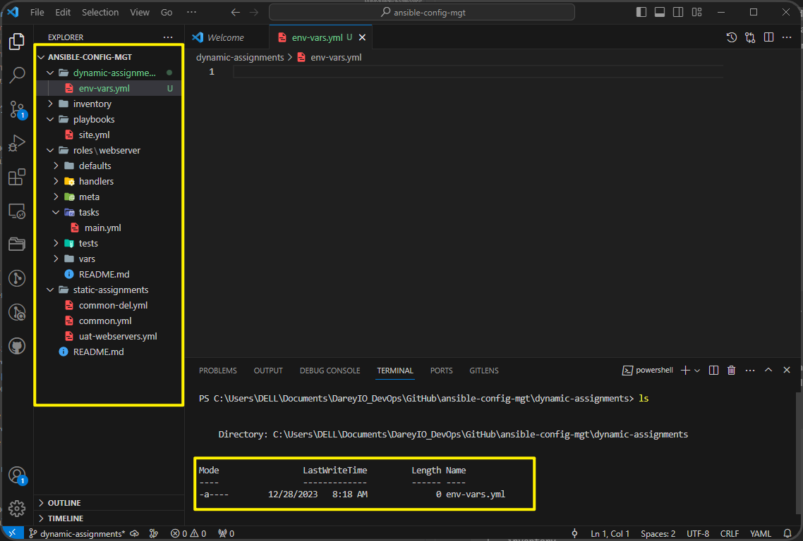

Since we will be using the same Ansible to configure multiple environments, and each of these environments will have certain unique attributes, such as **servername**, **ip-address** etc., we will need a way to set values to variables per specific environment.

For this reason, we will now create a folder to keep each environment's variables file. Therefore, create a new folder `env-vars`, then for each environment, create a new **YAML** file which we will use to set variables.

The current layout now should look like this below:

```
├── dynamic-assignments
│   └── env-vars.yml
├── env-vars
    └── dev.yml
    └── stage.yml
    └── uat.yml
    └── prod.yml
├── inventory
    └── dev
    └── stage
    └── uat
    └── prod
├── playbooks
    └── site.yml
└── static-assignments
    └── common.yml
    └── webservers.yml
```


Now paste the below instructions into `env-vars.yml` file.

```
---
- name: collate variables from env specific file, if it exists
  hosts: all
  tasks:
    - name: looping through list of available files
      include_vars: "{{ item }}"
      with_first_found:
        - files:
            - dev.yml
            - stage.yml
            - prod.yml
            - uat.yml
          paths:
            - "{{ playbook_dir }}/../env-vars"
      tags:
        - always
```

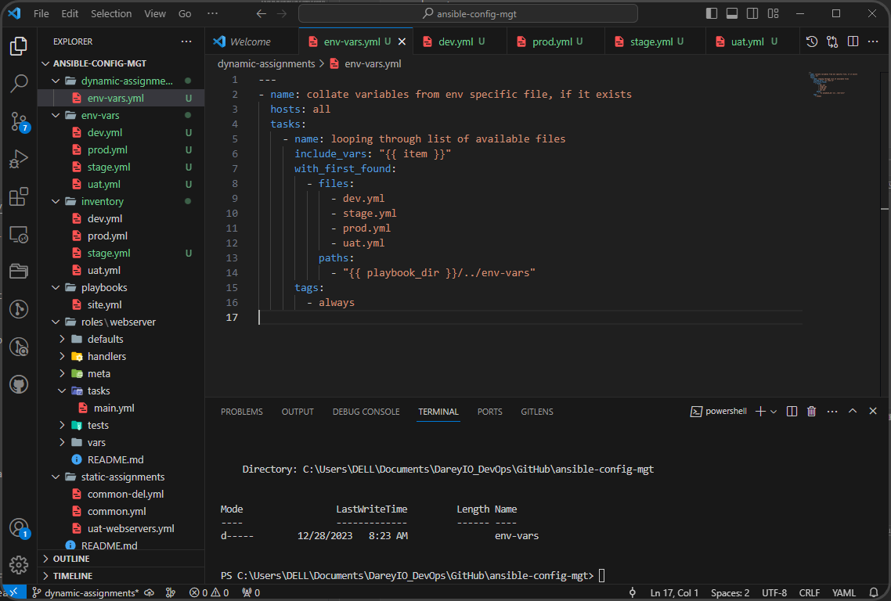

There are `3` things to notice here:

1. We used `include_vars` syntax instead of `include`, this is because Ansible developers decided to separate different features of the module. From Ansible version 2.8, the `include` module is deprecated and variants of `include_*` must be used. These are:

    * include_role
    * include_tasks
    * include_vars

    In the same version, variants of **import** were also introduced, such as:

    * import_role
    * import_tasks

2. We made use of a special variable `{{ playbook_dir }}` and `{{ inventory_file }}`. The former will help Ansible to determine the location of the running playbook, and from there navigate to other path on the filesystem. The latter on the other hand will dynamically resolve to the name of the inventory file being used, then append `.yml` so that it picks up the required file within the `env-vars` folder.

3. We are including the variables using a loop. `with_first_found` implies that, looping through the list of files, the first one found is used. This is good so that we can always set default values in case an environment specific env file does not exist.

Update site.yml with dynamic assignments
---
Update `site.yml` file to make use of the dynamic assignment. (We can not test it at this point. We are only setting the stage for what is yet to come).

**site.yml** file should now look like this below:

```
---
- hosts: all
- name: Include dynamic variables 
  tasks:
  import_playbook: ../static-assignments/common.yml 
  include: ../dynamic-assignments/env-vars.yml
  tags:
    - always

-  hosts: webservers
- name: Webserver assignment
  import_playbook: ../static-assignments/webservers.yml
```


Community Roles
---
Now it is time to create a role for MySQL database - it should install the MySQL package, create a database and configure users. But why should we re-invent the wheel? There are tons of roles that have already been developed by other open source engineers out there. These roles are actually production ready, and dynamic to accomodate most of Linux flavours. With Ansible Galaxy again, we can simply download a ready to use ansible role, and keep going.

Download MySQL Ansible role
---
You can browse available community roles _[here](https://galaxy.ansible.com/ui/)_. We will be using a [MySQL role developed by](https://galaxy.ansible.com/ui/standalone/roles/geerlingguy/mysql/) `geerlingguy`.

_**Hint:** To preserve our GitHub in actual state after we install a new role - make a commit and push to master our `ansible-config-mgt` directory. Of course you must have `git` installed and configured on `Jenkins-Ansible` server and, for more convenient work with codes, you can configure VScode to work wit the directory. In this case, we will no longer need webhook and Jenkins jobs to update our codes on Jenkins-Ansible server so we can disable it. We will be using Jenkins later for a better purpose._

On `Jenkins-Ansible` server make sure that `git` is installed with `git --version`, then go to 'ansible-config-mgt' directory and run:

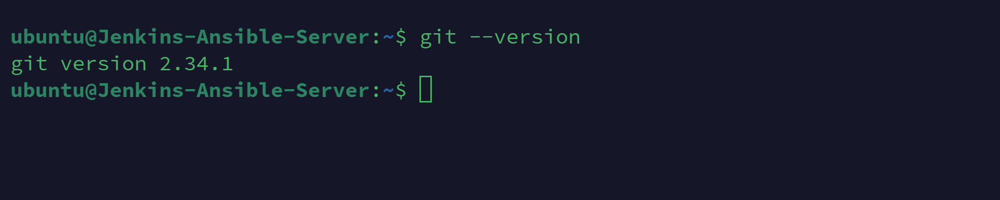

```
git init
git pull https://github.com/<your-name>/ansible-config-mgt.git
git remote add origin https://github.com/<your-name>/ansible-config-mgt.git
git branch roles-feature
git switch roles-feature
```

Inside `roles` directory create your new MySQL role with `ansible-galaxy install geerlingguy.mysql` and rename the folder to `mysql` with the command `mv geerlingguy.mysql/ mysql`

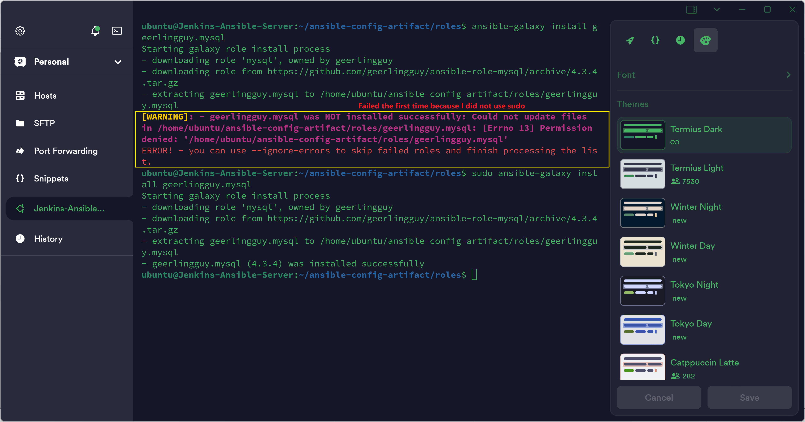

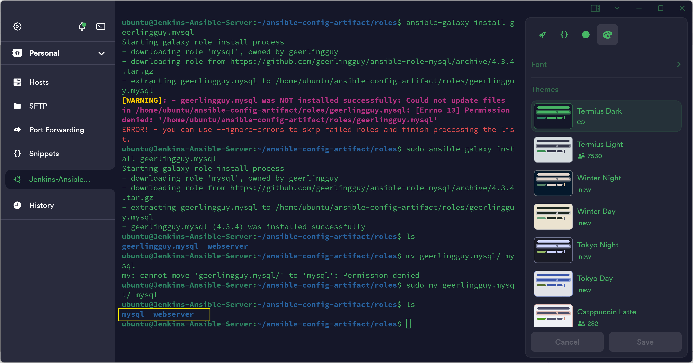

Read `README.md` file and edit roles configuration to use correct credentials for MySQL required for the `tooling` website.

Now it is time to upload the changes into our GitHub:

```
git add .
git commit -m "Commit new role files into GitHub"
git push --set-upstream origin roles-feature
```

Now, if you are satisfied with your codes, you can create a Pull Request and merge it to `main` branch on GitHub.

Load Balancer roles
---
We want to be able to choose which Load Balancer to use, `Nginx` or `Apache`, so we need to have two roles respectively:

1. Nginx
2. Apache

With our experience on Ansible so far we can:

* Decide if you want to develop your own roles, or find available ones from the community.

* Update both `static-assignment` and `site.yml` files to refer the roles.

_**Important Hints:**_ Since you cannot use both **Nginx** and **Apache** load balancer, you need to adda condition to enable either one - this is where we can make use of variables.

* Declare a variable in `defaults/main.yml` file inside the Nginx and Apache roles. Name each variables `enable_nginx_lb` and `enable_apache_lb` respectively.

* Set both values to false like this: `enable_nginx_lb: false` and `enable_apache_lb: false`.

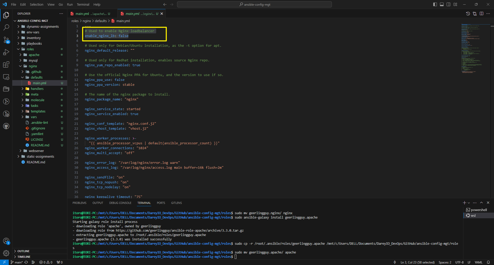


* Declare another variable in both roles `load_balancer_is_required` and set its value to `false` as well.

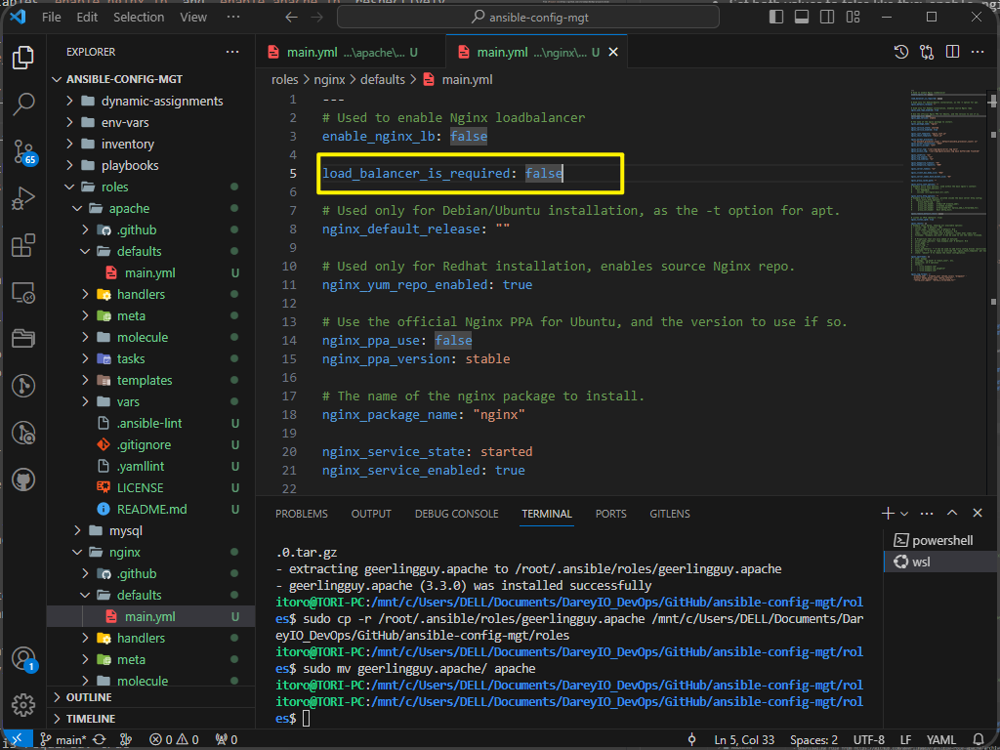

* Update both assignment and site.yml files respectively.

    ```
    # loadbalancer.yml file

    - hosts: lb
    roles:
        - { role: nginx, when: enable_nginx_lb and load_balancer_is_required }
        - { role: apache, when: enable_apache_lb and load_balancer_is_required }
    ```

    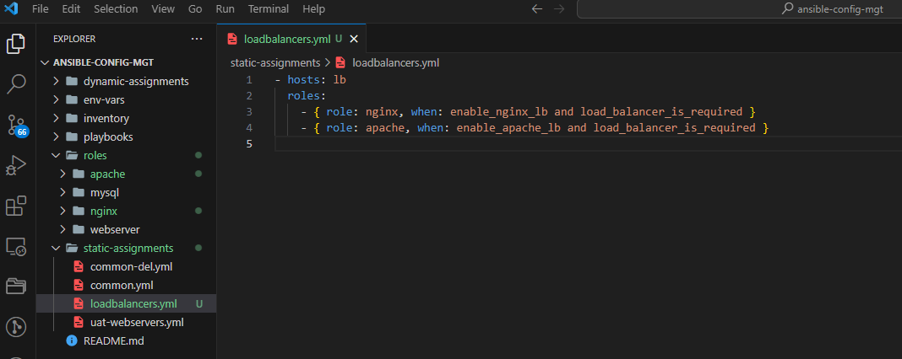

    ```
    # site.yml file

        - name: Loadbalancers assignment
        hosts: lb
            - import_playbook: ../static-assignments/loadbalancers.yml
            when: load_balancer_is_required 
    ```

    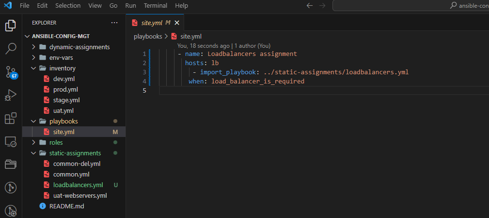

Now we can make use of `env-vars\uat.yml` file to define which loadbalancer to use in UAT environment by setting respective environmental variable to `true`.

We will activate load balancer, and enable `nginx` by setting these in the respective environment's env-vars file.

```
enable_nginx_lb: true
load_balancer_is_required: true
```
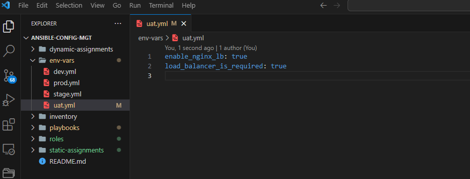

The same must work with `apache` LB, so we can switch it by setting respective environmental variable to `true` and other to `false`.

Finally, to test this, we can update inventory for each environment and run Ansible against each environment.

Run playbook using `ansible-playbook -i inventory/uat.yml playbooks/site.yml`

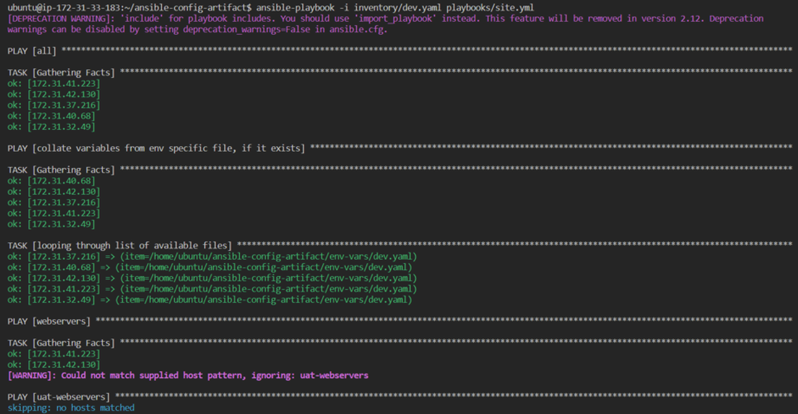

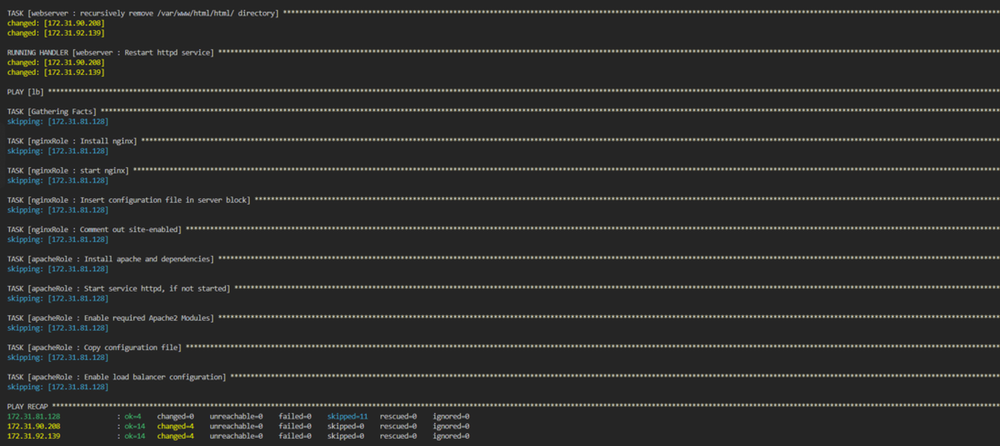


