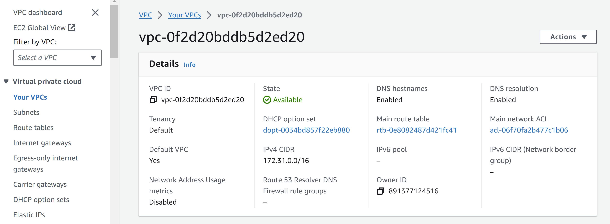
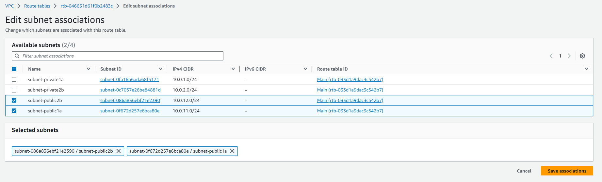
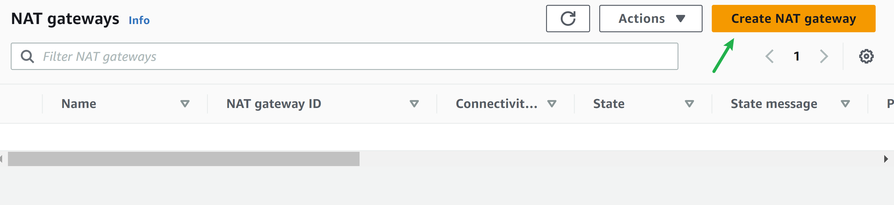

# AWS Networking Implementation (VPC, Subnets, Internet Gateways, NAT, Routing)

## AWS VPC Creation and Subnet Configuration

**Welcome to AWS Networking!** This field uses Virtual Private Clouds (VPC's) and subnets to create the backbone of your cloud-based projects.

> What is an Amazon VPC?

An Amazon Virtual Private Cloud is like your very own private section of the Amazon cloud, where you can place and manage your resources (like servers or databases). You control who and what can go in and out, just like a gated community.

Essentially, there are 3 steps to creating a VPC and configuring core network services.

1) The Default VPC
2) Creating a new VPC
3) Creating and configuring subnets

The Default VPC
---
The default VPC is like a starter pack provided by Amazon for your cloud resources. It's a pre-configured space in the Amazon cloud where you can immediately start deploying your applications or service. It has built-in security and network settings to help you get up and running quickly, but you can adjust these as you see fit.

A default VPC, which Amazon provides for you in each region (think of a region as a separate city), like a pre-built house in that city. This house comes with some default settings to help you move in and start living (or start deploying your applications) immediately. But just like a real house, you can change these settings according to your needs.

Creating a new VPC
---
We want to learn step by step and observe the components so we will select "VPC only" option, we'll use the "VPC and more" option later. Enter "first-vpc" as the name tag and "10.0.0.0/16" as the IPv4 CIDR. The "10.0.0.0/16" will be the primary IPv4 block and you can add a secondary IPv4 block e.g., "100.64.0.0/16". The use case of secondary CIDR block could be because you're running out of IP's and need to add additional block, or there's a VPC wit overlapping CIDR which you need to peer or connect.

To read about how secondary CIDR block is used in an overlapping scenario, see this [blog post](https://aws.amazon.com/blogs/networking-and-content-delivery/how-to-solve-private-ip-exhaustion-with-private-nat-solution/)

As soon as the VPC is created, it is assigned with a vpc-id and there's a route table created that serves as the main route table - _rtb-033d1a9dac3c542b7_ in the below screenshot.

Now we have a VPC and a route table, but you won't be able to put anything inside. If you try to create an EC2 instance for example, you can't proceed as it requires subnets.

Creating and configuring subnets
---
_What are subnets?:_ Subnets are like smaller segments within a VPC that help you organize and manage your resources. Subnets are like dividing an office building into smaller sections, where each section represents a department. In this analogy, subnets are created to organize and manage the network effectively.

| Subnet name | AZ | CIDR Block |
| :---: | :---: | :---: |
| subnet-public1a | us-east-1a | 10.0.11.0/24 |
| subnet-public2b | us-east-1b | 10.0.12.0/24 |
| subnet-private1a | us-east-1a | 10.0.1.0/24 |
| subnet-private2b | us-east-1b | 10.0.2.0/24 |

Go to VPC > Subnets > Create Subnets and select the VPC that you have created previously.

Click on `CREATE SUBNET`

Enter the subnet settings detail. Don't click the **"Create subnet"** button just yet, click the **Add new subnet** button to add the remaining subnets then after completing all the required subnets, click `Create subnet`. Note: if you don't choose a zone, it will be randomly picked by AWS.

Once done, you should see all the subnets you just created on the console. If you missed any, just create a subnet and select your desired VPC. As of now, you can deploy EC2 instances into the VPC by selecting one of the subnets, but the public subnet doesn't have any Internet access at this stage. When you select a public subnet > route, you'll see it uses the main route table and only has the local route, no default route for Internet access.

You can see from the screen shot below the route table for the public subnet shown is the main route table printed above when we created the "first-vpc"

## Understanding Public and Private Subnets in AWS VPC

In the world of AWS VPC, think of subnets as individual plots in your land (VPC). Some of these plots (subnets) have direct road access (internet access) - these are public subnets. Others are more private, tucked away without direct road access - these are private subnets.

## Creating a Public Subnet

Creating a public subnet is like creating a plot of land with direct road (internet) access. Here's how you do it:

* Go to the AWS VPC page.
* Find 'Subnets', click on it, then click 'Create subnet'.
* Give this new plot a name, select the big plot (VPC) you want to divide, and leave the IP settings as they are.
* Attach an Internet Gateway to this subnet to provide the road (internet) access.
* Update the route table associated with this subnet to allow traffic to flow to and from the internet.

## Creating a Private Subnet

Creating a private subnet is like creating a secluded plot without direct road (internet) access. Here's how you do it:

* Go to the AWS VPC page.
* Find 'Subnets', click on it, then click 'Create subnet'. Give this new plot a name, select the big plot (VPC) you want to divide, and leave the IP settings as they are.
* Don't attach an Internet Gateway to this subnet, keeping it secluded.
* The route table for this subnet doesn't allow direct traffic to and from the internet.

## Working with Public and Private Subnets

Public subnets are great for resources that need to connect to the internet, like web servers. Private subnets are great for resources that you don't want to expose to the internet, like databases.

Understanding public and private subnets helps you to organize and protect your AWS resources better. Always remember, use public subnets for resources that need internet access and private subnets for resources that you want to keep private.

## Introduction to Internet Gateway and Routing Table

Just like in a real city, in your virtual city (VPC), you need roads (Internet Gateway) for people (data) to come and go. And you also need a map or GPS (Routing Table) to tell people (data) which way to go to reach their destination.

> What is an Internet Gateway?

An Internet Gateway in AWS is like a road that connects your city (VPC) to the outside world (the internet). Without this road, people (data) can't come in or go out of your city (VPC).

## Deep Dive into Internet Gateways

To give your public subnet access to the main road (internet), you need an Internet Gateway. This acts like the entrance and exit to your property. We'll show you how to create and attach an Internet Gateway to your VPC.

## Public Subnets

Technically, the subnets are still private. You'll need these to make it work as public subnets:

* An Internet Gateway (IGW) attached to the VPC
* Route table with default route towards the IGW
* Public IP assigned to the AWS resources (e.g., EC2 instances)

Go to VPC > Internet gateways and click "Create internet gateway", Insert a name tag and click "create internet gateway"

Attach the IGW to the test-vpc

Select the VPC

And attach the Internet Gateway (IGW)

We want the private subnets to be private, we don't want the private subnets to have a default route to the Internet. For that, we'll need to create a separate route table for the public subnets.

> What is a Routing Table?

A Routing Table is like a map or GPS. It tells the people (data) in your city (VPC) which way to go to reach their destination. For example, if the data wants to go to the internet, the Routing Table will tell it to take the road (Internet Gateway) that you built.

## Creating and Configuring Routing Tables

Now that we have our entrance and exit (Internet Gateway), we need to give directions to our resources. This is done through a Routing Table. It's like a map, guiding your resources on how to get in and out of your VPC.

Let's go to the route table menu and create a route table for the public subnets. Put a name for the route table e.g., test-vpc-public-rtb and select the desired vpc - "test-vpc"

Once created, edit the route table, add a default route to the Internet Gateway (IGW)

after select Internet Gateway

Next, go to the "Subnet associations" tab and click **"Edit subnet associations"**

Select the public subnets and click **"Save associations"**

That's it! Now that the VPC is ready, we can now run an EC2 instance in public subnets if they need internet access or in private subnets if they don't.

**Note:**

_first-vpc-public-rtb: A route table with a target to Internet Gateway is a public route table._

_first-vpc-private-rtb: A route table with a target to NAT gateway is a private route table._

## Introduction to Private Subnets and NAT Gateway

In your AWS Virtual Private Cloud (VPC), private subnets are secluded areas where you can place resources that should not be directly exposed to the internet. But what if these resources need to access the internet for updates or downloads? This is where the NAT Gateway comes in.

A private subnet in AWS is like a secure room inside your house (VPC) with no windows or doors to the street (internet). Anything you place in this room (like a database) is not directly accessible from the outside world.

## Understanding NAT Gateway

A Network Address Translation (NAT) Gateway acts like a secure door that only opens one way. It allows your resources inside the private subnet to access the internet for things like updates and downloads, but it doesn't allow anything from the internet to enter your private subnet.

A Network Address Translation (NAT) allows instances in your private subnet to connect to outside services like Databases but restricts external services to connecting to these instances.

## Creating a NAT Gateway and Linking It to a Private Subnet

We'll guide you step-by-step on how to create a NAT Gateway and how to link it to your private subnet. We'll also cover how to configure a route in your routing table to direct outbound internet traffic from your private subnet to the NAT Gateway.

Go to VPC > NAT Gateways and click "Create NAT Gateway"

Create the NAT Gateway named "test-nat" under one of the private subnets which I choose the subnet-private1a as the subnet.

We need to allocate Elatic IP because it is required for the creation of NAT Gateway.

Now we will go to the route table menu and create a route table for the private subnets.

We will edit the route table, add a default route to the NAT Gateway.

Choose route table RTB-Private, select Routes tab and select Add Route. Under the Target, select the NAT gateway named "first-nat"

Next, go to the "Subnet associations" tab and click "Edit subnet associations"

## Summary and Best Practices

To conclude, we'll revisit the importance of NAT Gateways in the context of private subnets and summarize the key points of the course. We'll also share some best practices when working with private subnets and NAT Gateways in AWS.

By the end of this course, we'll have a clear understanding of how private subnets and NAT Gateways work in AWS and how you can use them to maintain security while allowing necessary internet access for your resources.

## Security Group and Network ACLs

### Understanding the Differences between Security Groups and Network Access Control Lists

Security groups and network access control lists (ACLs) are both important tools for securing your network on the AWS cloud, but they serve different purposes and have different use cases.

Security Groups

Security groups can be compared to a bouncer at a club who controls the flow of traffic to and from your resources in a cloud computing environment. Imagine you have a club, and you want to ensure that only authorized individuals can enter and exit. In this analogy, the club represents your cloud resources (such as virtual machines or instances), and the bouncer represents the security group.

Just like a bouncer checks the IDs and credentials of people at the club's entrance, a security group examines the IP addresses and ports of incoming and outgoing network traffic. It acts as a virtual firewall that filters traffic based on predefined rules. These rules specify which types of traffic are allowed or denied.

For example, a security group can be configured to allow incoming HTTP traffic (on port 80) to a web server, but block all other types of incoming traffic. Similarly, it can permit outgoing traffic from the web server to external databases on a specific port, while restricting all other outbound connections.

By enforcing these rules, security groups act as a line of defense, helping to protect your resources from unauthorized access and malicious attacks. They ensure that only the traffic that meets the defined criteria is allowed to reach your resources, while blocking or rejecting any unauthorized or potentially harmful traffic.

It's important to note that security groups operate at the instance level, meaning they are associated with specific instances and can control traffic at a granular level. They can be customized and updated as needed to adapt to changing security requirements.

Overall, security groups provide an essential layer of security for your cloud resources by allowing you to define and manage access control policies, much like a bouncer regulates who can enter and exit a club.

## Network Access Control Lists (NACL's)

Network ACLs (Access Control Lists) can be likened to a security guard for a building, responsible for controlling inbound and outbound traffic at the subnet level in a cloud computing environment. Imagine you have a building with multiple rooms and entry points, and you want to ensure that only authorized individuals can enter and exit. In this analogy, the building represents your subnet, and the security guard represents the network ACL.

Similar to a security guard who verifies IDs and credentials before allowing entry into the building, a network ACL examines the IP addresses and ports of incoming and outgoing network traffic. It serves as a virtual barrier or perimeter security, defining rules that dictate which types of traffic are permitted or denied.

For instance, a network ACL can be configured to allow incoming SSH (Secure Shell) traffic (on port 22) to a specific subnet, while blocking all other types of incoming traffic. It can also permit outgoing traffic from the subnet to a specific range of IP addresses on a certain port, while disallowing any other outbound connections.

By implementing these rules, network ACLs act as a crucial line of defense, safeguarding your entire subnet from unauthorized access and malicious attacks. They ensure that only traffic meeting the specified criteria is allowed to enter or exit the subnet, while blocking or rejecting any unauthorized or potentially harmful traffic.

It's important to note that network ACLs operate at the subnet level, meaning they control traffic for all instances within a subnet. They provide a broader scope of security compared to security groups, which operate at the instance level. Network ACLs are typically stateless, meaning that inbound and outbound traffic is evaluated separately, and specific rules must be defined for both directions.

In summary, network ACLs function as a virtual security guard for your subnet, regulating inbound and outbound traffic at a broader level. They operate similarly to a security guard who controls access to a building by examining IDs, ensuring that only traffic meeting the defined rules is allowed to pass, and thereby providing protection against unauthorized access and malicious activities for your entire subnet.

## In conclusion

In short, security groups and network ACLs are both important tools for securing your network on the AWS cloud, but they serve different purposes and have different use cases. Security groups are like a bouncer at a club, controlling inbound and outbound traffic to and from your resources at the individual resource level. Network ACLs, on the other hand, are like a security guard for a building, controlling inbound and outbound traffic at the subnet level.

## VPC Peering and VPN Connection: 

### Introduction to VPC Peering

VPC Peering is a networking feature that allows you to connect two Virtual Private Clouds (VPCs) within the same cloud provider's network or across different regions. VPC Peering enables direct communication between VPCs, allowing resources in each VPC to interact with each other as if they were on the same network. It provides a secure and private connection without the need for internet access. VPC Peering is commonly used to establish connectivity between VPCs in scenarios such as multi-tier applications, resource sharing, or data replication.

Benefits of VPC Peering
---

* **Simplified Network Architecture:** VPC Peering simplifies network design by enabling direct communication between VPCs, eliminating the need for complex networking configurations.

* **Enhanced Resource Sharing:** With VPC Peering, resources in different VPCs can communicate seamlessly, allowing for efficient sharing of data, services, and applications.

* **Increased Security:** Communication between peered VPCs remains within the cloud provider's network, ensuring a secure and private connection.

* **Low Latency and High Bandwidth:** VPC Peering enables high-performance networking with low latency and high bandwidth, improving application performance.

* **Cost Efficiency:** Utilizing VPC Peering eliminates the need for additional networking components, reducing costs associated with data transfer and network infrastructure.

## Introduction to VPN Connections

VPN (Virtual Private Network) connections establish a secure and encrypted communication channel between your on-premises network and a cloud provider's network, such as a VPC. VPN connections enable secure access to resources in the cloud from remote locations or connect on-premises networks with cloud resources.

There are two primary types of VPN connections:

1) **Site-to-Site VPN:** Site-to-Site VPN establishes a secure connection between your on-premises network and the cloud provider's network. It allows communication between your on-premises resources and resources in the VPC securely and privately. This type of VPN connection is commonly used in hybrid cloud architectures.

    

2) **AWS Client VPN:** AWS Client VPN provides secure remote access to the cloud network for individual users or devices. It enables secure connectivity for remote employees, partners or contractors to access resources in the VPC securely.

    

## Benefits of VPN Connections

* **Secure Remote Access:** VPN connections enable secure access to resources in the cloud network for remote users or devices, ensuring data privacy and protection.
* **Data Encryption:** VPN connections encrypt the data transmitted between your on-premises network and the cloud network, providing a secure channel for data transfer.
* **Flexibility and Mobility:** VPN connections allow authorized users to securely access cloud resources from any location, promoting flexibility and mobility in accessing critical applications and data.
* **Hybrid Cloud Connectivity:** VPN connections play a vital role in establishing secure and reliable connectivity between your on-premises network and cloud resources, facilitating hybrid cloud architectures and seamless integration.

## Summary

In summary, VPC Peering enables direct communication between VPCs, simplifying network architecture and enhancing resource sharing within the cloud network. VPN connections establish secure tunnels between on- premises networks and the cloud, enabling secure remote access and facilitating hybrid cloud connectivity. Both VPC Peering and VPN connections contribute to building secure, scalable, and efficient network infrastructures in cloud environments.
