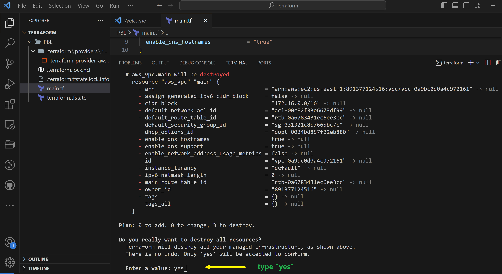
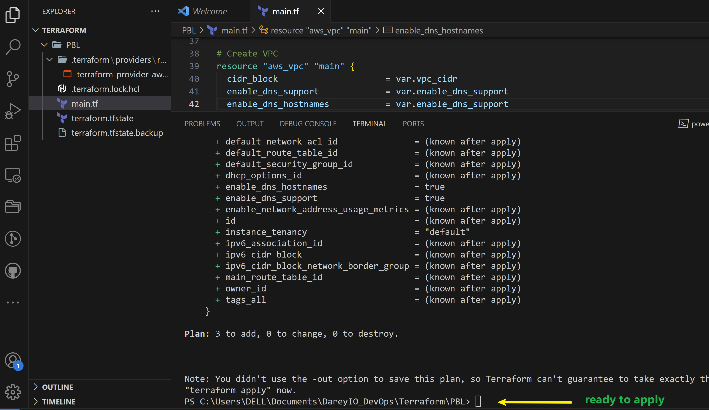
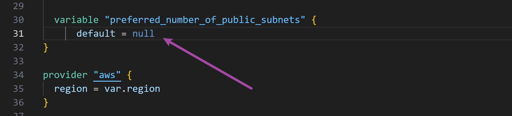

# Automating AWS Infrastructure in Code with Terraform by Itoro Ekpo  


### Automate Infrastructure with IaC using Terraform Part I
---
I have built several AWS infrastructures over the course of my previous projects. Now I will be automating the process of spinning up server infrastructure using [Terraform](https://www.terraform.io/).

We will leverage the power of *__Infrastructure-as-code__* to build similar setups.


### Pre-requisites before we begin writing Terraform code
1) Terraform course completed

2) IAM user created for programmatic access with `Administrator Access`

    

3) Access key ID and secret access key ID created and saved to notepad.

    

4) Install [Python SDK Boto3](https://boto3.amazonaws.com/v1/documentation/api/latest/guide/quickstart.html#installation) by reading the instructions. This will confirm python 3.8 or later is available, if not you have to install it. Then install `Boto3` by running the command `pip install boto3[crt]`.

    

* upgraded the pip utility since I was notified of an update.

    

5) Configure programmatic access from your workstation to connect to AWS using the access keys copied in `3` above using the command `aws configure`.

    

6) Create an [`s3 bucket`](https://docs.aws.amazon.com/AmazonS3/latest/userguide/UsingBucket.html) Amazon Simple Storage Service to store terraform state file. My bucket is named `itoro-dev-terraform-bucket`

    

7) After configuring authentication and installing `boto3`, confirm you can programatically access your AWS account by running the below commands in `>python`

    ```
    # I used the windows terminal so I typed 'py' to enter python

    > py

    # And paste in the below code

    import boto3
    s3 = boto3.resource('s3')
    for bucket in s3.buckets.all():
        print(bucket.name)
    ```

    You shall see your previously created s3 bucket name. In my case `itoro-dev-terraform-bucket`

    

## The secrets to writing quality Terraform code

The secret recipe of a successful terraform project consists of:
1) Your understanding of your goal (desired AWS infrastructure end state)
2) Your knowledge of the `IaC` technology used (in my case - Terraform)
3) Your ability to effectively use up-to-date Terraform documentation _[here](https://developer.hashicorp.com/terraform/language)_

As we proceed with this project, we will get familiar with [Terraform-specific-technology](https://developer.hashicorp.com/terraform/docs/glossary) such as:

* [Attribute](https://developer.hashicorp.com/terraform/docs/glossary#attribute)
* [Resource](https://developer.hashicorp.com/terraform/docs/glossary#resource)
* [Interpolations](https://developer.hashicorp.com/terraform/docs/glossary#interpolation)
* [Argument](https://developer.hashicorp.com/terraform/docs/glossary#argument)
* [Providers](https://developer.hashicorp.com/terraform/docs/glossary#terraform-provider)
* [Provisioners](https://developer.hashicorp.com/terraform/language/resources/provisioners/syntax)
* [Input Variables](https://developer.hashicorp.com/terraform/docs/glossary#input-variables)
* [Output Variables](https://developer.hashicorp.com/terraform/docs/glossary#output-values)
* [Module](https://developer.hashicorp.com/terraform/docs/glossary#module)
* [Data Source](https://developer.hashicorp.com/terraform/docs/glossary#data-source)
* [Local Values](https://developer.hashicorp.com/terraform/language/v1.1.x/configuration-0-11/locals)
* [Backend](https://developer.hashicorp.com/terraform/docs/glossary#backend)

Other concepts to know include `data types` like `Integer`, `Float`, `String`, `Boolean` etc.

```
Best Practices

- Ensure that every resource is tagged using multiple keyvalue pairs.
- Try to write reusable code, avoid hard coding values wherever possible.
```

## Base Infrastructure Automation (VPC | Subnets | Security Groups)

Create a directory structure `Terraform > PBL > main.tf` to the empty file `main.tf` as shown below.


Install terraform CLI by following [this instruction](https://developer.hashicorp.com/terraform/tutorials/aws-get-started/install-cli)

* Add `AWS` as a provider, and a resource to create a VPV in the `main.tf` file.

* Provider block informs Terraform that we intend to build infrastructure within AWS.

* Resource block will create a VPC.

    Paste in the below code:

    ```
    provider "aws" {
    region = "us-east-1"
    }

    # Create VPC
    resource "aws_vpc" "main" {
    cidr_block                     = "172.16.0.0/16"
    enable_dns_support             = "true"
    enable_dns_hostnames           = "true"
    #enable_classiclink             = "false"
    #enable_classiclink_dns_support = "false"
    }
    ```

    

* Download necessary plugins for Terraform to work. These plugins are used by `providers` and `provisioners`. At this stage, we only have `provider` in our `main.tf` file. So Terraform will download only plugin for AWS provider.

* Run the command `terraform init` as seen below:

    

* _Notice the new `.terraform\...` directory that is created. This is where Terraform keeps plugins. Generally, it is safe to delete this folder. It just means that you must execute `terraform init` again to download them._

* Now we can create the only resource we just defined. `aws_vpc`. But first we should check to see what terraform intends to create before we tell it to go ahead and create it. To do this run the command `terraform plan` and if you are happy with the planned changes the execute:

    > `terraform apply`

    

_**Observations:**_

1) A new file is created `terraform.tfstate`. This is how Terraform keeps itself up to date with the exact state of the infrastructure. It reads this file to know what already exists, what should be added, or destroyed based on the entire terraform code that is being developed.

2) If you also observed closely, you would realise that another file gets created during planning and apply. But this file gets deleted immediately. `terraform.tfstate.lock.info` This is what Terraform uses to track who is running its code against the infrastructure at any point in time. This is very important for teams working on the same Terraform repository at the same time. The lock prevents a user from executing Terraform configuration against the same infrastructure when another user is doing the same - it allows to avoid duplicates and conflicts.

    Its content is usually like this below. More on this later.

    ```
        {
            "ID":"e5e5ad0e-9cc5-7af1-3547-77bb3ee0958b",
            "Operation":"OperationTypePlan","Info":"",
            "Who":"dare@Dare","Version":"0.13.4",
            "Created":"2020-10-28T19:19:28.261312Z",
            "Path":"terraform.tfstate"
        }
    ```
Its a `json` format file that stores information about a user's `ID`, what operation he/she is doing, timestamp and location of the `state` file.

## Refactoring bad practice
According to our architectural design, we require 6 subnets: 2 public, 2 private for webservers and 2 private for data layer. Let us create the first 2 public subnets.

Add the below configuration to the `main.tf` file:

```
# Create public subnet1
resource "aws_subnet" "public1" {
    vpc_id                     = aws_vpc.main.id
    cidr_block                 = "172.16.0.0/24"
    map_public_ip_on_launch    = true
    availability_zone          = "us-east-1a"

}

# Create public subnet2
resource "aws_subnet" "public2" {
    vpc_id                     = aws_vpc.main.id
    cidr_block                 = "172.16.1.0/24"
    map_public_ip_on_launch    = true
    availability_zone          = "us-east-1b"
}
```


We are creating 2 subnets, therefore declaring 2 resource blocks - one for each of the subnets.

We are using the `vpc_id` argument to interpolate the value of the VPC `ID` by setting it to `aws_vpc.main.id`. This way, Terraform knows inside which VPC to create the subnet.

> run the command `terraform plan` and `terraform apply`


_**Observations:**_

* Hard coded values: Remember our best practice hint from the beginning? Both `availability_zone` and `cidr_block` arguments are hard coded. We should always endeavour to make our work dynamic.

* Multiple Resource Blocks: Notice that we have declared multiple resource block for each subnet in the code. This is bad coding practice. We need to create a single resource block that can dynamically create resources without specifying multiple blocks. Imagine if we wanted to create 10 subnets, our code would look very clumsy. We need to optimize this by introducing a `count` argument.

_Let us improve our code by refactoring it._

First, destroy the current infrastructure. Since we are still in development, this is totally fine._ Otherwise, **DO NOT DESTROY** an infrastructure that has been deployed to production. To destroy whatever has been creates run:

> `terraform destroy` and type `yes` after evaluating the plan.



## Fixing the problem by Code Refactoring

* **Fixing Hard Coded Values:** We will introduce variables, and remove hard coding.

    - Starting with the provider block, declare a variable named `region`, give it a default value and update the provider section by referring to the declared variable.

        ```
            variable "region" {
                default = "us-east-1"
            }

            provider "aws" {
                region = var.region
            }
        ```

    - Do the same to `cidr` value in the `vpc` block, and all other arguments.

        ```
            variable "region" {
                default = "us-east-1"
            }

            variable "vpc_cidr" {
                default = "172.16.0.0/16"
            }

            variable "enable_dns_support" {
                default = "true"
            }

            variable "enable_dns_hostnames" {
                default ="true" 
            }

            variable "enable_classiclink" {
                default = "false"
            }

            variable "enable_classiclink_dns_support" {
                default = "false"
            }

            provider "aws" {
            region = var.region
            }

            # Create VPC
            resource "aws_vpc" "main" {
            cidr_block                     = var.vpc_cidr
            enable_dns_support             = var.enable_dns_support 
            enable_dns_hostnames           = var.enable_dns_support
            enable_classiclink             = var.enable_classiclink
            enable_classiclink_dns_support = var.enable_classiclink

            }
        ```

* **Fixing multiple resource blocks:** This is where things become a little tricky. We are going to introduce **Loops & Data Sources**.

    Terraform has a functionality that allows us to pull data which exposes information to us. For example, every region has Availability Zones (AZ). Different regions have from 2 to 4 Availability Zones. With over 20 geographic regions and over 70 AZs served by AWS, it is impossible to keep up with the latest information by hard coding the names of AZs. Hence, we will explore the use of Terraform's Data Sources to fetch information outside of Terraform. In this case, from AWS

    Let us fetch Availability zones from AWS, and replace the hard coded value in the subnet's `availability_zone` section.

    ```
    # Get list of availability zones

    data "aws_availability_zones" "available" {
        state = "available"
    }
    ```

    To make use of this new `data` resource, we will need to introduce a `count` argument in the subnet block. Something like this below:

    ```
    # Create public subnet1
    resource "aws_subnet" "public" { 
        count                   = 2
        vpc_id                  = aws_vpc.main.id
        cidr_block              = "172.16.1.0/24"
        map_public_ip_on_launch = true
        availability_zone       = data.aws_availability_zones.available.names[count.index]
    }
    ```

    - The `count` tells us that we need 2 subnets. Therefore, Terraform will invoke a loop to create 2 subnets.

    - The `data` resource will return a list object that contains a list of AZ's. Internally, Terraform will receive the data like this: 

        `["eu-central-1a", "eu-central-1b"]`

    - Each of them is an index, the first one is index `0`, while the other is index `1`. If the data returned had more than 2 records, then the index numbers would continue to increment.

        Therefore, each time Terraform goes into a loop to create a subnet, it must be created in the retrieved AZ from the list. Each loop will need the index number to determine what AZ the subnet will be created. That is why we have `data.aws_availability_zones.available.names[count. index]` as the value for `availability_zone`. When the first loop runs, the first index will be `0`, therefore the AZ will be `eu-central-1a`. The pattern will repeat for the second loop.

        But we still have a problem. If we run Terraform with this configuration, it may succeed for the first time, but by the time it goes into the second loop, it will fail because we still have `cidr_block` hard coded. The same `cidr_block` cannot be created twice within the same VPC. So, we have a little more work to do.

* Let's make `cidr_block` dynamic.

    We will introduce a function `cidrsubnet()` to make this happen. It accepts 3 parameters. Let us use it first by updating the configuration, then we will explore its internals.

    ```
    # Create public subnet1
    resource "aws_subnet" "public" { 
        count                   = 2
        vpc_id                  = aws_vpc.main.id
        cidr_block              = cidrsubnet(var.vpc_cidr, 4 , count.index)
        map_public_ip_on_launch = true
        availability_zone       = data.aws_availability_zones.available.names[count.index]
    }
    ```

    A closer look at `cidrsubnet` - this function works like an algorithm to dynamically create a subnet CIDR per AZ. Regardless of the number of subnets created, it takes care of the cidr value per subnet. It's parameters are `cidrsubnet(prefix, newbits, netnum)`.

    - The `prefix` parameter must be given in CIDR notation, same as for the VPC.
    - The `newbits` parameter is the number of additional bits with which to extend the prefix. For example, if given a prefix ending with /16 and a newbits value of 4, the resulting subnet address will have length /20.
    - The `netnum` parameter is a whole number that can be represented as a binary integer with no more than `newbits` binary digits, which will be used to populate the additional bits added to the prefix.

* We can experiment how this works by entering the `terraform console` and keep changing the values to see the output.
    - On the terminal, run `terraform console`
    - type `cidrsubnet("172.16.0.0/16", 4, 0)`
    - Hit Enter
    - View the output
    - Keep changing the numbers and see what happens.
    - To exit the console, type `exit`

    

**The final problem to solve is removing the hard coded `count` value.**

If we cannot hard code a value we want, then we will need a way to dynamically provide the value based on some input. Since the `data` resource returns all the AZs within a region, it makes sense to count the number of AZs returned and pass that number to the `count` argument.

To do this, we can introduce `length()` function, which basically determines the length of a given list, map or string.

Since `data.aws_availability_zones.available.names[count.index]` returns a list like `["eu-central-1a", "eu-central-1b", "eu-central-1c"]`

Open up `terraform console` and try it.


Now we can update the public subnet block like this:

```
# Create public subnet1
resource "aws_subnet" "public" { 
    count                   = length(data.aws_availability_zones.available.names)
    vpc_id                  = aws_vpc.main.id
    cidr_block              = cidrsubnet(var.vpc_cidr, 4 , count.index)
    map_public_ip_on_launch = true
    availability_zone       = data.aws_availability_zones.available.names[count.index]
}
```

_**Observations:**_

* What we have now is sufficient to create the subnet resource required but if you observe, it does not satisfy our business requirement of just `2` subnets. The `length` function will return number 3 to the `count` argument, but what we actually need is `2`.

Let us fix this:

* Declare a variable to store the desired number of public subnets and set the default value.

    ```
    variable "preferred_number_of_public_subnets" {
        default = 2
    }
    ```
* Next, update the `count` argument with a condition. Terraform needs to check first if there is a desired number of subnets. Otherwise, use the data returned by the `length` function. See how that is presented below.

```
# Create public subnets
resource "aws_subnet" "public" {
  count  = var.preferred_number_of_public_subnets == null ? length(data.aws_availability_zones.available.names) : var.preferred_number_of_public_subnets   
  vpc_id = aws_vpc.main.id
  cidr_block              = cidrsubnet(var.vpc_cidr, 4 , count.index)
  map_public_ip_on_launch = true
  availability_zone       = data.aws_availability_zones.available.names[count.index]
}
```
Let us break down the above code:

* The first part `var.preferred_number_of_public_subnets == null` checks if the value of the variable is set to `null` or has some value defined.

* The second part `?` and `length(data.aws_availability_zones.available.names)` means, if the first part is true, then use this. In otherwords, if preferred number of public subnets is `null` _(Or not known)_ then set the value to the data returned by `length` function.

* The third part `:` and `var.preferred_number_of_public_subnets` means, if the first condition is false, i.e preferred number of public subnets is `not null` then set the value to whatever is defined in `var.preferred_number_of_public_subnets`.

Now the entire configuration should now look like this below:

```
# Get list of availability zones
data "aws_availability_zones" "available" {
state = "available"
}

variable "region" {
    default = "eu-central-1"
}

variable "vpc_cidr" {
    default = "172.16.0.0/16"
}

variable "enable_dns_support" {
    default = "true"
}

variable "enable_dns_hostnames" {
    default ="true" 
}

variable "enable_classiclink" {
    default = "false"
}

variable "enable_classiclink_dns_support" {
    default = "false"
}

  variable "preferred_number_of_public_subnets" {
      default = 2
}

provider "aws" {
  region = var.region
}

# Create VPC
resource "aws_vpc" "main" {
  cidr_block                     = var.vpc_cidr
  enable_dns_support             = var.enable_dns_support 
  enable_dns_hostnames           = var.enable_dns_support
  enable_classiclink             = var.enable_classiclink
  enable_classiclink_dns_support = var.enable_classiclink
}


# Create public subnets
resource "aws_subnet" "public" {
  count  = var.preferred_number_of_public_subnets == null ? length(data.aws_availability_zones.available.names) : var.preferred_number_of_public_subnets   
  vpc_id = aws_vpc.main.id
  cidr_block              = cidrsubnet(var.vpc_cidr, 4 , count.index)
  map_public_ip_on_launch = true
  availability_zone       = data.aws_availability_zones.available.names[count.index]
}
```


See the result of `terraform plan` below



And after executing `terraform apply` we can see the below screenshot of the created VPC


And `2` subnets created shown below:


**Experiment:** We can change the value of `preferred_number_of_public_subnets` variable to `null` and notice how many subnets get created.

* First I will destroy the resources built by executing `terraform destroy`

    

* Change the value of the variable `preferred_number_of_public_subnets` to `null`

    

* Rebuild the infrastructure again by executing `terraform apply`

    

* You can see new VPC created with `ID` of `vpc-0227afe8d0ccacc62`. Now let us check how many subnets have been created this time with a `null` value given to the variable `preferred_number_of_public_subnets`.

    

* As we can see from the above snapshot, `6` subnets have been created by discarding the `null` value variable and using the value `length(data.aws_availability_zones.available.names)` variable.

## Variables & tfvars: Introducing variables.tf & terraform.tfvars
Instead of having a long list of variables in main.tf, we can actually make our code a lot more readable and better structured by moving out some parts of the configuration content to other files.

* We will put all variable declarations in a separate file
* And provide non default values to each of them.

1) Create a new file and name it `variables.tf`

2) Copy all the variable declarations into the new file.

3) Create another file, name it `terraform.tfvars`

4) Set values for each of the variables.

**The resulting code will look like this now:**

### main.tf
---

```
# Get list of availability zones
data "aws_availability_zones" "available" {
state = "available"
}

provider "aws" {
  region = var.region
}

# Create VPC
resource "aws_vpc" "main" {
  cidr_block                     = var.vpc_cidr
  enable_dns_support             = var.enable_dns_support 
  enable_dns_hostnames           = var.enable_dns_support
}

# Create public subnets
resource "aws_subnet" "public" {
  count  = var.preferred_number_of_public_subnets == null ? length(data.aws_availability_zones.available.names) : var.preferred_number_of_public_subnets   
  vpc_id = aws_vpc.main.id
  cidr_block              = cidrsubnet(var.vpc_cidr, 4 , count.index)
  map_public_ip_on_launch = true
  availability_zone       = data.aws_availability_zones.available.names[count.index]
}
```
### variables.tf
---

```
variable "region" {
    default = "us-east-1"
}

variable "vpc_cidr" {
    default = "172.16.0.0/16"
}

variable "enable_dns_support" {
    default = "true"
}

variable "enable_dns_hostnames" {
    default ="true" 
}

variable "enable_classiclink" {
    default = "false"
}

variable "enable_classiclink_dns_support" {
    default = "false"
}

variable "preferred_number_of_public_subnets" {
    default = null
}
```

### terraform.tfvars
---

```
region = "us-east-1"

vpc_cidr = "172.16.0.0/16" 

enable_dns_support = "true" 

enable_dns_hostnames = "true"  

enable_classiclink = "false" 

enable_classiclink_dns_support = "false" 

preferred_number_of_public_subnets = 2
```

Also the PBL folder structure should look like the below:
---

```
└── PBL
    ├── main.tf
    ├── terraform.tfstate
    ├── terraform.tfstate.backup
    ├── terraform.tfvars
    └── variables.tf
```

See screenshot of my implementation below:


