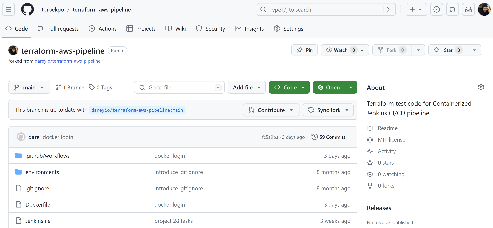
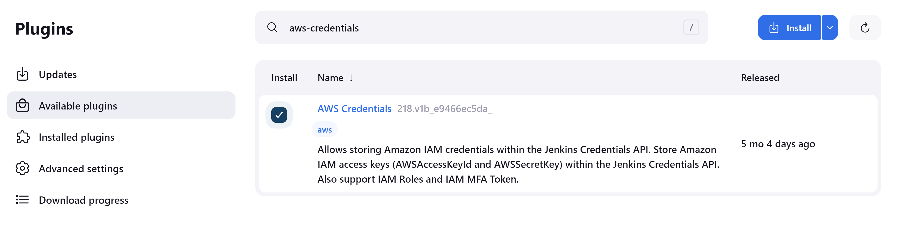
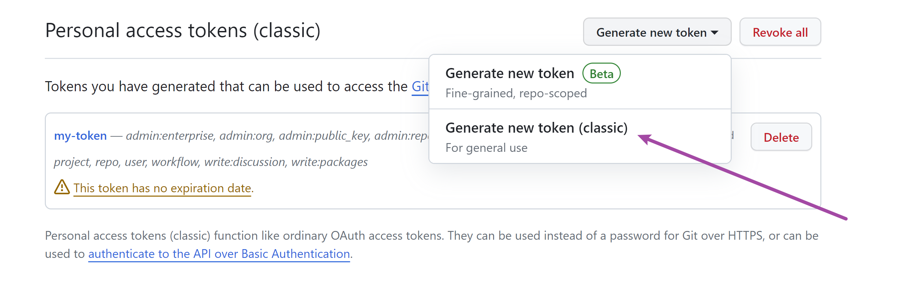
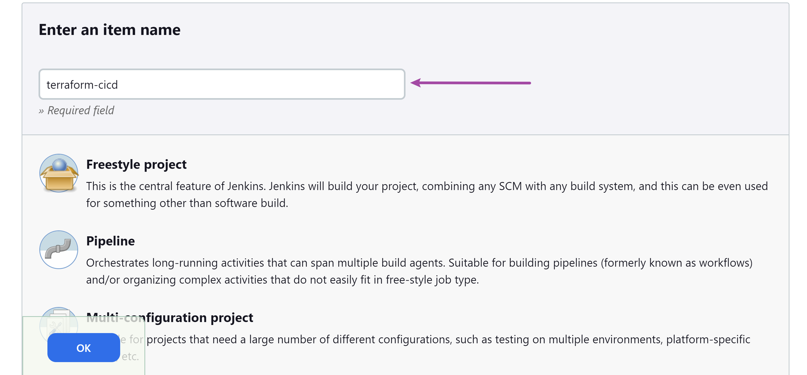

# Implementing a Jenkins CI/CD Pipeline for Terraform


In today's rapidly evolving IT landscape, efficient and reliable deployment of infrastructure is paramount. [Continuous Integration and Continuous Deployment (CI/CD)](https://about.gitlab.com/topics/ci-cd/) have emerged as indispensable practices, fostering automation and agility in the software development lifecycle. In this project, we will explore the powerful combination of Terraform, a leading Infrastructure as Code (IaC) tool, and Jenkins, a widely used automation server, to streamline and enhance infrastructure deployment workflows.

**Overview**
---
In the journey ahead, we will delve into the intricacies of building a robust CI/CD pipeline specifically tailored for Terraform projects. By automating the building, testing, and deployment of infrastructure changes, these pipelines enhance speed, reliability, and consistency across environments. The use of Infrastructure as Code (laC) with Terraform ensures reproducibility and scalability, while Jenkins facilitates collaborative development, visibility, and continuous integration and deployment as you will see in this project. This approach not only reduces time-to-market but also promotes resource efficiency, cost optimization, and compliance with security standards. Overall, CI/CD pipelines with Terraform and Jenkins empower organizations to adapt quickly to changing business requirements, fostering a culture of automation and continuous improvement in the dynamic landscape of modern software development and operations.

**Environment Setup**
---
Let's start by setting up a Jenkins server running in a docker container. We will create a Dockerfile to define the configuration for our Jenkins server. This Dockerfile will include the necessary dependencies and configurations to run Jenkins seamlessly, and also to run terraform cli.

_Note: Jenkins comes with a docker image that can be used out of the box to run a container with all the relevant dependencies for Jenkins. But because we have unique requirements to run terraform, we need to find a way to extend the readily available jenkins image._

Extending this image means we have to write our own dockerfile and include all the other stuff we need. Let's go through it quickly.

1) Create a directory and name it `terraform-with-cicd`

2) Create a file and name it `Dockerfile`

3) Add the below code in the dockerfile.

    ```
    # Use the official Jenkins base image
    FROM jenkins/jenkins:lts

    # Switch to the root user to install additional packages
    USER root

    # Install necessary tools and dependencies (e.g., Git, unzip, wget, software-properties-common)
    RUN apt-get update && apt-get install -y \
        git \
        unzip \
        wget \
        software-properties-common \
        && rm -rf /var/lib/apt/lists/*

    # Install Terraform
    RUN apt-get update && apt-get install -y gnupg software-properties-common wget \
        && wget -O- https://apt.releases.hashicorp.com/gpg | gpg --dearmor | tee /usr/share/keyrings/hashicorp-archive-keyring.gpg \
        && gpg --no-default-keyring --keyring /usr/share/keyrings/hashicorp-archive-keyring.gpg --fingerprint \
        && echo "deb [signed-by=/usr/share/keyrings/hashicorp-archive-keyring.gpg] https://apt.releases.hashicorp.com $(lsb_release -cs) main" | tee /etc/apt/sources.list.d/hashicorp.list \
        && apt-get update && apt-get install -y terraform \
        && rm -rf /var/lib/apt/lists/*

    # Set the working directory
    WORKDIR /app

    # Print Terraform version to verify installation
    RUN terraform --version

    # Switch back to the Jenkins user
    USER jenkins
    ```

    

Explaining the dockerfile
---
Before we proceed to building our custom jenkins image for terraform, we will go through this Dockfile to understand what is going on step by step.

1) Use the official Jenkins base image.

    `FROM jenkins/jenkins:lts`

    This line specifies the base image for your Dockerfile. In this case, it's using the official Jenkins LTS (Long Term Support) image as a starting point.

2) Switch to the root user to install additional packages

    `USER root`

    This command switches to the root user within the Docker image. This is done to perform actions that require elevated permissions, such as installing packages.

3) Install necessary tools and dependencies (e.g., Git, unzip wget, software-properties-common)

    ```
    RUN apt-get update && apt-get install -y \
    git \
    unzip \
    wget \
    software-properties-common \
    && rm -rf /var/lib/apt/lists/*
    ```

    This section installs various tools and dependencies needed for the image. The `apt-get update` command refreshes the package list, and `apt-get install` installs the specified packages `git`, `unzip`, `wget`, `software-properties-common`. The `&&` is used to chain commands and `rm -rf /var/lib/apt/lists/*` removes unnecessary package lists, helping to reduce the size of the Docker image.

4) Install Terraform

    ```
    RUN apt-get update && apt-get install -y gnupg software-properties-common wget \
        && wget -O- https://apt.releases.hashicorp.com/gpg | gpg --dearmor | tee /usr/share/keyrings/hashicorp-archive-keyring.gpg \
        && gpg --no-default-keyring --keyring /usr/share/keyrings/hashicorp-archive-keyring.gpg --fingerprint \
        && echo "deb [signed-by=/usr/share/keyrings/hashicorp-archive-keyring.gpg] https://apt.releases.hashicorp.com $(lsb_release -cs) main" | tee /etc/apt/sources.list.d/hashicorp.list \
        && apt-get update && apt-get install -y terraform \
        && rm -rf /var/lib/apt/lists/*
    ```

    The above block installs Terraform. It follows similar steps as before: updating the package list, installing dependencies, adding HashiCorp's GPG key, configuring the repository, updating again and finally installing Terraform. Again, it includes cleaning up unnecessary package lists.

    **A quick note on GPG Key:** GPG (GNU Privacy Guard) is a free and open-source software for encryptingand signing data. In the context of software distribution, GPG keys are used to verify the integrity and authenticity of packages.

    If you really want to get into the details of what the block of code is doing you can follow below:

    * Downloading HashiCorp's GPG Key:
        `wget -O- https://apt.releases.hashicorp.com/gpg | gpg --dearmor | tee /usr/share/keyrings/hashicorp-archive-keyring.gpg`

        This command downloads HashiCorp's GPG key from `https://apt.releases.hashicorp.com/gpg`

        `gpg --dearmor` converts the key into a format that can be easily used by tools.

        `tee /usr/share/keyrings/hashicorp-archive-keyring.gpg` writes the key to the specified file with `.gpg` extension.

    * Displaying the GPG key fingerprint:

        `gpg --no-default-keyring --keyring /usr/share/keyrings/hashicorp-archive-keyring.gpg --fingerprint`

        This command displays the fingerprint of the GPG key. The fingerprint is a unique identifier for the key and is used to verify it's authenticity.

    * Configuring the repository with the GPG key:

       `echo "deb [signed-by=/usr/share/keyrings/hashicorp-archive-keyring.gpg] https://apt.releases.hashicorp.com $(lsb_release -cs) main" | tee /etc/apt/sources.list.d/hashicorp.list`

       This command adds HashiCorp's repository configuration to the system's package manager (apt in this case).

       It specifies the GPG key to be used for package verification.

    * Updating and installing Terraform:

        `RUN apt-get update && apt-get install -y terraform && rm -rf /var/lib/apt/lists/*`

        These commands update the package list, install Terraform and then remove unnecessary package lists to reduce the size of the Docker image.

5) Set the working directory `WORKDIR /app`

    This line sets the working directory for subsequent commands to `/app`. This is where you'll be when you enter the container.

6) Print Terraform version to verify installation `RUN terraform --version`

7) Switch back to the Jenkins user `USER jenkins`. This switches back to the jenkins user, returning to a lower privilege level. This is a good security practice to minimize the risk of running processes as the root user within the container.

Building and running the docker imago
---
Let us remember our mission is to have a docker container running Jenkins, but also have terraform installed. Now let us build the docker image and run it for further configuration.

Make sure that you are inside the folder containing the `Dockerfile`. This is generally referred to as the `Docker Build Context`. The build context is the set of files located in the specified directory or path when you build a Docker image using `docker build command`. The content of the build context is sent to the Docker daemon during the build process and it serves as the source for building the Docker image.

1) Build the custom jenkins image `docker build -t jenkins-server .`

    Notice the ` . ` at the end. That is the `docker build context`, meaning the current directory where the Dockerfile is.

2) Run the image into a docker container `docker run -d -p 8080:8080 --name jenkins-server jenkins-server`

    This should output a hash data like `800f8f48466b3419d7cbf37908b12f146120b31260147bdd3b433d23e60f976b`

    

    **Let's break down the command for clear understanding:** 

    `docker run`: This is the command used to run a Docker container.

    `-d`: This flag stands for "detach". It runs the container in the background, allowing you to continue using the terminal for other commands.

    `-p 8080:8080`: This flag maps the port `8080` from the host to the port `8080` inside the container. It means that you can access the application running inside the container on your host machine's port 8080. Simply go to the browser and put in there `localhost:8080` to display the application.

    `--name jenkins-server`: This flag assigns a name to the container. In this case, the name is set to `jenkins-server`.

    `jenkins-server`: This is the name of the Docker image that we want to run. It refers to the image named `jenkins-server` that was built earlier when we ran `docker build` command.

3) Check that the container is running: `docker ps`. You should have a result similar to the one shown below.

    ```
    CONTAINER ID   IMAGE            COMMAND                  CREATED              STATUS              PORTS                               NAMES
    800f8f48466b   jenkins-server   "/usr/bin/tini -- /u…"   About a minute ago   Up About a minute   0.0.0.0:8080->8080/tcp, 50000/tcp   jenkins-server
    ```

    

4) Access the Jenkins server from the web browser on `localhost:8080`. In my case I am using an EC2 instance so I access it using the public ip address `54.209.204.222:8080`. 

    

    _Note: Remember to open port 8080 in the security group if you are implementing using an EC2 instance._

5) Access the Jenkins Server directly inside the container `docker exec -it  8b5955dca292  /bin/bash`

    

    **Let's breat down the command:**

    `docker exec`: This command is used to execute a command in a running Docker container.

    `-it`: These flags are often used together. `-i` stands for "interactive" which allows you to interact with the container. `-t` allocates a pseudo-TTY or terminal enabling a more interactive session as seen in the screenshot above.

    `8b5955dca292`: This is the Container ID or Container Name. It uniquely identifies the running container. In this case, you replace it with the actual ID or name of your container which you can retrieve from the output of the command `docker ps` shown above.

    `/bin/bash`: This is the command that you want to execute inside the container. In this example, It is launching an interactive bash shell (bash) within the specified container.

    You will notice that once you get into the container, the directory you get to find yourself is the `/app` which is from the `WORKDIR` directive inside the `Dockerfile`.

6) Retrieve the initial Jenkins admin password.

    

    

7) Installing Jenkins Plugins

    

8) Create first admin user and access Jenkins

    

    

    


## Setting Up Jenkins for Terraform CI/CD

**Jenkins Pipelines for Terraform**

The first question that may come to your mind is "why do we need to have CI/CD for our infrastructure?", "I thought CI/CD is for the software code that developers write?" - Well you are correct if you have thought of those questions. But the infrastructure in which the software is being operated can also be treated in similar manner, especially now that we can have the entire infrastructure as code through ["Terraform"](https://www.terraform.io/use-cases/infrastructure-as-code).

Treating our infrastructure the same way we would treat our software presents a set of benefits such as:

1. Automating the release of features into our cloud infrastructure

2. Experiencing a fast feedback loop for infrastructure changes

3. Continous testing of our infrastructure

4. Collaboration and Team Productivity

5. Rapid Release Cycle and

6. Risk Reduction in production

Set up Git repository with Terraform code
---
The use case we will satisfy is that:

* Your terraform code has an existing set of resources that it creates in your preferred cloud provider.

* You as a DevOps engineer intend to create an additional resource by updating the code base with the new resource that needs to be created.

Therefore, we need to have an existing terraform code.

1) Fork the github repository from https://github.com/darey-devops/terraform-aws-pipeline.git.

    

2) The `provider.tf` file has an S3 backend configuration. We need to create our own bucket and update the code.

    * Create an S3 bucket in your AWS account.

    

    * Update the bucket name from the backend configuration.

    

3) Push your latest changes to Github

    

4) Run terraform init, plan and apply and confirm everything works fine.

    _terraform init_

    

    

    _terraform plan_

    

    _terraform apply_

    

## Connect the Github repository to Jenkins

1) Install Jenkins Github Plugin:

    

    If everything is successful, then click to restart Jenkins. Note that you may need to refresh your browser if the restart takes a long time. If this happens your docker container may exit and Jenkins will no longer load in your browser.

    Got to your terminal and check the status of the container `docker ps -a`

    If the status says `Exited` then take the container ID and simply restart `docker restart 8b5955dca292`

    Check the status again and confirm the container is back up. You can now go back to your browser and access Jenkins.

2) Configure Github credentials in Jenkins. This will allow Jenkins to authenticate to the repository.

3) Install Terraform and AWS credential plugin.

    * Terraform Plugin:

    The Terraform plugin for Jenkins enables seamless integration of Terraform into Jenkins pipelines. With this plugin, you can manage the installation of mutliple terraform versions, update terraform modules and do much more as documented in the official site https://plugins.jenkins.io/terraform/

    

    * AWS Credentials Plugin:

    The AWS Credentials plugin is essential for securely managing and utilizing AWS (Amazon Web Services) credentials within Jenkins. This plugin facilitates the secure storage and retrieval of AWS access and secret keys, ensuring that Jenkins jobs and pipelines can securely interact with AWS services during the execution of various tasks and deployments, including terraform runs. You can read more about the plugin here https://plugins.jenkins.io/aws-credentials/

    

## Configure Github Credentials in Jenkins
Jenkins needs to know how to connect to Github, otherwise i real world cases where repositories are private, it won't know how to access the repository. Hence, the first thing we need to do is to store the github credentials in Jenkins.


_In Github, navigate to your profile -> Click on "Settings" -> then scroll down to -> "Developer Settings" -> click on "Personal access tokens" and click on "Tokens (classic)"_


_Generate an access token_




_Scroll down and click on **[Generate token]**_


_Copy the access token and save in a notepad for use later_


_In Jenkins, navigate to "Manage Jenkins" -> Click on "Credentials"_


_Click on the arrow next to "global" and select "Add credentials"_


_Select username and password. Use the Access token generated earlier as your password and specify anything descriptive as your ID. In the credentials section, you will be able to see the created credential_


_Create a second credential for AWS secret and access key. If you have installed the AWS credentials plugin, you will see the "AWS Credentials" kind as shown below. Simply add the new AWS secret and access key generated from AWS console._


## Set Up a Jenkins Multibranch Pipeline

_From the Jenkins dashboard, click on "New Item"_



_Give it a name and description_


_Select the type of source of the code and the Jenkinsfile_ `Github source`

_Select the credentials to be used to connect to Github from Jenkins_

_Add the repository URL_


_Leave everything at default and hit save_

_You will immediately see the scanning of the repository for branches and the Jenkinsfile_


_The terraform-cicd pipeline and main branch scanned_


_Pipeline run and console output_

_Click on "Build now" for a second run and check the console output_

_Show the plan and decide to proceed to apply or abort_

## The Jenkinsfile
The Jenkinsfile pipeline automates the process of code checkout, planning infrastructure changes with Terraform, and conditionally applying those changes. It's designed to ensure that changes to infrastructure (managed by Terraform) are reviewed and applied systematically, with an additional manual check before applying changes to critical environments like production.

Let's break down each section.

**Pipeline**

`pipeline { ... }`: This is the wrapper for the entire pipeline script. Everything that defines what the pipeline does is included within these braces.

**Agent**

`agent any`: THis line specifies that the pipeline can run on any available agent. In Jenkins, an agent is a worker that executes the job. 'Any' means it doesn't require a specific agent configuration.

**Environment**

`environment { ... }`: This section is used to define environment variables that are applicable to all stages of the pipeline

`TF_CLI_ARGS = '-no-color'`: Sets an environment variable for Terraform. It tells Terraform to not colorize it's output, which can be used for logging and readability in CI/CD environments. Feel free to change this vaalue as you wish.

**Stages**

`stages { ... }`: This block defines the various stages of the pipeline. Each stage in the pipeline process.

**Stage: Checkout**

`stage('Checkout') { ... }`: This is the first stage, named `Checkout`. It's typically used to checkout source code from a version control system.

`checkout scm`: Checks out source code from the Source Control Management (SCM) system configured for the job (In this case, _**Git**_).

**Stage: Terraform Plan**

`stage('Terraform Plan') { ... }`: This stage is responsible for running a Terraform plan.

`withCredentials([aws(...)]) { ... }`: This block securely injects AWS credentials into the environment.

`sh 'terraform init'`: Initializes Terraform in the current directory.

`sh 'terraform plan -out=tfplan'`: Runs Terraform plan and outputs the plan to a file named `tfplan`.

**Stage: Terraform apply**

`stage('terraform apply') { ... }`: This stage applies the changes from Terraform plan to make infrastructure changes.

`when { ... }`: This block sets conditions for executing this stage. 

`expression { env.BRANCH_NAME == 'main' }`: This condition checks if the pipeline is running on the `main` branch.

`expression { ... }`: Checks if the build was triggered by a user action.

`input message: 'Do you want to apply changes?', ok: 'Yes'`: A manual intervention step asking for confirmation before proceeding. If `yes` is clicked, it runs the `terraform init & apply` otherwise, the pipeline is aborted.

## Task: Enhance and Extend the Pipeline
Update the existing pipeline script to include additional stages and improve the existing ones. This will encompass adding new functionality, improving code clarity and ensuring best practices in CI/CD pipelines.

1) Create a new branch from the main branch and scan the Jenkins pipeline so that the new branch can be discovered.

2) In the new branch, Correct and Enhance the 'Terraform Apply' Stage. It mistakenly contains a `sh 'terraform aply -out=tfplan'` command. Correct it to `sh 'terraform apply tfplan'`.

3) Add logging to track the progress of the pipeline within both Terraform plan & apply. Use the `echo` command to print messages before and after each execution so that in the console output everyone can understand what is happening at each stage.

4) Introduce a new stage in the pipeline script to validate the Terraform configurations using `terraform validate`. Add the _**'Lint Code'**_ Stage, Place this stage before the `terraform plan` stage. The purpose of this stage is to validate the syntax, consistency and correctness of Terraform configuration files in the directory it is run. It does not access any remote sevices.

5) Introduce a cleanup stage. Add a final stage named cleanup that runs regardless of whether previous stages succeeded or failed (use the post-directive). In this stage, include commands to clean up any temporary files or state that the pipeline may have created.

    Kind find the link to the documentation on Jenkins [Post Directive](https://www.jenkins.io/doc/book/pipeline/syntax/#post).

6) Implement Error Handling. Add error handling to the pipeline. For instance, if 'Terraform Apply' fails, the pipeline should handle this gracefully, perhaps by sending a notification or logging detailed error messages.

7) Document the Pipeline. Add comments to the pipeline script explaining each stage and important commands. This will make the pipeline more maintainable and understandable.
