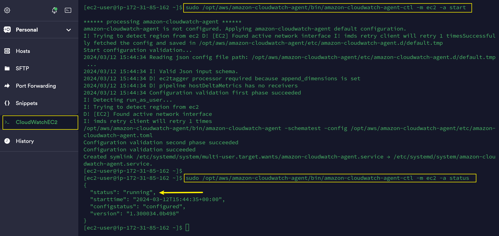

# Monitoring Infrastructure in AWS (CloudWatch | CloudTrail) By Itoro Ekpo


Imaging just launching your startup's new application on Amazon Web Service [AWS](https://aws.amazon.com/). Excitedly you see traffic start to flow in as users begin to interact with your service. However, with success comes responsibility. As your application grows, so does the complexity of managing it's underlying infrastructure. How do you that everything continues to run smoothly? How do you detect and address issues before they impact your users? This is where monitoring your infrastructure becomes crucial.

## AWS CloudWatch and CloudTrail

AWS CloudWatch is a monitoring and observability service provided by Amazon Web Service [AWS](https://aws.amazon.com/). It allows users to collect and track metrics, monitor logs, set alarms, and automatically react to changes in AWS resources and applications running on the AWS infrastructure. CloudWatch provides insights into the performance, health, and operational status of AWS resources and applications, helping users to troubleshoot issues, optimize resource utilization and ensure the reliability of their systems.

AWS CloudTrail on the other hand is also a service provided by Amazon Web Services (AWS) that enables governance, compliance, operational auditing, and risk auditing of your AWS account. CloudTrail records and logs all API activity in your AWS account, providing a comprehensive trail of events that can be used for security analysis, resource change tracking, troubleshooting, and compliance auditing.

## CloudWatch Metrics and Alarms

Amazon CloudWatch Metrics and Alarms are essential components of the Amazon CloudWatch service, which provides monitoring and observability capabilities for AWS resources and applications. Let's delve into each of these components:

## CloudWatch Metrics

CloudWatch Metrics are data points representing the behavior of AWS resources and applications over time. These metrics can be collected from various AWS services such as Amazon EC2, Amazon RDS, Amazon S3, AWS Lambda, and many others. Metrics provide insights into the performance, health, and operational status of these resources, allowing users to monitor and analyze their behavior.


**Key aspects of CloudWatch Metrics include:**

_**Default and Custom Metrics:** AWS services automatically publish default metrics to CloudWatch, such as CPU utilization, network traffic, and disk I/O for EC2 instances. Additionally, users can create custom metrics to monitor specific aspects of their applications or services._

_**Namespace and Dimensions:** Metrics are organized into namespaces, which categorize related metrics together. Within each namespace, metrics can have dimensions that further specify the resource or aspect being monitored. For example, an EC2 instance metric might have dimensions such as Instanceld or InstanceType._

_**Timestamps and Units:** Each metric data point includes a timestamp indicating when the measurement was taken, as well as a unit specifying the measurement's scale (e.g., bytes, percentage, seconds)._


**Retention and Granularity:** CloudWatch retains metric data for different periods depending on the data's age and granularity. Users can specify the granularity of their metric data, ranging from one-minute to one-day intervals.


## CloudWatch Alarms

CloudWatch Alarms allow users to define thresholds on CloudWatch Metrics and trigger actions when these thresholds are breached. Alarms are used to proactively monitor the health and performance of AWS resources and applications, enabling users to respond promptly to changes in their environment.

**Key aspects of CloudWatch Alarms include:**

_**Thresholds and Actions:** Users can set thresholds on CloudWatch Metrics, specifying conditions that, when met or exceeded, trigger alarm states. When an alarm enters an alarm state, users can configure actions such as sending notifications via Amazon SNS, executing AWS Lambda functions, or auto-scaling resources._

_**Alarm States:** CloudWatch Alarms have three possible states: OK, INSUFFICIENT_DATA, and ALARM. The OK state indicates that the metric is within the defined threshold, while the ALARM state indicates that the threshold has been breached. The INSUFFICIENT_DATA state occurs when there is not enough data to evaluate the alarm._

_**Alarm History:** CloudWatch maintains a history of alarm state changes, allowing users to track when alarms transition between states and investigate the circumstances surrounding each state change._

_**Configuration and Management:** Users can create, modify, and delete alarms through the CloudWatch Management Console, AWS CLI, or SDKs. Alarms can be managed individually or as part of larger monitoring configurations, such as CloudFormation templates or AWS Auto Scaling policies._

## Monitoring AWS EC2 using CloudWatch
Now that we have an idea of what AWS CloudWatch and CloudTrail is all about, let us launch an EC2 instance and monitor it.

**Step 1:** Create an [IAM Role](https://docs.aws.amazon.com/IAM/latest/UserGuide/id_roles.html) With CloudWatchFullAccess and SSMFullAccess

1. Navigate to the IAM console.

2. In the IAM Console navigation click on roles.

    

3. Follow the image to create a role with `CloudWatchFullAccess` and `SSMFullAccess` policy.

    

**Step 2:** Create A Parameter In System Manager

Now that we have created an IAM role, we need to create a parameter in the system manager console. By doing this, we will be able to define the metrics we want to monitor for our EC2 instance.

1. Navigate to the AWS System Manager Console.

2. In the AWS System Manager navigate manu, select parameter store.

    

3. Create a new parameter and paste the code snippet below:

    ```
    {
        "metrics": {
            "append_dimensions": {
                "InstanceId": "${aws:InstanceId}"
            },
            "metrics_collected": {
                "mem": {
                    "measurement": [
                        "mem_used_percent"
                    ],
                    "metrics_collection_interval": 180
                },
                "disk": {
                    "measurement": [
                        "disk_used_percent"
                    ],
                    "metrics_collection_interval": 180
                }
            }
        }
    }
    ```

    

    

    

The parameters above are a configuration file for the CloudWatch agent, which defines the metrics that will be collected from your EC2 instance and sent to CloudWatch.

1. `metrics`: This is the top-level key in the configuration file, indicating that it contains the definitions for the metrics to be collected.

2. `append_dimensions`: This section specifies dimensions to be appended to all collected metrics. Dimensions are key-value pairs that help identify the source of the data in CloudWatch. In this case, the dimension      _**Instanceld**_ is appended, and its value is populated dynamically with the instance ID of the EC2 instance where the CloudWatch agent is installed.

    * `"InstanceId": "${aws: InstanceId}"`: This line specifies that the value of the _**Instanceld**_ dimension should be dynamically populated with the instance ID of the EC2 instance.

3. `metrics_collected`: This section defines the specific metrics to be collected from the EC2 instance.

    * `mem`: This subsection specifies memory-related metrics to be collected.

        * `measurement`: This is an array of specific memory metrics to collect. In this case, only `"mem_used_percent"` is specified, which represents the percentage of memory used on the instance.

        * `metrics_collection_interval`: This parameter specifies how frequently (in seconds) the metrics should be collected. Here, memory metrics will be collected every 60 seconds.

    * `disk`: This subsection specifies disk-related metrics to be collected.

        * `measurement`: This is an array of specific disk metrics to collect. Only `"disk_used_percent"` is specified, representing the percentage of disk space used on the instance. 

        * `"metrics_collection_interval"`: Similar to the memory section, this parameter specifies how frequently disk metrics will be collected, which is every 60 seconds.

## Create an EC2 Instance and Attach the role created in Step 1

Now that we have created an IAM Role and also created a parameter in the Account System Manager Console, let's create an EC2 instance for that roles we created earlier. But note that SSM will have access to the parameter we created and by attaching the role to the EC2 instance, EC2 will also have access to the parameters.

1. Navigate to the EC2 console, select instances. Click on launch instance on the top right

    

2. Now we will need to launch an `Amazon linux 2 instance` and attach the role we created in step 1. Follow the images below to attach IAM role to your instance.

    

    

    

3. Install CloudWatch agent. Create a filename `script.sh` and paste the shell script below:

* Create a file: `sudo nano script.sh`

* Paste the shell script below:

    ```
    #!/bin/bash
    wget https://s3.amazonaws.com/amazoncloudwatch-agent/linux/amd64/latest/AmazonCloudWatchAgent.zip
    unzip AmazonCloudWatchAgent.zip
    sudo ./install.sh
    sudo /opt/aws/amazon-cloudwatch-agent/bin/amazon-cloudwatch-agent-ctl -a fetch-config -m ec2 -c ssm:/alarm/AWS-CWAgentLinConfig -s
    ```

    

* Make the file executable: `sudo chmod +x script.sh`

* Save and run the file: `./script.sh`

    

4. Start the CloudWatch agent.

    `sudo /opt/aws/amazon-cloudwatch-agent/bin/amazon-cloudwatch-agent-ctl -m ec2 -a start`

5. Verify if CloudWatch is installed and successfully running.

    `sudo /opt/aws/amazon-cloudwatch-agent/bin/amazon-cloudwatch-agent-ctl -m ec2 -a status`

    

**Step 4:** Monitor Your Metric In CloudWatch

Before we can monitor our EC2 instance metrics, create a new policy and attach it to our IAM role so that the role does not lack permissions to perform the ec2:DescribeTags action, which is necessary for the CloudWatch agent to retrieve EC2 instance tags.

1. Create a new Policy

* In the IAM console navigation menu, click on policy and on the top right, select create policy and attach it to the IAM role. I will be using the JSON code snippet below for my policy.

    ```
    {
        "Version": "2012-10-17",
        "Statement": [
            {
                "Effect": "Allow",
                "Action": [
                    "ec2:DescribeTags"
                ],
                "Resource": "*"
            }
        ]
    }
    ```

    

    

    

    

    

2. Let's recall the parameters we created for our EC2 metric, now let's view the metric on CloudWatch console.

* Navigate to the CloudWatch console. In the navigation menu, select all metrics.

    

* Select the browser tab and Search and click on CWAgent.

    

* Select either of the two as highlighted in the image below to view any of the metric we defined in our parameter.

    

* We can view our metric the memory percent of our EC2 instance.

    

> COMPLETED! We have successfully installed and configured CloudWatch to monitor our EC2 instance. To monitor more metrics, you can go to the parameter store and edit the parameter we created then add more parameters to it. Follow the [AWS Official Documentation](https://docs.aws.amazon.com/AmazonCloudWatch/latest/monitoring/CloudWatch-Agent-Configuration-File-Details.html) to read more on parameters syntax for metrics.


