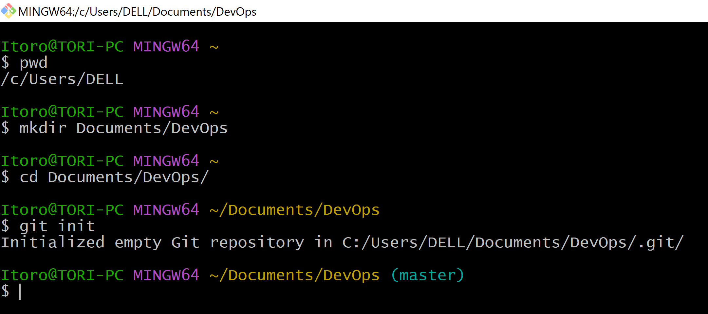
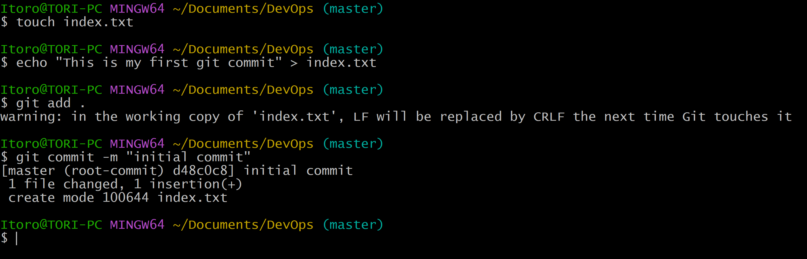
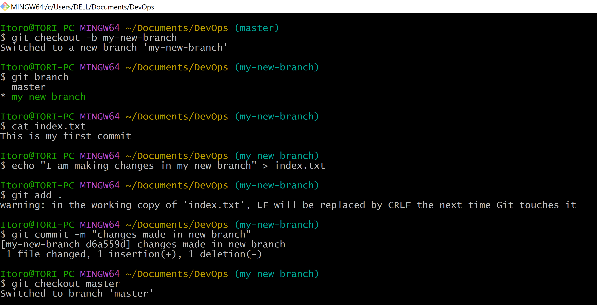
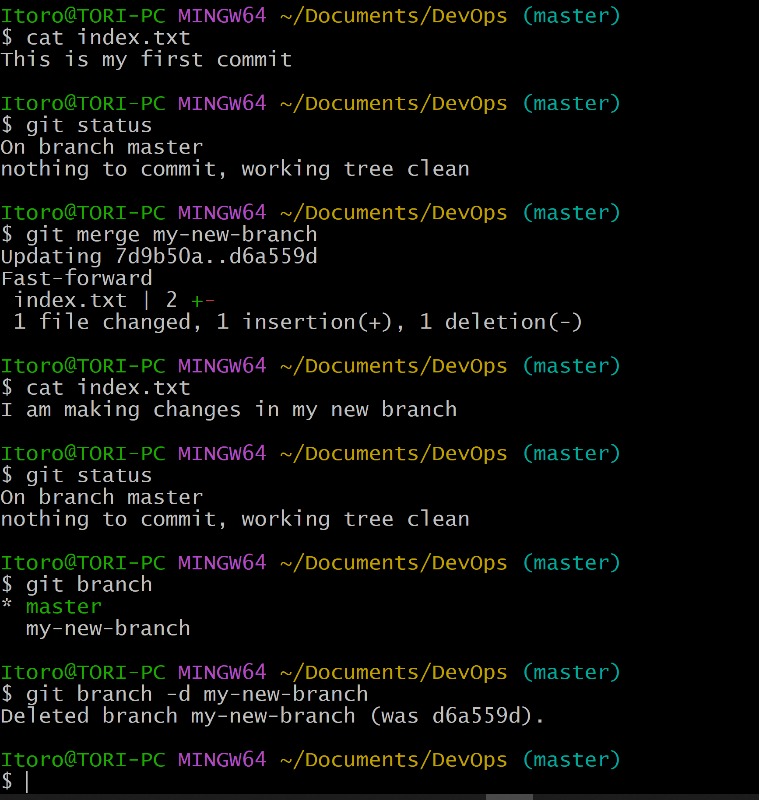
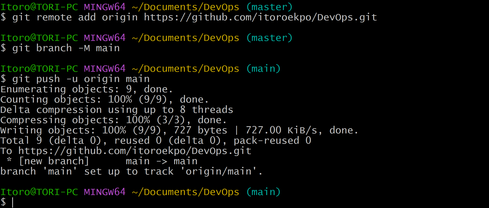
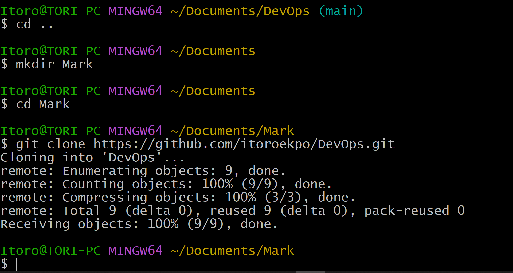
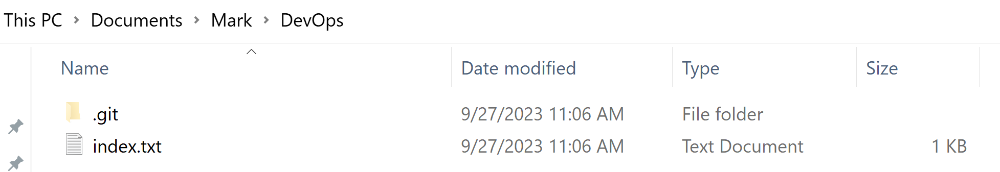

# Git Project - Itoro Ekpo

> _**Git**_ is a powerful version control system widely used in software development. This practical mini project will help learners quickly grasp its core concepts using hands-on exercises. You can click on _**[Git](https://git-scm.com/download/)**_ to download this powerful application to your computer and get started right away.

### Initializing a Repository and Making Commits
The below steps were followed:
- I opened a terminal on my computer. git bash was used for this project.
- I created a directory called _DevOps_ using the command `mkdir Documents/DevOps`
- I changed to the newly created directory using the command `cd Documents/DevOps/`
- While inside the _DevOps_ directory, I ran the `git init` command to initialize the folder as a Git repository

  
- After initializing, I created a new text file in my working directory called _index.txt_ with the command `touch index.txt`
- I wrote a line of text into the text file with the command `echo "This is my first git commit" > index.txt`
- I added my changes to the git staging area using the command `git add .`
- I committed my changes using the command `git commit -m "initial commit"`

### Working with Branches  
- I created a new branch with the command `git checkout -b my-new-branch`
- I then used the command `git branch` to list my branches
- I confirmed the contents of the text file _index.txt_ with the command `cat index.txt`
- As expected the command returned the contents of the file __This is my first commit__
- I proceeded to make changes to the file under my new branch
- By using the command **`echo "I am making changes in my new branch" > index.txt`**, I wrote into the existing file
- I added my changes and committed using above commands `git add .` and `git commit -m "changes made in new branch"` respectively
- After making changes to the text file I switched back to my old branch with the command `git checkout master`

- Back in my old branch I confirmed using `cat index.txt` it still carried the old contents of the file __This is my first commit__
- Then I did a merge using the command `git merge my-new-branch`
- checking the contents of the file again using `cat index.txt`, I could now see that the contents of the file had changed
- _Now displaying **I am making changes in my new branch**_ showing the branches have been merged successfully.
- I could now proceed to delete the new branch using the command `git branch -d my-new-branch`

- I ran the command `git branch --help` to access the documentation on more git branch commands

### Collaboration and Remote Repositories
- I created an account on [github](https://github.com/) and created a new repository called [DevOps](https://github.com/itoroekpo/DevOps.git)
- I pushed my local git repo to my newly created remote github repository using the command below
- `git remote add origin https://github.com/itoroekpo/DevOps.git`
- I set _**main**_ as main branch `git branch -M main`
- And pushed the contents to the remote repository `git push -u origin main`

- Now that my repository is on [github](https://github.com/) my colleague _Mark_ wishes to make changes to my text file
- He can achieve this by cloning the remote git repository using the command below
- `git clone https://github.com/itoroekpo/DevOps.git`

- _You can see the result of the clone command below. The remote git repository has been cloned into directory named __Mark__ on the local machine_

