# Lamp Stack Project by Itoro Ekpo

> The project LAMP Stack is a comprehensive program designed for individuals seeking to build and deploy web applications using the LAMP technology stack.
**LAMP** stands for _Linux_, _Apache_, _MySQL_ and _PHP_. A technology stack of powerful development and deployment tools for web applications. This project covers essential topics such as setting up a Linux environment, configuring the Apache web server, managing MySQL databases and writing PHP code for server-side functionality.

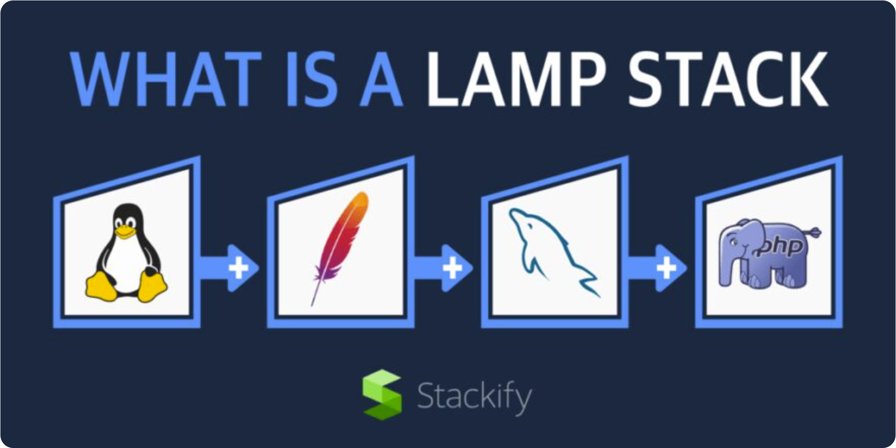

## Step 0 - Preparing Prerequisites
1. I setup an [AWS](https://aws.amazon.com/) account and provisioned a virtual server instance with Ubuntu Server OS using _Elastic Compute Cloud (EC2)_

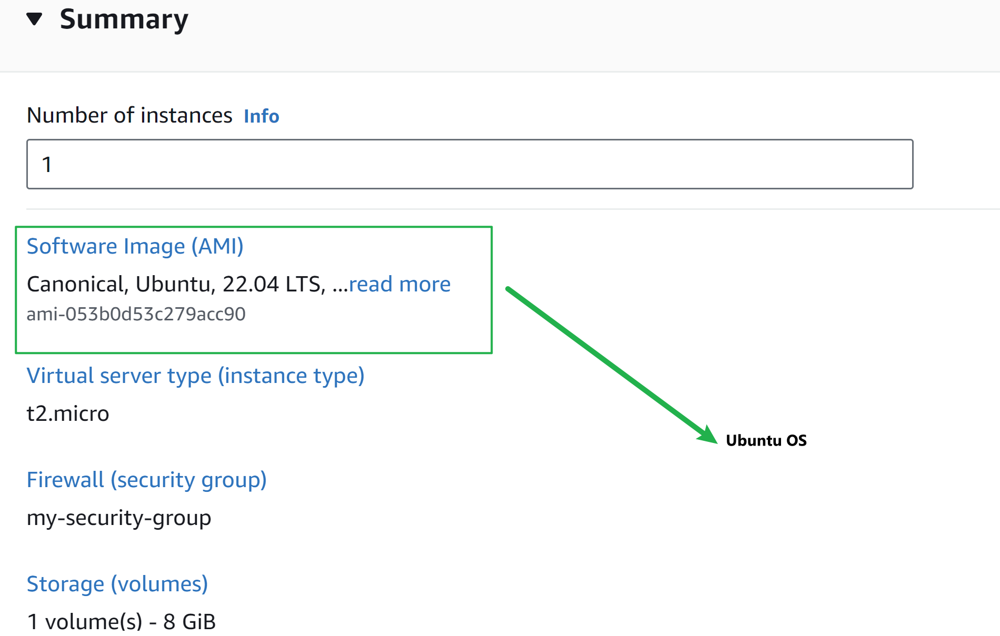
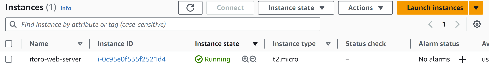

2. I connected to my EC2 instance using _ssh_ with the below command: `ssh -i "itoro-web-server.pem" ubuntu@ec2-54-82-253-191.compute-1.amazonaws.com`

- For my implementation, I am using windows terminal which you can install [_here_](https://learn.microsoft.com/en-us/windows/terminal/install)
- .pem file was saved to _My Downloads_ folder.

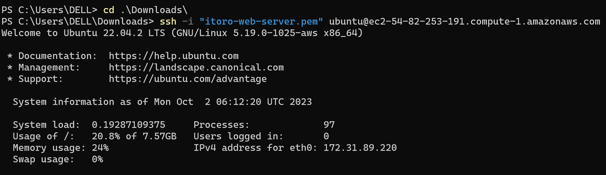

See below screenshot of my connected instance.

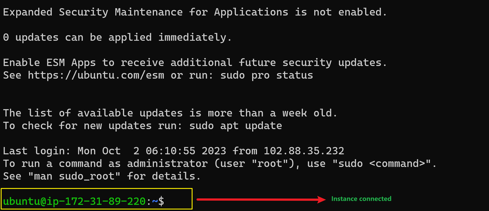

## Step 1 - Installing Apache and Updating the Firewall
[Apache HTTPServer](https://httpd.apache.org/) is the most widely used web server software. Developed and maintained by Apache Software Foundation. It is an open source software available for free and runs on 67% of all webservers in the world. We will be installing apache2 by following the below steps:

1. Update a list of packages in package manager using command `sudo apt update`
2. Run apache2 package installation using command `sudo apt install apache2`
3. Verify that apache2 is running using command `sudo systemctl status apache2`

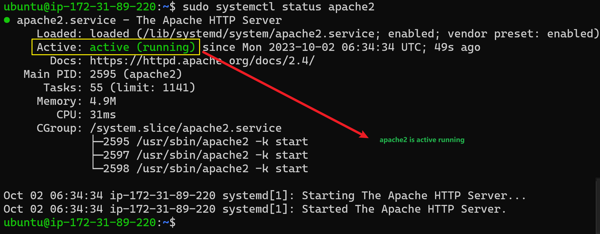

4. Verify TCP port 80 is open

- `curl http://localhost:80`
- `curl http://127.0.0.1:80`

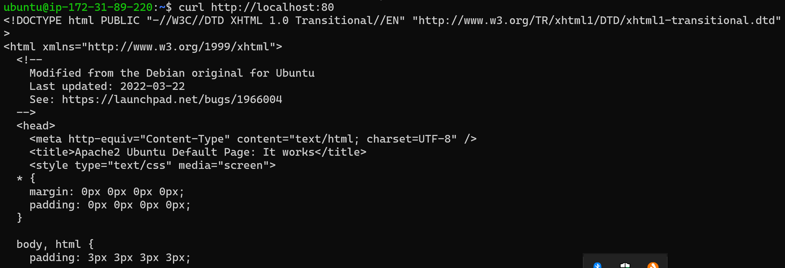

5. Test Apache HTTP server can respond to requests from the internet.
- Open a web browser and try to access the url _http://\<Public-IP-Address\>:80_
- You can retrieve your public ip address from your instance summary in AWS

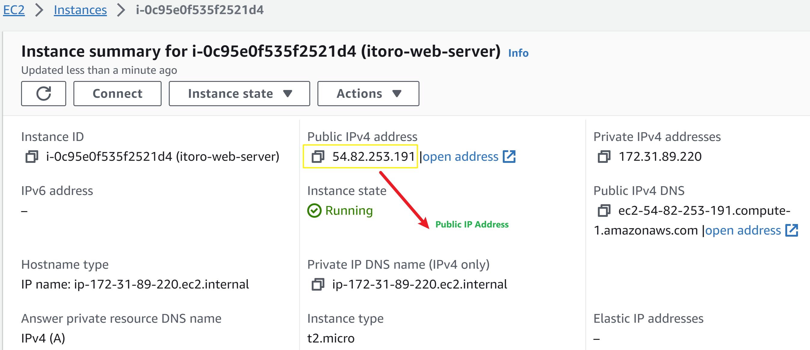

- My public IPv4 address is **54.82.253.191** so my url will be `http://54.82.253.191:80`

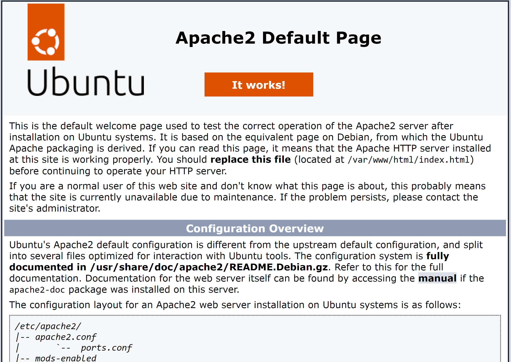

## Step 2 - Installing MySQL
Now that a webserver is up and running, I need to install a [Database Management System(DBMS)](https://en.wikipedia.org/wiki/Database#Database_management_system) to store and manage data for my site in a [Relational Database](https://cloud.google.com/learn/what-is-a-relational-database#:~:text=A%20relational%20database%20is%20a,structures%20relate%20to%20each%20other.). MySQL is a popular [relational database management system](https://www.techtarget.com/searchdatamanagement/definition/RDBMS-relational-database-management-system) used within PHP environments. I will be installing [_MySQL_](https://www.mysql.com/) using the steps below:

1. Install MySql using command `sudo apt install mysql-server`
2. When installation is complete, login to the MySQL console by typing `sudo mysql`

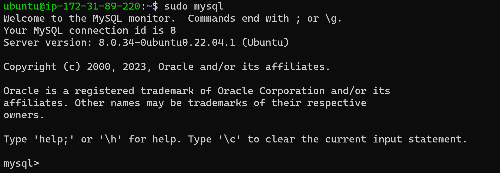

3. set password for root user to `PassWord.1`
- `ALTER USER 'root'@'localhost' IDENTIFIED WITH mysql_native_password BY 'PassWord.1';`

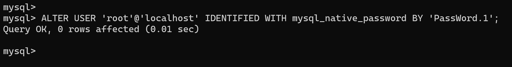

4. Exit the MySQL shell with the command `exit`
5. Start the interactive script by running `sudo mysql_secure_installation`
> VALIDATE PASSWORD PLUGIN can be used to test passwords
and improve security. It checks the strength of password
and allows the users to set only those passwords which are
secure enough. Would you like to setup VALIDATE PASSWORD plugin?

> Press y|Y for Yes, any other key for No:

> There are three levels of password validation policy:

> LOW    Length >= 8
> MEDIUM Length >= 8, numeric, mixed case, and special characters
> STRONG Length >= 8, numeric, mixed case, special characters and dictionary file

> Please enter 0 = LOW, 1 = MEDIUM and 2 = STRONG: 1

6. Test log in to the MySQL console by typing `sudo mysql -p`
7. Exit the MySQL console by typing `exit`

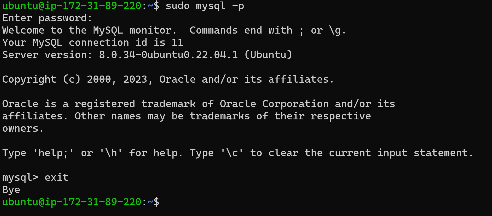

## Step 3 - Installing PHP
Now I have Apache installed to serve my content and MySQL installed to store and manage my data. [PHP](https://www.php.net/) is the final component of the LAMP technology stack. It will process code to display dynamic content to the end user. In addition to the _php_ package, I will need _php-mysql_, a PHP module that allows PHP to communicate with MySQL-based databases. I will also need _libapache2-mod-php_ to enable Apache to handle PHP files.

1. Install all 3 packages at once with the command `sudo apt install php libapache2-mod-php php-mysql`
2. Once installation is complete you can run `php -v` to confirm the php version.

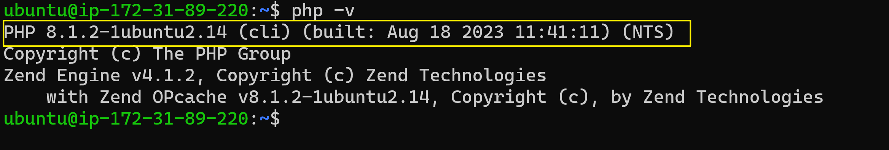

> **LAMP STACK SETUP IS NOW COMPLETE**
> - Linux (Ubuntu)
> - Apache HTTP Server
> - MySQL
> - PHP

## Step 4 - Create a Virtual Host for my Website using Apache
A virtual host allows you to have multiple websites located on a single machine and users of the websites will not even notice it. Apache for Ubuntu 20.04 has one server block enabled by default to serve documents from the _/var/www/html_ directory. We will leave this configuration and add our own directorynext to the default one.

1. Setup a new domain called _projectlamp_ by creating its directory 
> `sudo mkdir /var/www/projectlamp`

2. Assign ownership of the directory with the `$USER` environment variable which will reference my current system user.
> `sudo chown -R $USER:$USER /var/www/projectlamp`

3. Create and open a new configuration file in Apache's `sites-available` directory using your preferred command-line editor.
> `sudo vi /etc/apache2/sites-available/projectlamp.conf`

This will create a new blank file. Paste in the following bare-bones configuration by hitting `i` on the keyboard to enter insert mode, and paste the text below:

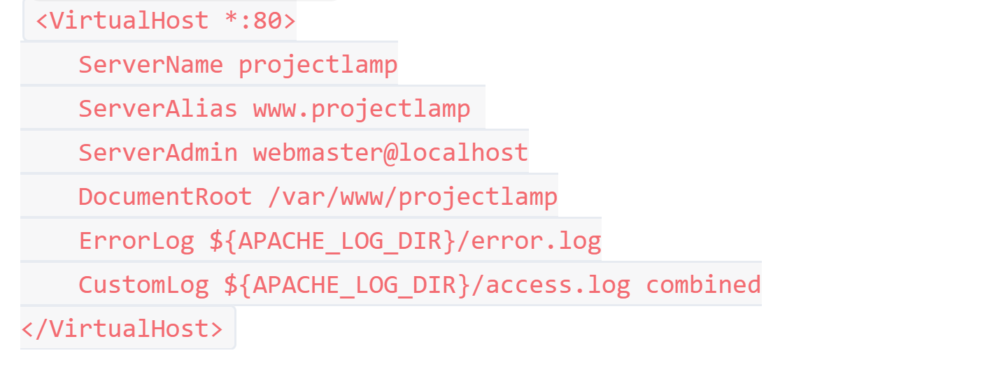

4. Save and close the file
> - Hit `esc` button on the keyboard
> - Type `:`
> - Type `wq` to write and quit simulataneously
> - Hit `Enter` to save the file
> - Use `ls` to show the new file in the **sites-available** directory

5. Enable the new virtual host
> `sudo a2ensite projectlamp`

6. Disable Apache's default website if you're not using a custom domain name
> `sudo a2dissite 000-default`

7. Confirm your configuration file does not contain syntax errors
> `sudo apache2ctl configtest`

8. Finally, reload Apache so these changes take effect
> `sudo systemctl reload apache2`

9. Website is now active but the web root /var/www/projectlamp is still empty. Create an index.html file in that location to test that the virtual host works as expected.
> `sudo echo 'Hello LAMP from hostname' $(curl -s http://169.254.169.254/latest/meta-data/public-hostname) 'with public IP' $(curl -s http://169.254.169.254/latest/meta-data/public-ipv4) > /var/www/projectlamp/index.html
`
10. From your browser try and open your website URL using IP address
> `http://54.82.253.191:80`  

11. You can also access the website from the browser by public DNS name.
> `http://ec2-54-82-253-191.compute-1.amazonaws.com:80`

You can leave this `index.html` file in place as a temporary landing page for your application until you set up an `index.php` file to replace it. Once you do that, remember to remove or rename the `index.html` file from your document root, as it would take precedence over an `index.php` file by default.

## Step 5 - Enable PHP on the website
With the default **Directory Index** settings on Apache, a file named `index.html` will always take precedence over an `index.php` file. This is useful for setting up maintenance pages in PHP applications by creating a temporary `index.html` file containing an informative message to visitors. Because this page will  take precedence over the `index.php` page, it will then become the landing page for the application. Once maintenance is over, the `index.html` is renamed or removed from the document root, bringing back the regular application page.

In case you want to change this behavior, you'll need to do the following:
1. Edit the _/etc/apache2/mods-enabled/dir.conf_ file and change the order in which the `index.php` file is listed within the **DirectoryIndex** directive:
> `sudo vim /etc/apache2/mods-enabled/dir.conf`

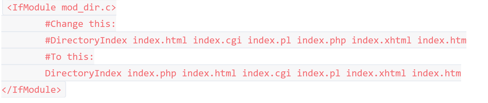

2. After saving and closing the file, reload Apache so the changes take effect:
> `sudo systemctl reload apache2`

3. Finally, create a PHP script to test that PHP is correctly installed and configured on your server. Since I have a custom location to host my website files and folders, I will create a PHP test script to confirm that Apache is able to handle and process requests for PHP files.

- Create a new filed named _index.php_ inside the custom web roor folder
> `vim /var/www/projectlamp/index.php`

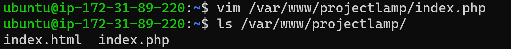

- This will open a blank file. Add the following text, which is valid PHP code, inside the file:

> `<?php`  
`phpinfo();`
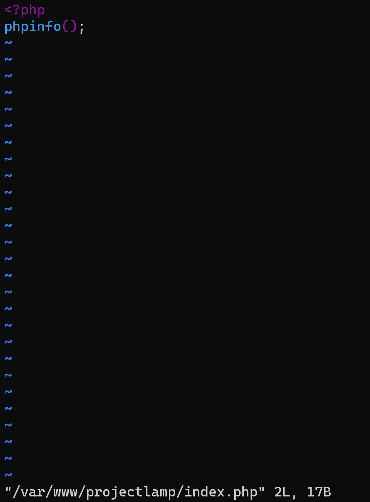

- Save and close the file. Refresh the page and you will see a PHP information landing page like the one below:

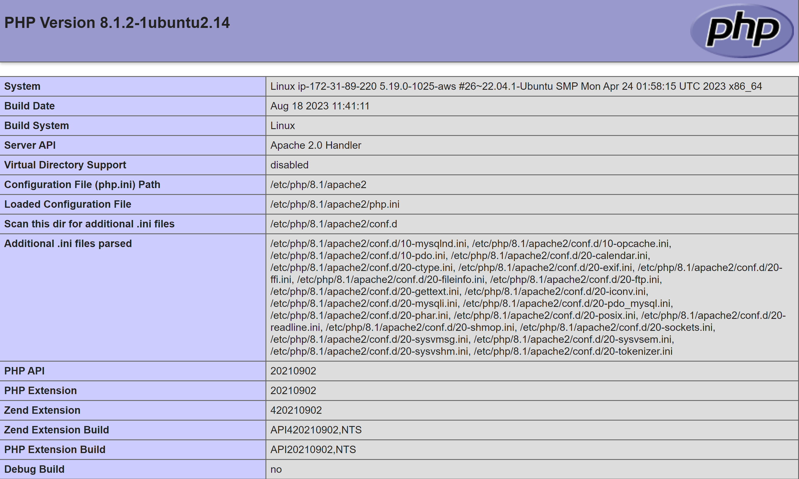

- After checking the relevant PHP information, it is best to remove the file you created as it contains sensitive system information.
> `sudo rm /var/www/projectlamp/index.php`

> **LAMP Stack deployment complete**

