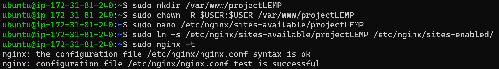
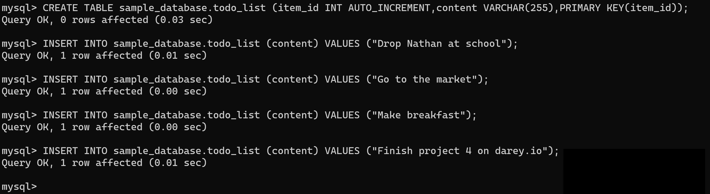

# Web Stack Implementation (LEMP Stack) Project by Itoro Ekpo


> The project LEMP Stack covers similar concepts as that of LAMP and helps to cement my skills of deploying web solutions using LA(E)MP stacks. In this project I will be implementing a similar stack, but with an alternative Web Server-_NGINX_, which is also very popular and widely used by many websites on the internet.

**LEMP** deploys _Linux_, _NGINX_, _MySQL_ and _PHP_ to create dynamic and high-performing websites. We will dive into the architecture of the LEMP stack, understanding how Linux provides a solid foundation , Nginx serves as a powerful webserver, MySQL for the database and PHP empowering server-side functionality.

## Step 0 - Preparing Prerequisites
1. I setup a second [AWS](https://aws.amazon.com/) account and provisioned a virtual server instance with Ubuntu Server OS using _Elastic Compute Cloud (EC2)_


2. This time around I will be connecting to my EC2 instance using _ssh_ with _Git Bash_. You can download Git [**_here_**](https://git-scm.com) 

>`ssh -i "itoro-web-server.pem" ubuntu@ec2-3.86.35.129.compute-1.amazonaws.com`


## Step 1 Installing the Nginx Web Server
I will be employing Nginx, a high performing web server. I will use `apt` package manager to install it but first we must update our server's package index.

> `sudo apt update`
> `sudo apt install nginx`

Verify that nginx was successfully installed and is running as a service in Ubuntu.

> `sudo systemctl status nginx`


Verify TCP port 80 is open

- `curl http://localhost:80`
- `curl http://127.0.0.1:80`


Now we can test that our Nginx server can respond to requests from the internet by entering `http://<public-ip-address>:80` into a web browser.

You can retrieve your public-ip-address from AWS or you can run the command below
`curl -s http://169.254.169.254/latest/meta-data/public-ipv4`


> My public IP address is `3.86.35.129` so `http://3.86.35.129:80`

You should have the below.


## Step 2 Installing MySQL
Now that a webserver is up and running, I need to install a [Database Management System(DBMS)](https://en.wikipedia.org/wiki/Database#Database_management_system) to store and manage data for my site in a [Relational Database](https://cloud.google.com/learn/what-is-a-relational-database#:~:text=A%20relational%20database%20is%20a,structures%20relate%20to%20each%20other.). MySQL is a popular [relational database management system](https://www.techtarget.com/searchdatamanagement/definition/RDBMS-relational-database-management-system) used within PHP environments. I will be installing [_MySQL_](https://www.mysql.com/) using the steps below:

1. Install MySql using command `sudo apt install mysql-server`
2. When installation is complete, login to the MySQL console by typing `sudo mysql`


3. set password for root user to `PassWord.1`
- `ALTER USER 'root'@'localhost' IDENTIFIED WITH mysql_native_password BY 'PassWord.1';`


4. Exit the MySQL shell with the command `exit`
5. Start the interactive script by running `sudo mysql_secure_installation`
> VALIDATE PASSWORD PLUGIN can be used to test passwords
and improve security. It checks the strength of password
and allows the users to set only those passwords which are
secure enough. Would you like to setup VALIDATE PASSWORD plugin?

> Press y|Y for Yes, any other key for No:

> There are three levels of password validation policy:

> LOW    Length >= 8
> MEDIUM Length >= 8, numeric, mixed case, and special characters
> STRONG Length >= 8, numeric, mixed case, special characters and dictionary file

> Please enter 0 = LOW, 1 = MEDIUM and 2 = STRONG: 1

6. Test log in to the MySQL console by typing `sudo mysql -p`
7. Exit the MySQL console by typing `exit`


MySQL server is now installed and secured. Next step is to install our final component. PHP.

## Step 3 - Installing PHP
Now I have Nginx installed to serve my content and MySQL installed to store and manage my data. [PHP](https://www.php.net/) is the final component of the LEMP technology stack. It will process code and generate dynamic content to the end user. 

While Apache embeds the PHP interpreter in each request, Nginx requires an external program to handle PHP processing and act as a bridge between the PHP interpreter itself and the web server. This allows for a better overall performance in most PHP-based websites but it requires additional configuration.

I will need to install `php-fpm` which stands for PHP fast CGI process manager and tell Nginx to pass PHP requests to this software for processing. In addition, I will need `php-mysql`, a PHP module that allows PHP to communicate with MySQL-based databases.

1. Install all 3 packages at once with the command `sudo apt install php-fpm php-mysql`
2. Once installation is complete you can run `php -v` to confirm the php version.


> **LEMP STACK SETUP IS NOW COMPLETE**
> - Linux (Ubuntu)
> - Nginx web server
> - MySQL
> - PHP

## Step 4 Configuring Nginx to use PHP processor
When using Nginx web server, we can create server blocks (similar to virtual hosts in Apache) to encapsulate configuration details and host more than one domain on a single server. 

We will be using _projectLEMP_ as an example domain name.

On Ubuntu 20.04, Nginx has one server block enabled by default and is configured to serve documents out of the directory at `/var/www/html`. While this works well for a single site, it can become difficult to manage if you are hosting multiple sites.

So instead of modifying `/var/www/html`, we'll create a directory structure within `/var/www` for our domain website.

1. Create a root web directory for our domain: `sudo mkdir /var/www/projectLEMP`
2. Assign ownership of the directory with the $USER environment variable, which will reference your current system user `sudo chown -R $USER:$USER /var/www/projectLEMP`
3. Open a new configuration file in Nginx's _sites-available_ directory using your preferred command-line editor. We will be using `nano` this time. `sudo nano /etc/nginx/sites-available/projectLEMP`. This will create a blank file where we will paste the below bare-bones configuration.

```
#/etc/nginx/sites-available/projectLEMP

server {
    listen 80;
    server_name projectLEMP www.projectLEMP;
    root /var/www/projectLEMP;

    index index.html index.htm index.php;

    location / {
        try_files $uri $uri/ =404;
    }

    location ~ \.php$ {
        include snippets/fastcgi-php.conf;
        fastcgi_pass unix:/var/run/php/php8.1-fpm.sock;
     }

    location ~ /\.ht {
        deny all;
    }

}
```
As shown in the screenshot below:


Below details what each of these directives and location blocks do:

- `listen` - Defines what port Nginx will listen on. In this case port `80`, the default HTTP port.
- `root` - Defines the document root where the files served by this website are stored.
- `index` - Defines in which order Nginx will prioritize index files for this website. It is common practice to list `index.html` files with a higher precedence than `index.php` files to allow for quickly setting up a maintenance landing page in PHP applications. You can adjust these settings to better suit your application needs.
- `server-name` - Defines which domain names and/or IP addresses this server block should respond for. **Point this directive to your server's domain name or public IP address.**
- `location /` - The first location block includes a `try_files` directive, which checks for the existence of files or directories matching a URI request. If Nginx cannot find the appropriate resource, it will return a 404 error.
- `location ~ \.php$` - This location block handles the actual PHP processing by pointing Nginx to the _fastcgi-php.conf_ configuration file and the `php7.4-fpm.sock file`, which declares what socket is associated with `php-fpm`
- `location ~ /\.ht` - The last location block deals with `.htaccess` files, which Nginx does not process. By adding the deny all directive, if any `.htaccess` files happen to find their way into the document root, they will not be served to visitors.


4. After editing, save and close the file. For _nano_, you can do so by typing `CTRL+X`, then `y`, and then `ENTER` to confirm.
5. Activate your configuration by linking to the config file from Nginx's `sites-enabled` directory. `sudo ln -s /etc/nginx/sites-available/projectLEMP /etc/nginx/sites-enabled/`. This will tell Nginx to use the configuration next time it is reloaded.
6. You can test your config for syntax errors by typing: `sudo nginx -t`. You shall see the following message:

```
nginx: the configuration file /etc/nginx/nginx.conf syntax is ok
nginx: configuration file /etc/nginx/nginx.conf test is successful
```
As seen in the screenshot below.



7. Disable default Nginx host that is currently configured to listen on port 80 `sudo unlink /etc/nginx/sites-enabled/default`
8. Reload Nginx server to apply all the changes: `$ sudo systemctl reload nginx`

Our new website is now active, but the web root _/var/www/projectLEMP_ is still empty. Create an `index.html` file in that location so that we can test our new server block as expected.

>`sudo echo 'Hello LEMP from hostname' $(curl -s http://169.254.169.254/latest/meta-data/public-hostname) 'with public IP' $(curl -s http://169.254.169.254/latest/meta-data/public-ipv4) > /var/www/projectLEMP/index.html`

9. Now go to your browser and try to open your website URL using your IP address or DNS-name. In my case `http://http://52.90.8.253/:80` OR `http://ec2-52-90-8-253.compute-1.amazonaws.com:80`

Below is a screnshot of the result as expected.


You can leave this `index.html` file in place as a temporary landing page for your application until you setup an `index.php` file to replace it. Once you do that, remember to remove or rename the _index.html_ file from your document root, as it would take precedence over an _index.php_ file by default.

My LEMP stack is now fully configured. In the next step, I will create a PHP script to test that Nginx is in fact able to handle `.php` files within my newly configured website.

## Step 5 Testing PHP with Nginx
1. Create a test PHP file called `info.php` in the document root.
- `nano /var/www/projectLEMP/info.php`

2. Type in the following lines into the new file. This is valid PHP code that will return information about the server.

```
<?php
phpinfo();
```


I can now access this page in your web browser by visiting the domain name or public IP address I set up in my Nginx configuration file, followed by `/info.php`

> `http://52.90.8.253/info.php`

You will see a web page containing detailed information about the server as shown in the below screenshot.


- After checking the relevant PHP information, it is best to remove the file you created as it contains sensitive system information.
> `sudo rm /var/www/projectLEMP/info.php`

You can now see from below that the information is no longer accessible. You can always regenerate this file if needed later.


## Step 6 Retrieving data from MySQL database with PHP
In this step I will be creating a test database (DB) with simple "To-do list" and configure access to it, so the Nginx website can query data from the DB and display it.

I will create a database named `sample_database` and a user named `sample_user`and grant the new user full privileges to the newly created database.

1. Connect to the MySQL console using root account: 
> `sudo mysql -p`
2. Create the new database: 
> `mysql>  CREATE DATABASE sample_database;`
3. Create the new user: 
> `mysql>  CREATE USER sample_user@localhost IDENTIFIED WITH mysql_native_password BY 'PassWord.1';`

- The above command creates the new user using mysql_native_password as default authentication method.

4. Give _sample\_user_ full privileges to the new database: 
> `mysql> GRANT ALL ON sample_database.* TO sample_user@localhost;`
5. Exit the MySQL shell with: 
> `exit`


6. Test that the new user has the proper permissions by logging into the MySQL console again, this time using the custom user credentials:
> `mysql -u sample_user -p`


7. Confirm access to the database:
> `mysql> SHOW DATABASES;`


8. Create a test table named **todo_list**. From MySQL console, run the command:
> `CREATE TABLE sample_database.todo_list (item_id INT AUTO_INCREMENT,content VARCHAR(255),PRIMARY KEY(item_id));`
9. Insert a few rows of content in the test table, repeating the below command a few times using different VALUES:
> `INSERT INTO sample_database.todo_list (content) VALUES ("Drop Nathan at school");`

> `INSERT INTO sample_database.todo_list (content) VALUES ("Go to the market");`

> `INSERT INTO sample_database.todo_list (content) VALUES ("Make breakfast");`

> `INSERT INTO sample_database.todo_list (content) VALUES ("Finish project 4 on darey.io");`



10. Confirm that the data was successfully saved to my table:
> `mysql>  SELECT * FROM sample_database.todo_list;`

See screenshot of output data inserted into the new database below:


11. After confirming data, `exit` the MySQL console.

Now I can create a PHP script that will connect to MySQL and query for my content.

12. Create a new PHP file in my custom web root directory using preferred editor.
> `nano /var/www/projectLEMP/todo_list.php`

13. Copy the below php code into my `todo_list.php` file. Sava and close.
```
<?php
$user = "example_user";
$password = "PassWord.1";
$database = "example_database";
$table = "todo_list";

try {
  $db = new PDO("mysql:host=localhost;dbname=$database", $user, $password);
  echo "<h2>TODO</h2><ol>";
  foreach($db->query("SELECT content FROM $table") as $row) {
    echo "<li>" . $row['content'] . "</li>";
  }
  echo "</ol>";
} catch (PDOException $e) {
    print "Error!: " . $e->getMessage() . "<br/>";
    die();
}

```

See below screenshot.


I can now access this page in my web browser by visiting the domain name or public IP address configured for my website, followed by `/todo_list.php`

> `http://52.90.8.253//todo_list.php`

See below screenshot of successful implementation.


**This means my PHP environment is ready to connect and interact with my MySQL server.**

## Project 4 Web Stack Implementation (LEMP Stack) completed


