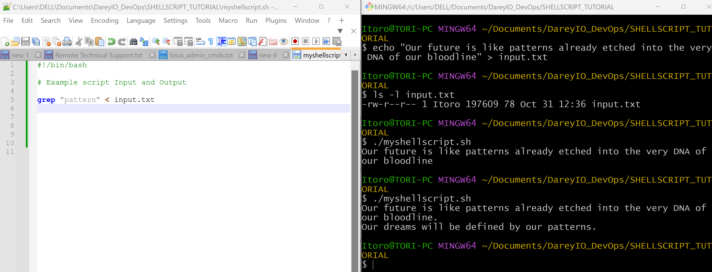

# Shell Scripting Hands-On Project by Itoro Ekpo


Shell scripting is a powerful tool commonly used across industries to automate tasks, test solutions, and increase efficiency. A Shell script is a text file with a list of commands that instruct an operating system to perform certain tasks. A shell is an interface that interprets, processes, and executes these commands from the shell script. It can be particularly helpful to automate repetitive tasks, such as backing up files, monitoring system resources, and managing user accounts, helping to save time and reduce human error. By turning a series of commands into a script, system administrators can save time, increase accuracy, and simplify complex tasks.

You can create a shell script by saving your collection of commands in a text file with a _.sh_ extension. These scripts can be executed directly from the command line or called from other scripts.

## Shell Scripting Elements

1. **Variables**:  Bash allows you to define and work with variables. Variables can store data of various data types such as numbers, strings and arrays. You can assign values to variables using the `=` operator, and access their values using the variable name preceeded by a `$` sign.

    _Example: Assigning value to a variable and retrieving the value from that variable:_

    > `name="John"`

    > `echo $name`

    

2. **Control Flow**: Bash provides control flow statements like if-else, for loops, while loops and case statements to control the flow of execution in your scripts. These statements allow you to make decisions, iterate over lists, and execute different commands based on conditions.

    Example: Using if-else to execute script based on a condition.

    ```
    #!/bin/bash
    # Example script to check if a number is positive, negative, or zero

    read -p "Enter a number: " num

    if [ $num -gt 0 ]; then
        echo "The number is positive."
    elif [ $num -lt 0 ]; then
        echo "The number is negative."
    else
        echo "The number is zero."
    fi
    ```
    _The piece of code above prompts you to type a number and prints a statement stating if the number is positive or negative._
    
    

    Example: Iterating through a list using a for loop

    ```
    #!/bin/bash

    # Example script to print numbers from 1 to 5 using a for loop

    for (( i=1; i<=5; i++ ))
    do
        echo $i
    done
    ```

    You can view the result of the above code below:

    

3. **Command Substitution**: Command substitution allows you to capture the output of a command and use it as a value within your script. You can use the backtick or the $() syntax for command substitution.
    
    Example: Using backtick for command substitution
    > current_date=`date +%Y-%m-%d`

    

    Example: Using `$()` syntax for command substitution
    > current_date=$(date +%Y-%m-%d)

    _cmd_sub.png)

4. **Input and Output**: Bash provides various ways to handle input and ouput. The `read` command to accept user input, and output text to the console using the `echo` command. Additionally, one can redirect input and ouput using operators like `>` (output to a file), `<` (input to a file), and `|` (pipe the output of one command as input to another).

    Example: Accepting user input
    ```
    echo "Enter your name:"
    read name
    ```
    

    Example: Output text to the terminal
    > `echo "Hello World"`

    Example: Output the result of a command into a file
    > `echo "hello world" > index.txt`

    

    Example: Pass the content of a file as input to a command
    > `grep "pattern" < input.txt`

    Example: Pass the result of a command as input to another command
    > `echo "hello world" | grep "pattern"`

    

5. **Functions**: Bash allows you to define and use functions to group related commands together. Functions provide a way to modularize your code and make it more reusable. You can define functions using the function keyword or simply by declaring the function name fillowed by parentheses.

    ```
    #!/bin/bash

    # Define a function to greet the user
    greet() {
        echo "Hello, $1! Nice to meet you."
    }

    # Call the greet function and pass the name as an argument
    greet "John"

    ```
    


## My First Shell Script

**step 1**: On your terminal, open a folder called _shell-scripting_ using the command `mkdir shell-scripting`. This will hold all the scripts we will write in this lesson.

**step 2**: Create a file called _user-input.sh_ using command `touch user-input.sh`


**step 3**: Inside the file copy and paste the block of code below:

```
#!/bin/bash

# Prompt the user for their name
echo "Enter your name:"
read name

# Display a greeting with the entered name
echo "Hello, $name! Nice to meet you."
```
_The above code block prompts for your name. When a name is typed, it displays the text hello! Nice to meet you._

`#! /bin/bash` specifies the type of bash interpreter to be used to execute the script.


**step 4**: Save your file.

**step 5**: Run the command `sudo chmod +x user-input.sh` to make the file executable.

**step 6**: Run the script using the command `./user-input.sh`


## Additional Learning Resources
You can access this text based [Shell-Scripting](https://www.freecodecamp.org/news/bash-scripting-tutorial-linux-shell-script-and-command-line-for-beginners/) material for more on the topic. Also, you can find a free interactive environment to learn shell scripting [here](https://www.learnshell.org)


## Directory Manipulation and Navigation
On the back of my lessons on directory manipulation and navigation of the Linux file system, I will be writing a simple shell script as a way of practicing what I have learnt.

The script will display the current directory, create a new directory called "my_directory", change to that directory, create two files inside it, list the files, move back one level up, remove the "my_directory" and it's contents, and finally list the files in the current directory again.

**step 1**: Open a file named _navigating-linux-filesystem.sh_


**step 2**: Paste the code block below into your file.
```
#!/bin/bash

# Display current directory
echo "Current directory: $PWD"

# Create a new directory
echo "Creating a new directory..."
mkdir my_directory
echo "New directory created."

# Change to the new directory
echo "Changing to the new directory..."
cd my_directory
echo "Current directory: $PWD"

# Create some files
echo "Creating files..."
touch file1.txt
touch file2.txt
echo "Files created."

# List the files in the current directory
echo "Files in the current directory:"
ls

# Move one level up
echo "Moving one level up..."
cd ..
echo "Current directory: $PWD"

# Remove the new directory and its contents
echo "Removing the new directory..."
rm -rf my_directory
echo "Directory removed."

# List the files in the current directory again
echo "Files in the current directory:"
ls
```


**step 3**: Run the command `sudo chmod +x navigating-linux-filesystem.sh` to set execute permission on the file.


**step 4**: Run the script using the command `./navigating-linux-filesystem.sh`


## File Operations and Sorting
In this lesson, I will be writing a simple shell script that focuses on _File Operations and Sorting_. This script creates three files (file1.txt, file2.txt and file3.txt), displays the files in their current order, sorts them alphabetically, saves the sorted files in sorted_files.txt, displays the sorted files, removes the original files, renames the sorted file to sorted_files_sorted_alphabetically.txt, and finally displays the contents of the final sorted file.

**step 1**: Open the terminal and create a file named _sorting.sh_ using the command `touch sorting.sh`


**step 2**: Copy and paste the code block below into the file. 
```
#!/bin/bash

# Create three files
echo "Creating files..."
echo "This is file3." > file3.txt
echo "This is file1." > file1.txt
echo "This is file2." > file2.txt
echo "Files created."

# Display the files in their current order
echo "Files in their current order:"
ls

# Sort the files alphabetically
echo "Sorting files alphabetically..."
ls | sort > sorted_files.txt
echo "Files sorted."

# Display the sorted files
echo "Sorted files:"
cat sorted_files.txt

# Remove the original files
echo "Removing original files..."
rm file1.txt file2.txt file3.txt
echo "Original files removed."

# Rename the sorted file to a more descriptive name
echo "Renaming sorted file..."
mv sorted_files.txt sorted_files_sorted_alphabetically.txt
echo "File renamed."

# Display the final sorted file
echo "Final sorted file:"
cat sorted_files_sorted_alphabetically.txt
```
I will be using the vi editor for this with the command `vi sorting.sh`


**step 3**: Set the execute permission on the file using the command `sudo chmod +x sorting.sh`

**step 4**: Run the script using the command `./sorting.sh`


## Working with Numbers and Calculations
This script defines two variables num1 and num2 with numeric values, performs basic arithmetic operations (addition, subtraction, multiplication, division and modulus), and displays the results. It also performs more complex calculations such as raising num1 to the power of 2 and calculating the square root of num2 and displays those results as well.

**step 1**: On the terminal create a file called _calculations.sh_ using the command `touch calculations.sh`


**step 2**: Copy and paste the code block below. I will use the `vi` command again.
```
#!/bin/bash

# Define two variables with numeric values
num1=10
num2=5

# Perform basic arithmetic operations
sum=$((num1 + num2))
difference=$((num1 - num2))
product=$((num1 * num2))
quotient=$((num1 / num2))
remainder=$((num1 % num2))

# Display the results
echo "Number 1: $num1"
echo "Number 2: $num2"
echo "Sum: $sum"
echo "Difference: $difference"
echo "Product: $product"
echo "Quotient: $quotient"
echo "Remainder: $remainder"

# Perform some more complex calculations
power_of_2=$((num1 ** 2))
square_root=$(echo "$num2" | awk '{print sqrt($1)}')

# Display the results
echo "Number 1 raised to the power of 2: $power_of_2"
echo "Square root of number 2: $square_root"
```


**step 3**: Set the execute permission on _calculations.sh_ using the command again `sudo chmod +x calculations.sh`


**step 4**: Run the script using the command `./calculations.sh`


## File Backup and Timestamping
This shell scripting example is focused on file backup and timestamp. As a DevOps Engineer backing up databases and other storage devices is one of the most common tasks you get to carry out.

This script defines the source directory and backup directory paths. It then creates a timestamp using the current date and time, and creates a backup directory with the timestamp appended to it's name. The script then copies all files from the source directory to the backup directory using `cp` command with the `-r` option for recursive copying. Finally, it displays a message indicating the completion of the backup process and shows the path of the backup directory with the timestamp.

**step 1**: On your terminal open a file named _backup.sh_ using the command `touch backup.sh`


**step 2**: Copy and paste the code block below into the file.

```
#!/bin/bash

# Define the source directory and backup directory

source_dir="C:/Users/DELL/Documents/DareyIO_DevOps/Notes/"
backup_dir="./backup_directory"

# Create a timestamp with the current date and time
timestamp=$(date +"%Y%m%d%H%M%S")

# Create a backup directory with the timestamp
backup_dir_with_timestamp="$backup_dir/backup_$timestamp"

# Create the backup directory
mkdir -p "$backup_dir_with_timestamp"

# Copy all files from the source directory to the backup directory
cp -r "$source_dir"/* "$backup_dir_with_timestamp"

# Display a message indicating the backup process is complete
echo "Backup completed. Files copied to: $backup_dir_with_timestamp"
```


**step 3**: Set the execute permission on _backup.sh_ using the command `sudo chmod +x backup.sh`


**step 4**: Run the script using the command `./backup.sh`


_You can see the screenshot of the backup directory with timestamp created in windows along with the backed up files in it._


**Project 5: Shell Scripting Hands-On Project Completed**


    


