# Client-Server Architecture Project by Itoro Ekpo with MySQL as RDBMS

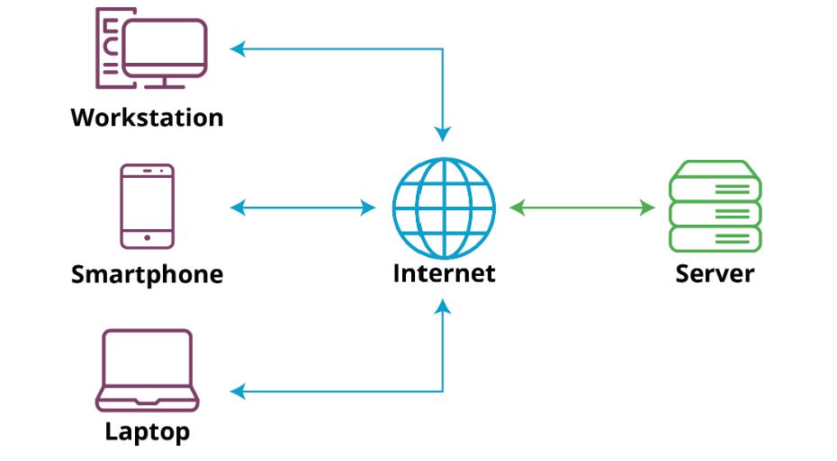

> [Client-Server](https://www.simplilearn.com/what-is-client-server-architecture-article) refers to an architecture in which two or more computers are connected together over a network to send and receive requests between one another. In their communication, each machine has its own role: The machine sending requests is usually referred to as 'Client' and the machine responding (serving) is called 'Server'.

A simple diagram of Web Client-Server architecture is shown below.

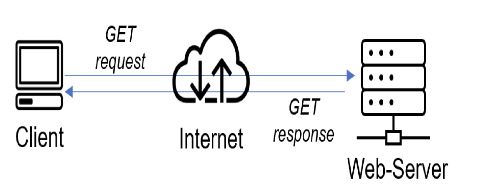

If we extend this concept further and add a Database Serve to our architecture, we can get the below structure.:

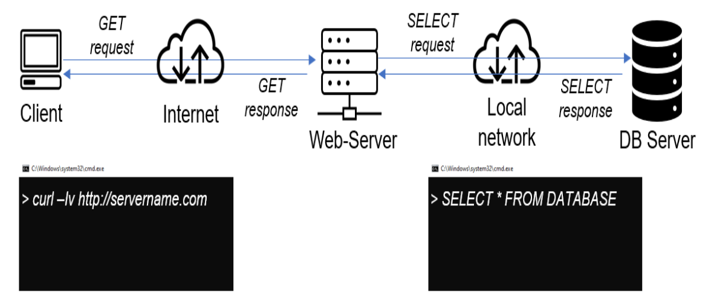

In this case, our Web Server has a role of a 'Client' that connects and reads/writes to/from a Database Server (MySQL, MongoDB, Oracle, SQL Server or any other), and the communication between them happens over a Local Network.

> It is noteworthy that it can also be an internet connection but it is a common practice to place Web Server and DB Server close to each other on a local network.

## LAMP website example
In [Project3](https://github.com/itoroekpo/DevOps-projects/tree/774867b51920a8e5431a73a22129cc7a09a89469/project3-lamp-stack) we implemented a [LAMP STACK](https://aws.amazon.com/what-is/lamp-stack/#:~:text=A%20LAMP%20stack%20is%20a,and%20the%20programming%20language%2C%20PHP.) website. Let us see an example of commercially deployed LAMP website - [www.propitixhomes.com](www.propitixhomes.com). This LAMP website server can be located anywhere in the world and you can reach it from any part of the globe over a global network like the internet.

If you go on our browser and type `www.propitixhomes.com`, it means that your browser is considered the **Client**. Essentially, it is sending a request to the remote server and in turn, would expect some kind of response from the remote server.

**Let us a take a quick example of Client-Server communication in action**  

Open up a terminal and run the `curl` command `curl -Iv www.propitixhomes.com`

> In this example my Ubuntu terminal is the client, while `www.propitixhomes.com` is the server.

See the response from the remote server in the below output. You can see that the requests from the [URL](https://en.wikipedia.org/wiki/URL) are being served by a computer with an IP address `75.2.115.196` on port `80`.

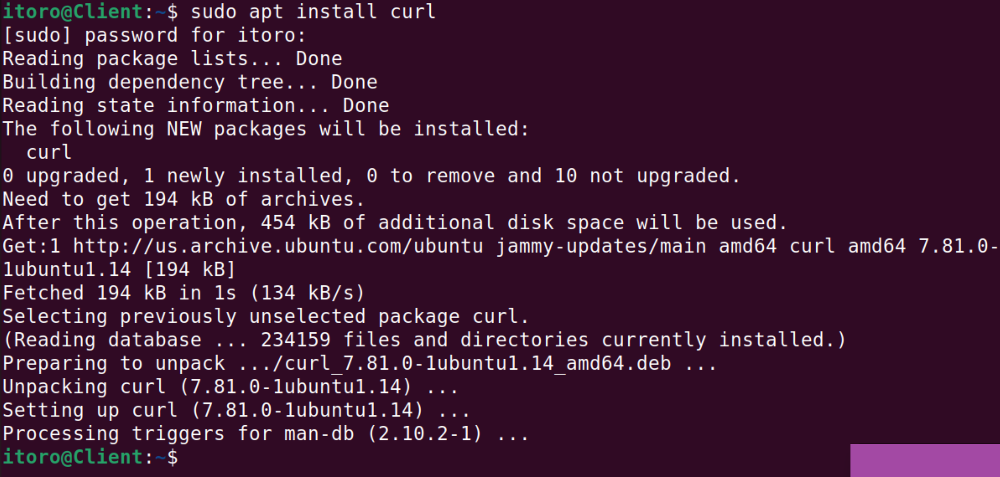

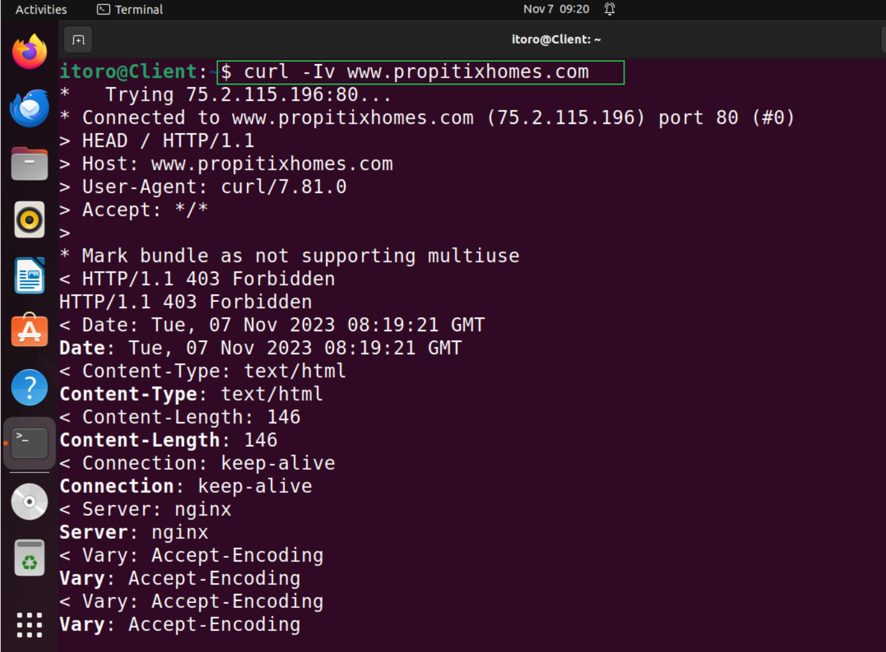

_Another simple way to get a server's IP address is to use a simple diagnostic tool like `ping`, it will also show round-trip time for packets to go to and back from the server. This tool uses [ICMP](https://en.wikipedia.org/wiki/Internet_Control_Message_Protocol) protocol._

## Implementing a Client Server Architecture using MySQL Database Management System (DBMS)

1. Create and configure two Linux-based virtual servers (EC2 instances in AWS)

    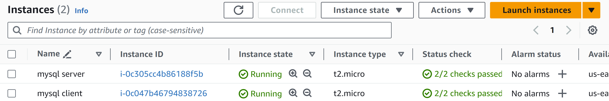

    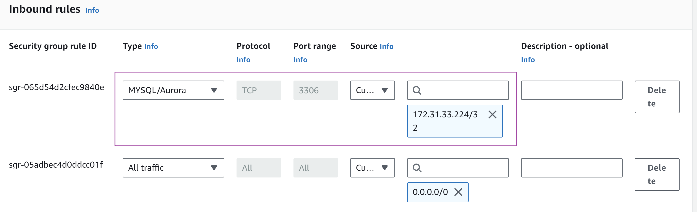

2. On `mysql server` Linux Server, install MySQL Server software.

    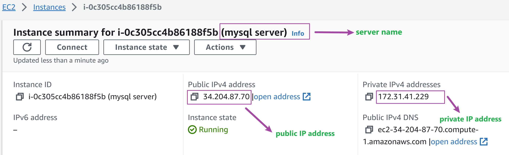

    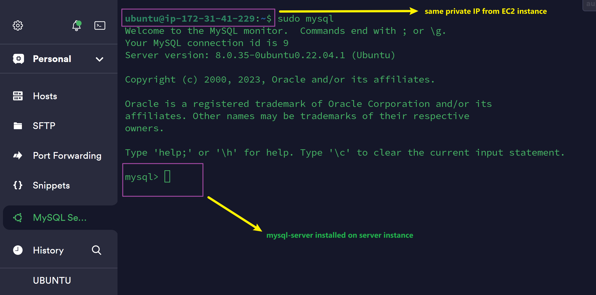

3. On `mysql client` Linux Server, install MySQL Client software.

    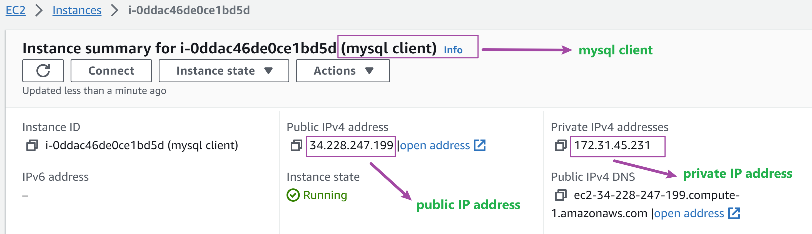

    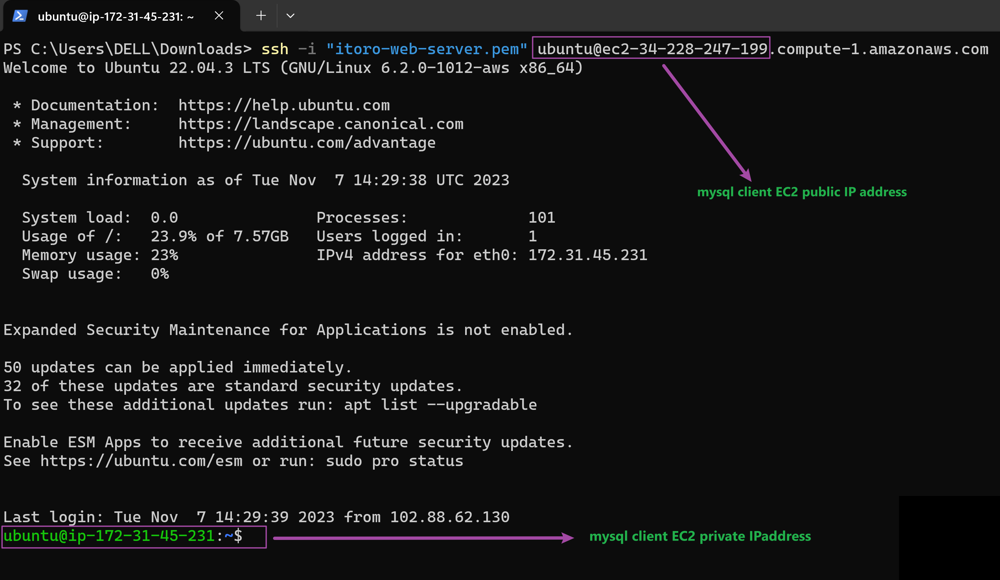

    Note: You might need to configure MySQL server to allow connections from remote hosts

    `sudo vi /etc/mysql/mysql.conf.d/mysqld.cnf`

    Replace `127.0.0.1` with `0.0.0.0` as seen below:

    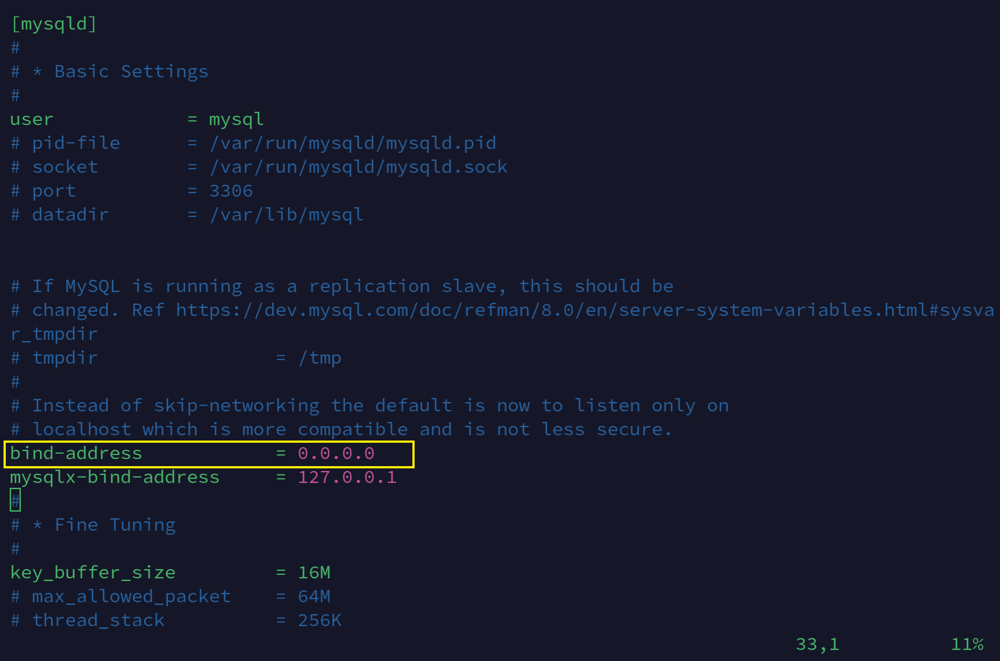

4. From `mysql client`, connect remotely to `mysql server` Database Engine without using `SSH`. You must use the `mysql` utility to perform this action.

    _We need to create a new MySQL user to be able to connect from a remote client. So on your mysqlserver, run the following code:_

    ```
    CREATE USER 'itoro'@'localhost' IDENTIFIED BY 'password';
    GRANT ALL PRIVILEGES ON *.* TO 'itoro'@'localhost' WITH GRANT OPTION;
    CREATE USER 'itoro'@'%' IDENTIFIED BY 'password';
    GRANT ALL PRIVILEGES ON *.* TO 'itoro'@'%' WITH GRANT OPTION;
    FLUSH PRIVILEGES;
    ```

    _This creates a DB user `itoro`. We can now login to our MySQL Server from the remote client using this user with the command:_

    > `sudo mysql -u itoro -h 172.31.41.229 -p`

    You can see from the screenshot below we are connected to the MySQL Server on the EC2  server instance from our EC2 client instance.

    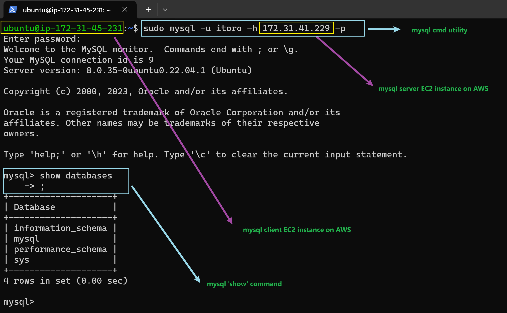

    > From the above screen shot we can see the result of the `show databases` command from our EC2 client instance.
    


