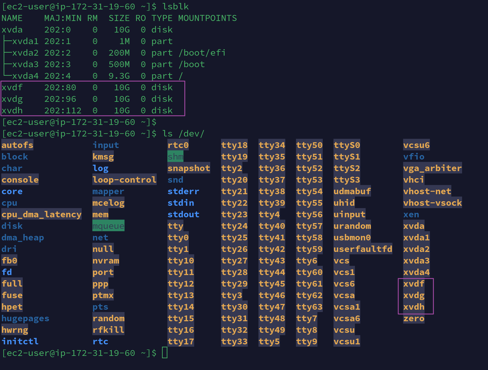
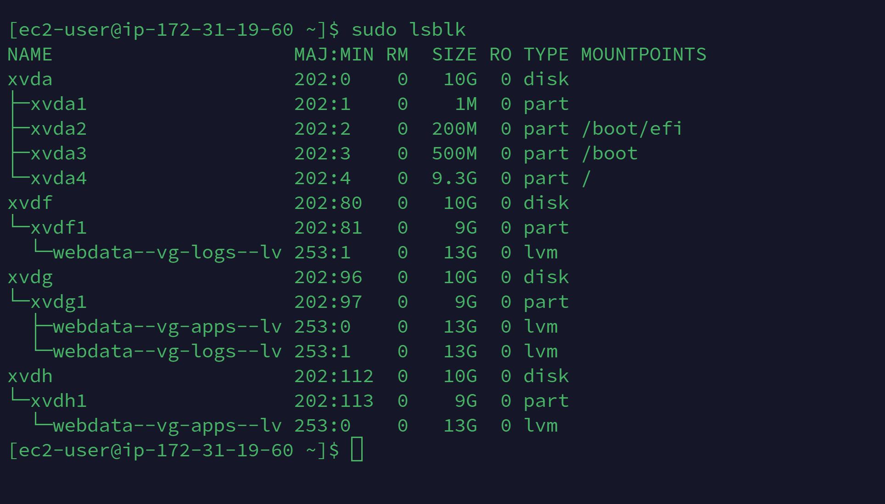
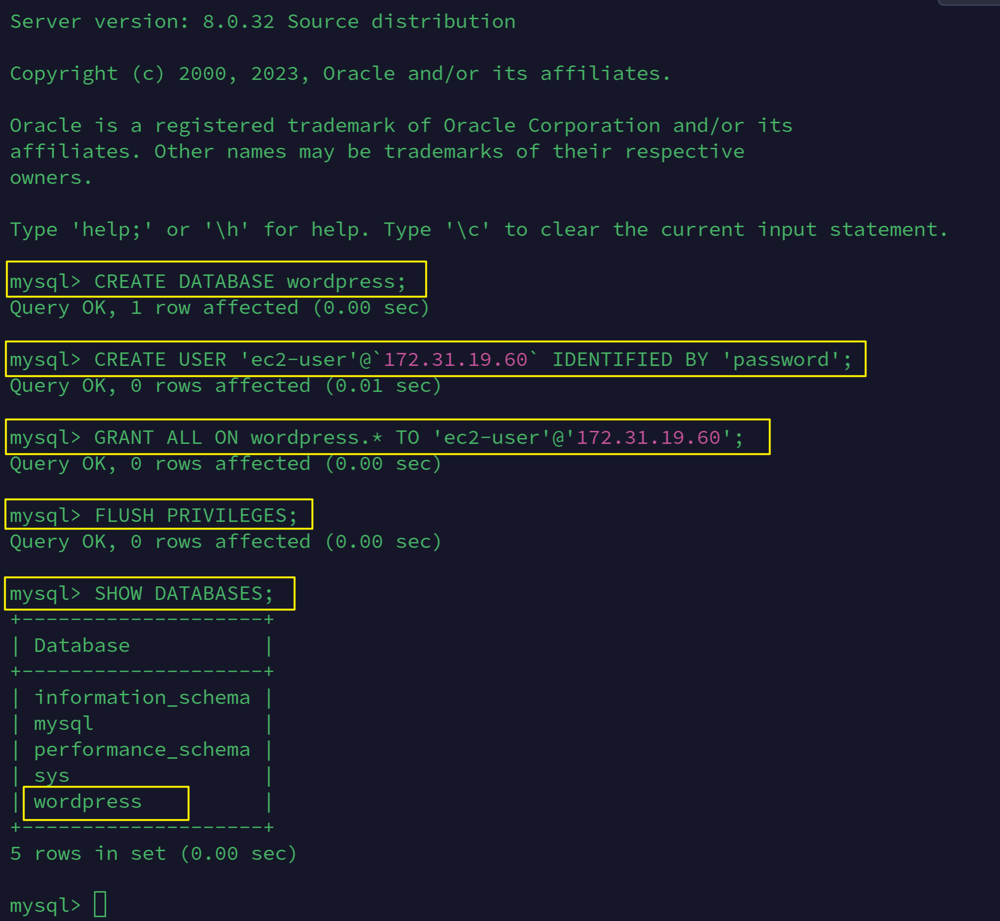

# Implementing WordPress Website with LVM Storage Management By Itoro Ekpo


[WordPress](https://wordpress.com/) is a web content management system. It was originally created as a tool to publish blogs but has evolved to support publishing other web content, including more traditional websites, mailing lists and internet forums, media galleries, membership sites, learning management systems and online stores. WordPress is among the most popular content management systems and is written in [PHP hypertext preprocessor](https://www.php.net/) language and paired with a [MySQL](https://www.mysql.com/) or [MariaDB](https://mariadb.org/) as its backend Relational Data Management System (RDBMS).

The project will be broken into two parts

1. Configure storage subsystems for Web and Database servers based on Linux OS. This will give us practical experience of working with disks, partitions and volumes in Linux.

2. Install WordPress and connect it to a remote MySQL database server. This will help solidify your skills of deploying Web and DB tiers of web solutions.

## Three-tier Architecture

Generally, web or mobile solutions are implemented based on what is called the **Three-tier Architecture**. It is a client-server architecture pattern that comprises of three(3) separate layers.

1. Presentation Layer: This is the user interface such as the browser on your laptop.

2. Business Layer: This is the backend program that implements business logic. Application or webserver.

3. Data Access or Management Layer: This is the layer for computer data storage and data access. Database Server or File System Server such as FTP Server or NFS Server.

In this project we will showcase **Three-tier Architecture** while also ensuring that the disks used to store files on the linux servers are adequately partitioned and managed through programs such as `gdisk` and `LVM` respectively.

Our 3-Tier setup will consist of:

* A laptop or PC to serve as a client.
* An EC2 Linux Server as a web server (Where we will be installing WordPress).
* An EC2 Linux Server as a database (DB) server.

> _We will be using **RedHat** OS for this project_

## Implementing LVM on Linux Servers (Web and Database Servers)

**Step 1**: Launch an EC2 instance that will serve as "Web Server" and create 3 10GiB volumes in the same [Availability Zone (AZ)](https://docs.aws.amazon.com/whitepapers/latest/get-started-documentdb/aws-regions-and-availability-zones.html) as your web server.


Create 3 10GiB volumes and attach to webserver instance


**Step 2**: Open up the linux terminal to begin configuration.

**Step 3**: Use `lsblk` command to inspect what block devices are attached to the webserver. All devices in Linux reside in `/dev/` directory. Inspect this directory using the command `ls /dev/` and confirm you see all 3 newly created block devices there. 

_Their names will likely be `xvdf`, `xvdh`, `xvdg`.



**Step 4**: Use `df -h` command to see all mounts and free space on your server.


**Step 5**: Use `gdisk` utility to create a single partition on each of the 3 disks using the command `sudo gdisk /dev/xvdf`


Use `lsblk` utility to view the newly configured partition on each of the 3 disks.


**Step 6**: Install `LVM2` package using the command `sudo yum install lvm2`. Run `sudo lvmdiskscan` command to check for available partitions.


_LVM disc scan_


**Step 7**: Use `pvcreate` utility to mark each of 3 disks as physical volumes (PVs) to be used by LVM

```
sudo pvcreate /dev/xvdf1
sudo pvcreate /dev/xvdg1
sudo pvcreate /dev/xvdh1
```


**Step 8**: Verify that your physical volume has been created successfully by running `sudo pvs`


**Step 9**: Use `vgcreate` utility to add all 3 PVs to a volume group (VG). Name the VG **webdata-vg**

> `sudo vgcreate webdata-vg /dev/xvdh1 /dev/xvdg1 /dev/xvdf1`

**Step 10**: Verify that the VG created successfully by running the command `sudo vgs`


**Step 11**: Use `lvcreate` utility to create 2 logical volumes. **apps-lv** and **logs-lv** which will be used to store website data and log data respectively.

> `sudo lvcreate -n apps-lv -L 13G webdata-vg`  
> `sudo lvcreate -n logs-lv -L 13G webdata-vg`


**Step 12**: Verify that your Logical Volume has been created successfully by running `sudo lvs`


**Step 13**: Verify the entire setup  
> `sudo vgdisplay -v` #view complete setup - VG, PV, and LV  
> `sudo lsblk`



**Step 14**: Use `mkfs.ext4` to format the logical volumes with **ext4** filesystem

> `sudo mkfs -t ext4 /dev/webdata-vg/apps-lv`  
> `sudo mkfs -t ext4 /dev/webdata-vg/logs-lv`


**Step 15**: Create **/var/www/thml** directory to store website files
> `sudo mkdir -p /var/www/html`

**Step 16**: Create **/home/recovery/logs** to store backup of log data
> `sudo mkdir -p /home/recovery/logs`

**Step 17**: Mount **/var/www/html** on **apps-lv** logical volume
> `sudo mount /dev/webdata-vg/apps-lv /var/www/html/`


**Step 18**: Use `rsync` utility to backup all the files in the log directory **/var/log** into **/home/recovery/logs** (This is required before mounting the file system)
> `sudo rsync -av /var/log/. /home/recovery/logs/`


**Step 19**: Mount **/var/log** on **logs-lv** logical volume. _(Note that all the existing data on /var/log will be deleted. That is why step 15 above is very important)_
> `sudo mount /dev/webdata-vg/logs-lv /var/log`

**Step 20**: Restore log files back into **/var/logs** directory
> `sudo rsync -av /home/recovery/logs/. /var/log`


**Step 21**: Update `/etc/fstab` file so that the mount configuration will persist after restart of the server. The UUID of the device will be used to update the `/etc/fstab` file;

> `sudo blkid`


> `sudo vi /etc/fstab`

Update `/etc/fstab` in this format using your own UUID and remember to remove the leading and ending quotes.


**Step 22**: Test the configuration and reload the daemon
> `sudo mount -a`  
> `sudo systemctl daemon-reload`


**Step 23**: Verify your setup by running `df -h`. The output will look like in the below screenshot.


## Installing WordPress and configuring it to use MySQL Database

**Step 1**: Prepare the Database Server
Launch a second RedHat EC2 instance that will have a role - 'DB Server'. Repeat the same steps as for the webserver but instead of apps-lv, create `db-lv` and mount it to `/db` directory instead of `/var/www/html/`.

See below screenshots of implementation for the DBServer instance using LVM-SM


**Step 2**: Open up the linux terminal to begin configuration.

**Step 3**: Use `lsblk` command to inspect what block devices are attached to the webserver. All devices in Linux reside in `/dev/` directory. Inspect this directory using the command `ls /dev/` and confirm you see all 3 newly created block devices there. 

_Their names will likely be `xvdf`, `xvdh`, `xvdg`.


**Step 4**: Use `df -h` command to see all mounts and free space on your server.


**Step 5**: Use `gdisk` utility to create a single partition on each of the 3 disks using the command `sudo gdisk /dev/xvdf`

Use `lsblk` utility to view the newly configured partition on each of the 3 disks.


**Step 6**: Install `LVM2` package using the command `sudo yum install lvm2`. Run `sudo lvmdiskscan` command to check for available partitions.

_LVM disc scan_


**Step 7**: Use `pvcreate` utility to mark each of 3 disks as physical volumes (PVs) to be used by LVM

```
sudo pvcreate /dev/xvdf1
sudo pvcreate /dev/xvdg1
sudo pvcreate /dev/xvdh1
```

**Step 8**: Verify that your physical volume has been created successfully by running `sudo pvs`


**Step 9**: Use `vgcreate` utility to add all 3 PVs to a volume group (VG). Name the VG **webdata-vg**

> `sudo vgcreate webdata-vg /dev/xvdh1 /dev/xvdg1 /dev/xvdf1`

**Step 10**: Verify that the VG created successfully by running the command `sudo vgs`


**Step 11**: Use `lvcreate` utility to create 2 logical volumes. **db-lv** and **logs-lv** which will be used to store website data and log data respectively.

> `sudo lvcreate -n db-lv -L 13G webdata-vg`  
> `sudo lvcreate -n logs-lv -L 13G webdata-vg`

**Step 12**: Verify that your Logical Volume has been created successfully by running `sudo lvs`


**Step 13**: Verify the entire setup  
> `sudo vgdisplay -v` #view complete setup - VG, PV, and LV  
> `sudo lsblk`


**Step 14**: Use `mkfs.ext4` to format the logical volumes with **ext4** filesystem

> `sudo mkfs -t ext4 /dev/webdata-vg/db-lv`  
> `sudo mkfs -t ext4 /dev/webdata-vg/logs-lv`


**Step 15**: Create **/var/www/html** directory to store website files
> `sudo mkdir -p /db`

**Step 16**: Create **/home/recovery/logs** to store backup of log data
> `sudo mkdir -p /home/recovery/logs`

**Step 17**: Mount **/var/www/html** on **apps-lv** logical volume
> `sudo mount /dev/webdata-vg/db-lv /db/`


**Step 18**: Use `rsync` utility to backup all the files in the log directory **/var/log** into **/home/recovery/logs** (This is required before mounting the file system)
> `sudo rsync -av /var/log/. /home/recovery/logs/`

**Step 19**: Mount **/var/log** on **logs-lv** logical volume. _(Note that all the existing data on /var/log will be deleted. That is why step 15 above is very important)_
> `sudo mount /dev/webdata-vg/logs-lv /var/log`

**Step 20**: Restore log files back into **/var/logs** directory
> `sudo rsync -av /home/recovery/logs/. /var/log`

**Step 21**: Update `/etc/fstab` file so that the mount configuration will persist after restart of the server. The UUID of the device will be used to update the `/etc/fstab` file;

> `sudo blkid`


> `sudo vi /etc/fstab`

Update `/etc/fstab` in this format using your own UUID and remember to remove the leading and ending quotes.

```
# mounts for WordPress database server
UUID=3615a4cf-82bb-4b7c-a09d-fa9babd019ea /db ext4 defaults 0 0
UUID=dfd3e909-2c71-481d-bc78-4f7fb69efc04 /var/log ext4 defaults 0 0
```


**Step 22**: Test the configuration and reload the daemon
> `sudo mount -a`  
> `sudo systemctl daemon-reload`

**Step 23**: Verify your setup by running `df -h`. The output will look like in the below screenshot.


## Install Wordpress on the Webserver EC2 Instance

1. Update the repository `sudo yum -y update`

2. Install wget, Apache and it's dependencies `sudo yum -y install wget httpd php php-mysqlnd php-fpm php-json`

3. Start Apache  
    `sudo systemctl enable httpd`  
    `sudo systemctl start httpd`

4. Install PHP and it's dependencies

    ```
    sudo yum install https://dl.fedoraproject.org/pub/epel/epel-release-latest-8.noarch.rpm
    sudo yum install yum-utils http://rpms.remirepo.net/enterprise/remi-release-8.rpm
    sudo yum module list php
    sudo yum module reset php
    sudo yum module enable php:remi-7.4
    sudo yum install php php-opcache php-gd php-curl php-mysqlnd
    sudo systemctl start php-fpm
    sudo systemctl enable php-fpm
    sudo setsebool -P httpd_execmem 1
    ```

5. Restart Apache `sudo systemctl restart httpd`

6. Download wordpress and copy wordpress to `/var/www/html`

    ```
    mkdir wordpress
    cd   wordpress
    sudo wget http://wordpress.org/latest.tar.gz
    sudo tar xzvf latest.tar.gz
    sudo rm -rf latest.tar.gz
    sudo cp wordpress/wp-config-sample.php wordpress/wp-config.php
    sudo cp -R wordpress /var/www/html/
    ```

    

    edit the `wp-config.php` file and input the database credentials.

    

7. Configure SE Linux Policies

    ```
    sudo chown -R apache:apache /var/www/html/wordpress
    sudo chcon -t httpd_sys_rw_content_t /var/www/html/wordpress -R
    sudo setsebool -P httpd_can_network_connect=1
    ```

## Install MySQL on the DB Server EC2 Instance

1. Install MySQL on the DB Server EC2 Instance

    ```
    sudo yum update
    sudo yum install mysql-server
    ```

    Verify the service is up and running using `sudo systemctl status mysqld`. If it is not runnning, restart the service and enable it so it will be running even after reboot.

    `sudo systemctl restart mysqld`  
    `sudo systemctl enable mysqld`

    

2. Configure DB to work with WordPress

    ```
    sudo mysql
    CREATE DATABASE wordpress;
    CREATE USER 'ec2-user'@`172.31.19.60` IDENTIFIED BY 'password';
    GRANT ALL ON wordpress.* TO 'ec2-user'@'172.31.19.60';
    FLUSH PRIVILEGES;
    SHOW DATABASES;
    exit
    ```

    


## Configure WordPress to connect to remote database

_Do not forget to open MySQL port `3306` on DB Server EC2. For extra security, we will allow access to the DB server **ONLY** from our Webserver's IP address, so in the inbound rule configuration specify source as `/32`_


1. Install MySQL client and test that we can connect from our webserver to our DB server by using `mysql-client`

    > `sudo yum install mysql`
    > `sudo mysql -u ec2-user -p -h 172.31.40.243`

    

2. Verify if we can successfully execute `SHOW DATABASES;` command and see a list of existing databases.

    

3. Change permissions and configuration so Apache could use WordPress

4. Enable TCP port 80 Inbound Rules configuration for your Web Server EC2 (Enable from everywhere `0.0.0.0/0` or from your workstation's IP)

    

5. Try to access from your browser the link to your WordPress `http://54.225.9.93/wordpress/`. We can see the WordPress welcome page from the screenshot below

    

    After filling in the required details you should have the below

    

    


> Implementation Complete

    


